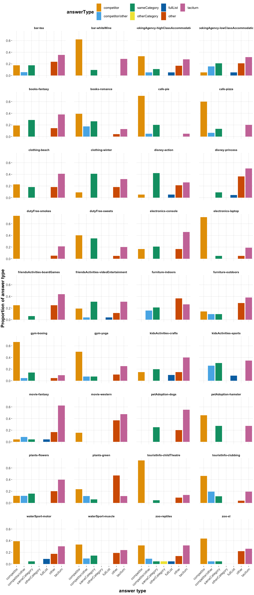
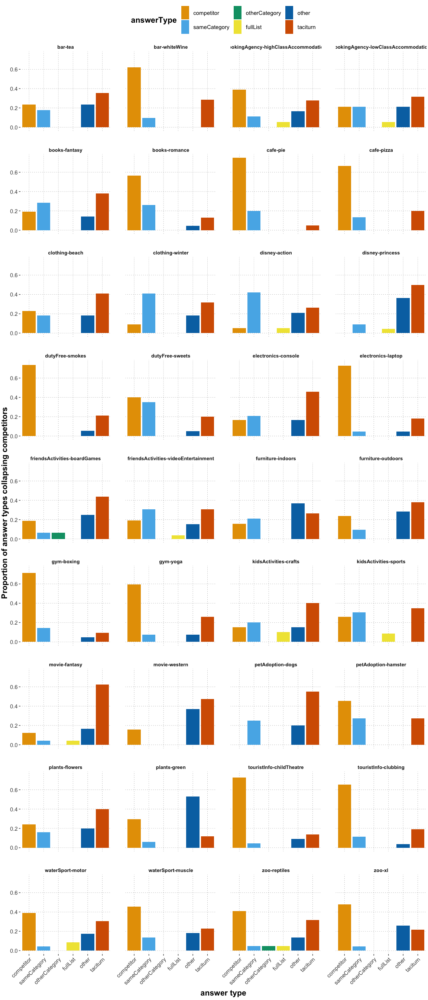
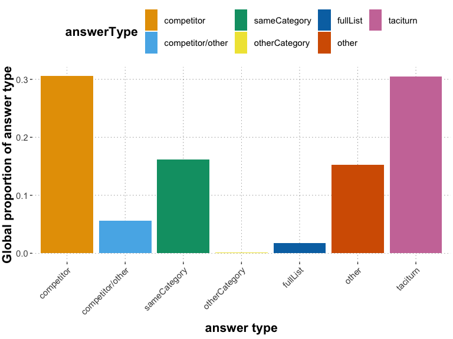
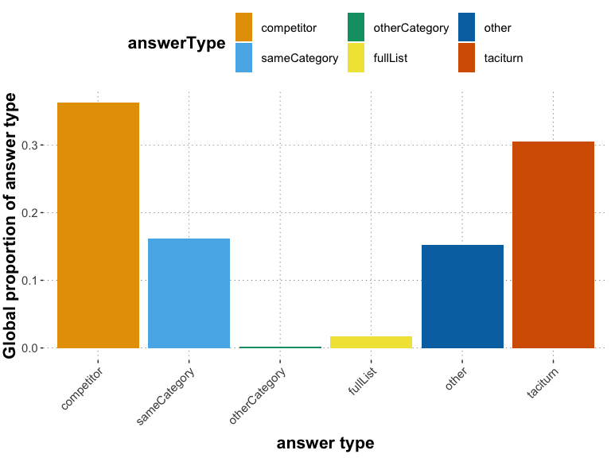

QA free typing analysis
================
Polina Tsvilodub
2022-11-01

# Intro

Below, exploratory analysis of the free production QA experiment data
can be found.

The responses were manually classified by Polina into seven categories:

- The “taciturn” category includes “No, we don’t have XY” responses. It
  also subsumes the responses which include some kind of explanation
  (like “Moana isn’t here today, she is helping her islanders so can’t
  be with us.”).
- The “competitor” category includes responses offering the competitor
  instead of the target object. It includes responses where the
  alternative is the anticipated competitor.
- The “competitor/other” category includes responses where either
  additional information was included next to offering the competitor or
  the named competitor differed from our preclassification.
- The “sameCategory” option includes responses offering several
  alternatives (2-3) from the same category or offering one option which
  I did not consider a direct competitor.
- The “otherCategory” option includes responses offering 1-2
  alternatives from the different category.
- The “fullList” option includes responses where all alternatives were
  presented.
- The “other” category includes other unclassifiable responses as well
  as responses trying to offer some kind of vague solution to the
  request on top of saying “No” (like “We sell a selection of different
  types of books, I am sure you will find something in the adventure
  section.”).

An analysis making the distinction between the two competitor-containing
categories is compared to an analysis collapsing the two competitor
categories into one “competitor” category. Additionally, single
responses were classified as incorrect with the “yes” category (e.g.,
“Yes let’s go see it” for the zoo-xl vignette).

    ## Subjects who failed attention checks:  108 107 149

    ## 
    ## Subject exclusion rate:  0.03

    ## Number of excluded inccorect ('yes') responses:  15

    ## # A tibble: 7 x 2
    ##   category             n
    ##   <chr>            <int>
    ## 1 competitor         233
    ## 2 competitor/other    43
    ## 3 fullList            13
    ## 4 other              116
    ## 5 otherCategory        1
    ## 6 sameCategory       123
    ## 7 taciturn           232

    ## # A tibble: 36 x 2
    ##    itemName                                 n
    ##    <chr>                                <int>
    ##  1 bar-tea                                 17
    ##  2 bar-whiteWine                           21
    ##  3 bookingAgency-highClassAccommodation    18
    ##  4 bookingAgency-lowClassAccommodation     19
    ##  5 books-fantasy                           21
    ##  6 books-romance                           23
    ##  7 cafe-pie                                20
    ##  8 cafe-pizza                              15
    ##  9 clothing-beach                          22
    ## 10 clothing-winter                         22
    ## # … with 26 more rows

    ## 
    ## average number of responses per vignette: 21.13889

    ## 
    ## vignette with most responses:  gym-yoga 28

    ## 
    ## vignette with least responses:  cafe-pizza 15

<!-- -->

<!-- -->

    ## `summarise()` ungrouping output (override with `.groups` argument)

    ## [1] 1

    ## # A tibble: 7 x 3
    ##   answerType       answerType_count answerType_proportion
    ##   <fct>                       <int>                 <dbl>
    ## 1 competitor                    233               0.306  
    ## 2 competitor/other               43               0.0565 
    ## 3 sameCategory                  123               0.162  
    ## 4 otherCategory                   1               0.00131
    ## 5 fullList                       13               0.0171 
    ## 6 other                         116               0.152  
    ## 7 taciturn                      232               0.305

<!-- -->

    ## `summarise()` ungrouping output (override with `.groups` argument)

    ## [1] 1

    ## # A tibble: 6 x 3
    ##   answerType    answerType_count answerType_proportion
    ##   <fct>                    <int>                 <dbl>
    ## 1 competitor                 276               0.363  
    ## 2 sameCategory               123               0.162  
    ## 3 otherCategory                1               0.00131
    ## 4 fullList                    13               0.0171 
    ## 5 other                      116               0.152  
    ## 6 taciturn                   232               0.305

<!-- -->

    ## Vignettes receiving the most 'other' responses (mostly 'no but we have other options which might interest you')

    ## # A tibble: 6 x 3
    ##   itemName                     answerType responseCategory_proportion
    ##   <chr>                        <fct>                            <dbl>
    ## 1 plants-green                 other                            0.471
    ## 2 furniture-indoors            other                            0.368
    ## 3 movie-western                other                            0.368
    ## 4 disney-princess              other                            0.364
    ## 5 furniture-outdoors           other                            0.286
    ## 6 friendsActivities-boardGames other                            0.25

    ## 
    ## Vignettes with highest proportion of competitor responses where either additional information was included or the named competitor differed from our preclassification

    ## # A tibble: 6 x 3
    ##   itemName                           answerType       responseCategory_proporti…
    ##   <chr>                              <fct>                                 <dbl>
    ## 1 kidsActivities-sports              competitor/other                      0.261
    ## 2 touristInfo-clubbing               competitor/other                      0.192
    ## 3 books-romance                      competitor/other                      0.174
    ## 4 furniture-indoors                  competitor/other                      0.158
    ## 5 bookingAgency-lowClassAccommodati… competitor/other                      0.158
    ## 6 plants-flowers                     competitor/other                      0.12

    ## 
    ## Vignettes receiving the most 'taciturn' responses

    ## # A tibble: 6 x 3
    ##   itemName                     answerType responseCategory_proportion
    ##   <chr>                        <fct>                            <dbl>
    ## 1 movie-fantasy                taciturn                         0.625
    ## 2 petAdoption-dogs             taciturn                         0.55 
    ## 3 disney-princess              taciturn                         0.5  
    ## 4 movie-western                taciturn                         0.474
    ## 5 electronics-console          taciturn                         0.458
    ## 6 friendsActivities-boardGames taciturn                         0.438

    ## Number of participants providing taciturn responses only:  7

    ## 
    ## Number of participants providing competitor responses only:  0

    ## 
    ## Number of participants providing 'other' responses only:  0

    ## 
    ## Maximal number of distinct response types provided by a participant:  6

    ## 
    ## Number of participants providing maximal number of distinct response types:  1

    ## 
    ## Average number of response types provided by a participant:  3.538961
