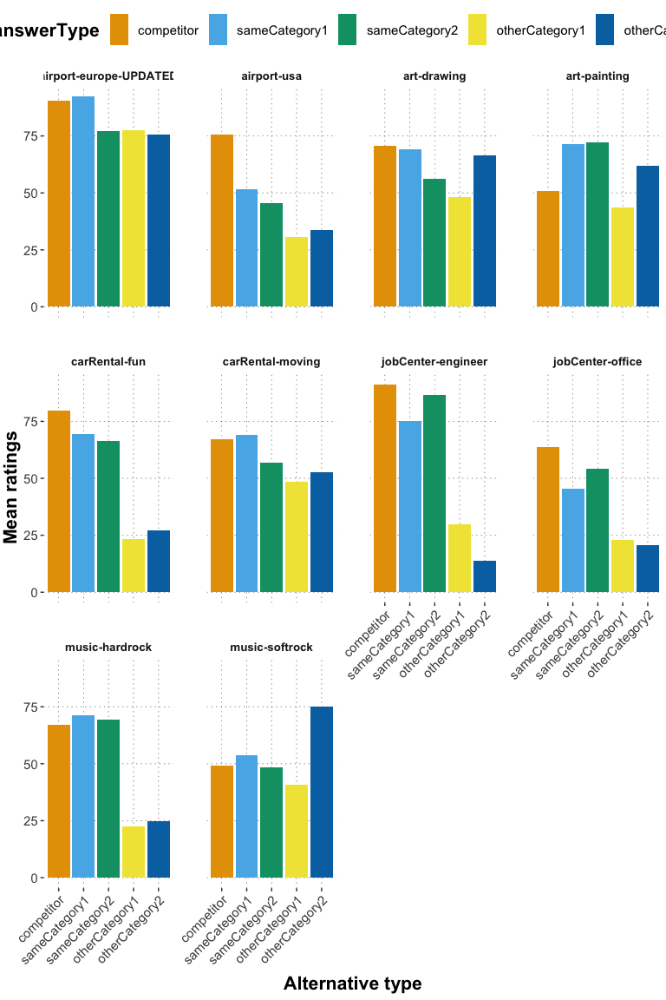
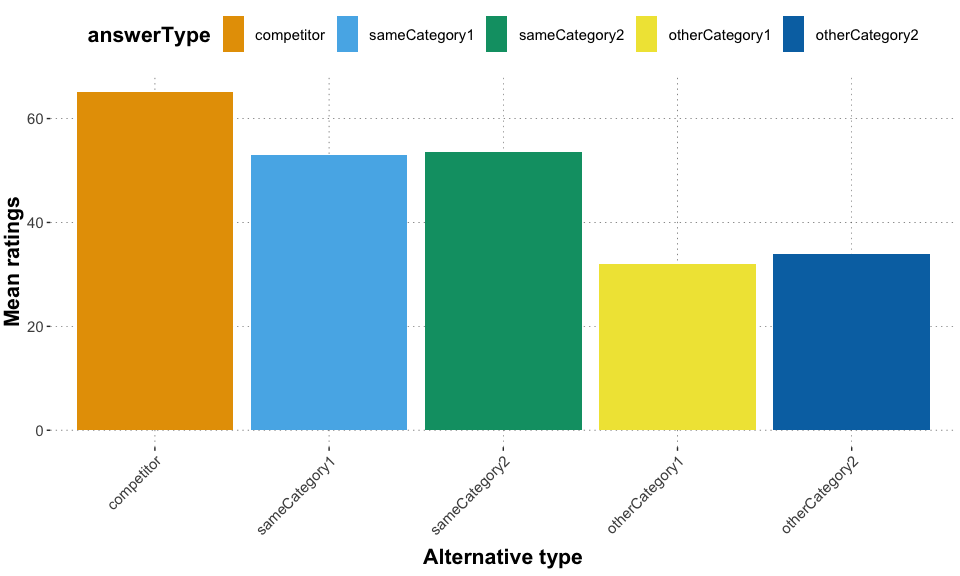
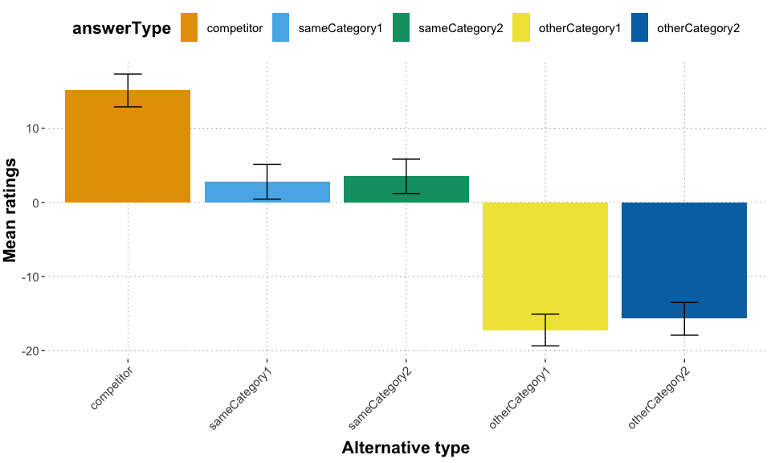
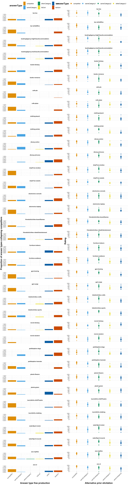
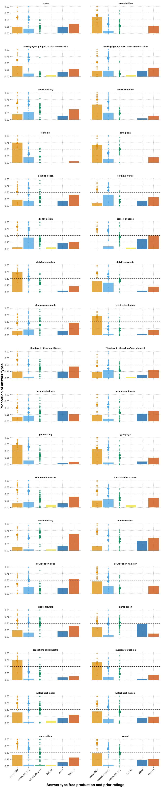

QA prior elicitation & free typing analysis
================
Polina Tsvilodub
2022-11-06

## Intro

Below, exploratory analysis of the prior elicitation QA experiment data
can be found. In the end, the results are compared against the free
production results. Details of the free production analysis can be found
[here](https://github.com/magpie-ea/magpie3-qa-overinfo-free-production/blob/main/data%2Banalysis/01_main_free_typing_analysis.md).

Participants failing all attention checks (3 out of 11 trials) are
excluded from analysis. The attention checks consisted of trials where
participants read instructions to move all sliders all the way to the
left or to the right.

    ## # A tibble: 10 x 3
    ##    itemName               passed_subj     n
    ##    <chr>                  <lgl>       <int>
    ##  1 airport-europe-UPDATED FALSE          20
    ##  2 airport-usa            FALSE          45
    ##  3 art-drawing            FALSE          40
    ##  4 art-painting           FALSE          20
    ##  5 carRental-fun          FALSE          40
    ##  6 carRental-moving       FALSE          25
    ##  7 jobCenter-engineer     FALSE          15
    ##  8 jobCenter-office       FALSE          30
    ##  9 music-hardrock         FALSE          30
    ## 10 music-softrock         FALSE          20

    ## Numbrer of subjects who failed attention checks:  19

    ## 
    ## Subject exclusion rate:  0.2375

To understand what is going on in the attention checks, plot the ratings
in the attention checking trials only, selecting participants who
failed. It seems that many participants simply ignored the instructions
and followed “anticipated” ratings.

``` r
df_attention %>%
  filter(submission_id %in% subj_id_attention_fails) %>%
  mutate(answerType = factor(answerType, levels=answerOrder)) %>%
  group_by(itemName, answerType) %>%
  summarize(mean_response = mean(response)) %>%
  ggplot(aes(x = answerType, fill = answerType, y = mean_response)) +
  geom_col() +
  facet_wrap(itemName~., ncol=4) +
  theme(axis.text.x = element_text(angle = 45, hjust = 1)) +
  theme(strip.text.x = element_text(size = 10)) +
  theme(panel.spacing = unit(2, "lines")) +
  ylab("Mean ratings") +
  xlab("Alternative type")
```

    ## `summarise()` regrouping output by 'itemName' (override with `.groups` argument)

<!-- -->

We further exclude participants who provide the same responses on all
trials (i.e. responses within the range of 5 points, basically just
click trough the experiment).

    ## # A tibble: 40 x 6
    ## # Groups:   submission_id [1]
    ##    itemName        submission_id answerType   response centered_respon… bad_subj
    ##    <chr>                   <dbl> <chr>           <dbl>            <dbl> <lgl>   
    ##  1 petAdoption-do…          4476 competitor          0              -50 TRUE    
    ##  2 petAdoption-do…          4476 sameCategor…        0              -50 TRUE    
    ##  3 petAdoption-do…          4476 sameCategor…        0              -50 TRUE    
    ##  4 petAdoption-do…          4476 otherCatego…        0              -50 TRUE    
    ##  5 petAdoption-do…          4476 otherCatego…        0              -50 TRUE    
    ##  6 touristInfo-ch…          4476 competitor          3              -47 TRUE    
    ##  7 touristInfo-ch…          4476 sameCategor…        3              -47 TRUE    
    ##  8 touristInfo-ch…          4476 sameCategor…        3              -47 TRUE    
    ##  9 touristInfo-ch…          4476 otherCatego…        3              -47 TRUE    
    ## 10 touristInfo-ch…          4476 otherCatego…        3              -47 TRUE    
    ## # … with 30 more rows

    ## 
    ## number of subjects who provided the same responses within 5 points on all main trials: 1

Characteristics of the analysed clean dataset:

    ## 
    ## Number of analysed vignette responses:  480

    ## # A tibble: 36 x 2
    ##    itemName                                 n
    ##    <chr>                                <int>
    ##  1 bar-tea                                  7
    ##  2 bar-whiteWine                           16
    ##  3 bookingAgency-highClassAccommodation     9
    ##  4 bookingAgency-lowClassAccommodation     18
    ##  5 books-fantasy                           13
    ##  6 books-romance                           11
    ##  7 cafe-pie                                10
    ##  8 cafe-pizza                              14
    ##  9 clothing-beach                          16
    ## 10 clothing-winter                         10
    ## # … with 26 more rows

    ## 
    ## average number of responses per vignette: 13.33333

    ## 
    ## vignette with most responses:  bookingAgency-lowClassAccommodation 18

    ## 
    ## vignette with least responses:  bar-tea 7

The first plot below shows the raw prior ratings (y-axis) against the
alternative category (i.e., competitor, sameCategory1, otherCategory1
etc; x-axis). The second plot shows only by-vignette by-alternative
average ratings across participants. The horizontal dashed line
represents no change in beliefs of the participants about the
alternative, given the context. The error bars represent 95%
bootstrapped credible intervals.

    ## Warning: `as_data_frame()` is deprecated as of tibble 2.0.0.
    ## Please use `as_tibble()` instead.
    ## The signature and semantics have changed, see `?as_tibble`.
    ## This warning is displayed once every 8 hours.
    ## Call `lifecycle::last_warnings()` to see where this warning was generated.

    ## Warning: `cols` is now required when using unnest().
    ## Please use `cols = c(strap)`

    ## `summarise()` regrouping output by 'itemName' (override with `.groups` argument)

<!-- --><!-- -->

The global plot below shows by-category ratings averaging over
vignettes. The error bars represent 95% bootstrapped credible intervals.

    ## Warning: `cols` is now required when using unnest().
    ## Please use `cols = c(strap)`

<!-- -->

The plot below shows the raw by-vignette by-alternative ratings (small
points) with labels representing the actual alternative options. The
large points indicate the by-vignette by-alternative means. **Please
note the varying order of the answer alternative categories on the
x-axis (color).**

    ## `summarise()` regrouping output by 'answerOption_string', 'answerType' (override
    ## with `.groups` argument)

<!-- -->

## Comparing prior ratings to free production

The plot below combines free production response rates with prior
ratings. More specifically, the x axis shows the categorized free
production response proportions (over participants) as bars. The prior
elicitation raw responses were collapsed into the categories
‘competitor’, ‘sameCategory’ (comprising ratings for ‘sameCategory1’ and
‘sameCategory2’ alternatives, respectively) and ‘otherCategory’
(collapsing ‘otherCategory1’ and ‘otherCategory2’ ratings). The raw
responses (samller points) as well as by-item by-alternative means
(larger points) are added in the respective answer categories for easier
comparison. The horizontal dashed line represents no change in
participants’ beliefs in the prior rating experiment.

<!-- -->
Fit a linear model as a baseline, predicting the response type
proportion from the respective prior rating:

``` r
df_long_scaled4lm <- df_clean_main_wItems_long2_scaled %>% 
  select(itemName, answerType, mean_response) %>%
  unique() %>% 
  pivot_wider(names_from = "answerType", values_from = "mean_response", values_fn = mean) %>%
  pivot_longer(cols = -itemName, names_to = "answerType", values_to = "mean_rating")

df_prior_freeProd <- d_clean_main_collapsedCompetitor_summary_100 %>% 
  left_join(., df_long_scaled4lm, by=c('itemName', 'answerType')) %>%
  filter(answerType %in% c("competitor", "sameCategory", "otherCategory"))

lm_freeProd_prior <- lme4::lmer(responseCategory_proportion ~ mean_rating + (1 | itemName), data = df_prior_freeProd)
summary(lm_freeProd_prior)
```

    ## Linear mixed model fit by REML ['lmerMod']
    ## Formula: responseCategory_proportion ~ mean_rating + (1 | itemName)
    ##    Data: df_prior_freeProd
    ## 
    ## REML criterion at convergence: -38.9
    ## 
    ## Scaled residuals: 
    ##      Min       1Q   Median       3Q      Max 
    ## -2.29214 -0.62103  0.03121  0.33244  2.04832 
    ## 
    ## Random effects:
    ##  Groups   Name        Variance Std.Dev.
    ##  itemName (Intercept) 0.003313 0.05756 
    ##  Residual             0.027900 0.16703 
    ## Number of obs: 70, groups:  itemName, 36
    ## 
    ## Fixed effects:
    ##             Estimate Std. Error t value
    ## (Intercept) -0.24585    0.09901  -2.483
    ## mean_rating  0.87237    0.16320   5.345
    ## 
    ## Correlation of Fixed Effects:
    ##             (Intr)
    ## mean_rating -0.974

## Exploratory analysis without participant exclusions

Since a relatively large proportion of participants was excluded due to
attention check failure, the plot below explores whether there are
qualitative differences between the cleaned results with 60 subjects and
non-cleaned results with 80 subjects. This does not seem to be the case.

<!-- -->

## Extracting weakest items

Below, the vignettes are sorted in terms of difference between mean
sizes. The items with smaller differences are taken to be weaker items.

``` r
df_weak_items <- df_clean_main_summary_unique %>% group_by(itemName) %>%
  mutate(response_range = max(mean) - min(mean)) %>%
  arrange(response_range)

df_weak_items %>% select(itemName, response_range) %>% unique()
```

    ## # A tibble: 36 x 2
    ## # Groups:   itemName [36]
    ##    itemName                             response_range
    ##    <chr>                                         <dbl>
    ##  1 electronics-console                            8.82
    ##  2 plants-green                                  17.6 
    ##  3 plants-flowers                                17.9 
    ##  4 friendsActivities-videoEntertainment          20.9 
    ##  5 furniture-indoors                             21.5 
    ##  6 movie-fantasy                                 24.5 
    ##  7 waterSport-motor                              27.2 
    ##  8 cafe-pizza                                    29.7 
    ##  9 disney-princess                               29.9 
    ## 10 dutyFree-sweets                               30.5 
    ## # … with 26 more rows

``` r
cat("Top 10 weakes items (worst to best): ", df_weak_items %>% pull(itemName) %>% unique() %>% .[1:10])
```

    ## Top 10 weakes items (worst to best):  electronics-console plants-green plants-flowers friendsActivities-videoEntertainment furniture-indoors movie-fantasy waterSport-motor cafe-pizza disney-princess dutyFree-sweets

Below, several further computations try to extract in a principled way
which items did not work well based on free production + slider rating
results.

For checking if the prior elicitation values are predictive of the
proportion of free production response patterns (specifically, taciturn
rate), several metrics on prior elicitation results can be computed:

Option 1: compute the difference between the mean (by-vignette)
competitor rating and the highest alternative rating. A difference of 0
indicates that the competitor was rated highest, while a negative
difference means that another option was rated higher.

Option 2: compute the difference between the competitor rating and the
mean over the same category alternatives (a) or other category
alternatives (b).

Option 3: compute the average change in beliefs (i.e., the absolute
difference to the rating 50 ) of the competitor (an approximation of the
presence of an obvious alternative). Vignettes with smallest difference
are assumed to be weakest.

For checking if vignette worked well overall, we focus on the pattern of
the free production data. More specifically, we assume that the
prototype response pattern would put 0.7 of responses into the
competitor category and 0.3 of responses into sameCategory responses,
and 0 in other response categories.

Option 4: compute a distance between the prototype distribution and the
observed distribution – Wasserstein distance

Option 5: TBD: compute mean differences on prior elicitation data but
add some uncertainty term

``` r
# option 1: compute differences between competitor and the most salient other option
df_clean_main_summary_unique_wide <- df_clean_main_summary_unique %>%
  group_by(itemName) %>%
  mutate(max_rating = max(mean)) %>% ungroup() %>%
  pivot_wider(id_cols = c("itemName", "answerType", "max_rating"), names_from = "answerType", values_from = "mean") %>%
  rowwise() %>%
  mutate(competitor_vs_maxAlternative = competitor - max_rating,
         competitor_vs_sameCategory = competitor - mean(sameCategory1, sameCategory2), # option 2a
         competitor_vs_otherCategory = competitor - mean(otherCategory1, otherCategory2), # option 2b
          sameCat_changeBeliefs = competitor-50) # option 3 
```

    ## worst items according to option 1:  bookingAgency-lowClassAccommodation petAdoption-dogs clothing-beach movie-fantasy kidsActivities-sports bookingAgency-highClassAccommodation clothing-winter books-fantasy friendsActivities-videoEntertainment bar-tea

    ## 
    ## worst items according to option 2a (difference to same category):  bookingAgency-lowClassAccommodation petAdoption-dogs clothing-beach bookingAgency-highClassAccommodation books-fantasy bar-tea gym-yoga electronics-console disney-princess clothing-winter

    ## 
    ## worst items according to option 2b (difference to other category):  electronics-console plants-flowers movie-fantasy cafe-pizza plants-green friendsActivities-videoEntertainment clothing-beach furniture-indoors petAdoption-dogs waterSport-motor

    ## 
    ## worst items according to option 3 (change in beliefs for competitor):  petAdoption-dogs electronics-console friendsActivities-videoEntertainment furniture-indoors clothing-beach bookingAgency-lowClassAccommodation movie-fantasy plants-green bar-tea plants-flowers

Option 4:

``` r
d_clean_main_collapsedCompetitor_summary_100_wBaseline <- d_clean_main_collapsedCompetitor_summary_100 %>%
  mutate(expected_prop = case_when(
    answerType == "competitor" ~ 0.7,
    answerType == "sameCategory" ~ 0.3,
    TRUE ~ 0.00001
  ))

d_clean_main_collapsedCompetitor_summary_100_wBaseline <- d_clean_main_collapsedCompetitor_summary_100_wBaseline %>% group_by(itemName) %>%
  mutate(wasserstein_dist = sum(abs(responseCategory_proportion - expected_prop)))

cat("items with the largest Wasserstein distance relative to expected free production distribution:  ", d_clean_main_collapsedCompetitor_summary_100_wBaseline %>% arrange(desc(wasserstein_dist)) %>% pull(itemName) %>% unique() %>% .[1:10])
```

    ## items with the largest Wasserstein distance relative to expected free production distribution:   movie-fantasy friendsActivities-boardGames movie-western furniture-outdoors kidsActivities-crafts disney-action plants-green furniture-indoors electronics-console clothing-winter

As an alternative which might be more appropriate for a discrete
distribution, compute KL divergence between observed and expected
distribution.

``` r
itemNames <- d_clean_main_collapsedCompetitor_summary_100_wBaseline %>% arrange(itemName) %>% pull(itemName) %>% unique()

kl_divs <- c()

for (i in itemNames) {
  
  observed_dist <- d_clean_main_collapsedCompetitor_summary_100_wBaseline %>% filter(itemName == i) %>% arrange(answerType) %>% .$responseCategory_proportion
  expected_dist <- d_clean_main_collapsedCompetitor_summary_100_wBaseline %>% filter(itemName == i) %>% arrange(answerType) #%>% .$expected_prop
  if (sum(expected_dist$expected_prop) > 1) {
    expected_dist[expected_dist$answerType=='sameCategory', 'expected_prop'] <- 0.3 - 0.00001 * (length(observed_dist) - 2)
  }
  
  expected_dist <- expected_dist %>% .$expected_prop
  
  x <- rbind(observed_dist, expected_dist) 
  kl <- KL(x)
  kl_divs <- append(kl_divs, as.numeric(kl))
}
```

    ## Metric: 'kullback-leibler' using unit: 'log2'; comparing: 2 vectors.
    ## Metric: 'kullback-leibler' using unit: 'log2'; comparing: 2 vectors.
    ## Metric: 'kullback-leibler' using unit: 'log2'; comparing: 2 vectors.
    ## Metric: 'kullback-leibler' using unit: 'log2'; comparing: 2 vectors.
    ## Metric: 'kullback-leibler' using unit: 'log2'; comparing: 2 vectors.
    ## Metric: 'kullback-leibler' using unit: 'log2'; comparing: 2 vectors.
    ## Metric: 'kullback-leibler' using unit: 'log2'; comparing: 2 vectors.
    ## Metric: 'kullback-leibler' using unit: 'log2'; comparing: 2 vectors.
    ## Metric: 'kullback-leibler' using unit: 'log2'; comparing: 2 vectors.
    ## Metric: 'kullback-leibler' using unit: 'log2'; comparing: 2 vectors.
    ## Metric: 'kullback-leibler' using unit: 'log2'; comparing: 2 vectors.
    ## Metric: 'kullback-leibler' using unit: 'log2'; comparing: 2 vectors.
    ## Metric: 'kullback-leibler' using unit: 'log2'; comparing: 2 vectors.
    ## Metric: 'kullback-leibler' using unit: 'log2'; comparing: 2 vectors.
    ## Metric: 'kullback-leibler' using unit: 'log2'; comparing: 2 vectors.
    ## Metric: 'kullback-leibler' using unit: 'log2'; comparing: 2 vectors.
    ## Metric: 'kullback-leibler' using unit: 'log2'; comparing: 2 vectors.
    ## Metric: 'kullback-leibler' using unit: 'log2'; comparing: 2 vectors.
    ## Metric: 'kullback-leibler' using unit: 'log2'; comparing: 2 vectors.
    ## Metric: 'kullback-leibler' using unit: 'log2'; comparing: 2 vectors.
    ## Metric: 'kullback-leibler' using unit: 'log2'; comparing: 2 vectors.
    ## Metric: 'kullback-leibler' using unit: 'log2'; comparing: 2 vectors.
    ## Metric: 'kullback-leibler' using unit: 'log2'; comparing: 2 vectors.
    ## Metric: 'kullback-leibler' using unit: 'log2'; comparing: 2 vectors.
    ## Metric: 'kullback-leibler' using unit: 'log2'; comparing: 2 vectors.
    ## Metric: 'kullback-leibler' using unit: 'log2'; comparing: 2 vectors.
    ## Metric: 'kullback-leibler' using unit: 'log2'; comparing: 2 vectors.
    ## Metric: 'kullback-leibler' using unit: 'log2'; comparing: 2 vectors.
    ## Metric: 'kullback-leibler' using unit: 'log2'; comparing: 2 vectors.
    ## Metric: 'kullback-leibler' using unit: 'log2'; comparing: 2 vectors.
    ## Metric: 'kullback-leibler' using unit: 'log2'; comparing: 2 vectors.
    ## Metric: 'kullback-leibler' using unit: 'log2'; comparing: 2 vectors.
    ## Metric: 'kullback-leibler' using unit: 'log2'; comparing: 2 vectors.
    ## Metric: 'kullback-leibler' using unit: 'log2'; comparing: 2 vectors.
    ## Metric: 'kullback-leibler' using unit: 'log2'; comparing: 2 vectors.
    ## Metric: 'kullback-leibler' using unit: 'log2'; comparing: 2 vectors.

``` r
kl_divs
```

    ##  [1]  8.2437457  3.9618165  6.6400199  7.9216805  7.3910812  2.0816886
    ##  [7]  0.5720545  2.6546327  8.3399050  7.2473664  7.5477302 13.7096815
    ## [13]  3.7286617  3.2268571  8.9796874  3.0414063 10.6876804  6.8382030
    ## [19]  9.0059496  9.4982241  1.7084898  4.4616141  9.0744349  6.0201135
    ## [25] 12.3663661 12.6064759 11.4527131  3.6980451  8.4569034  9.3922394
    ## [31]  2.9848103  2.9714129  7.6709774  5.4236361  7.2960093  6.5754196

``` r
kl_df <- tibble('itemName' = itemNames, 'kl' = kl_divs) %>% arrange(desc(kl))
kl_df
```

    ## # A tibble: 36 x 2
    ##    itemName                        kl
    ##    <chr>                        <dbl>
    ##  1 disney-princess              13.7 
    ##  2 movie-western                12.6 
    ##  3 movie-fantasy                12.4 
    ##  4 petAdoption-dogs             11.5 
    ##  5 friendsActivities-boardGames 10.7 
    ##  6 furniture-outdoors            9.50
    ##  7 plants-green                  9.39
    ##  8 kidsActivities-crafts         9.07
    ##  9 furniture-indoors             9.01
    ## 10 electronics-console           8.98
    ## # … with 26 more rows

Checking if either measure derived from the prior elicitation correlates
well with the Wasserstein results or the raw taciturn proportion:

    ## correlation of by-vignette free production Wasserstein distances and prior elicitation differences between competitor and most salient alternative:  -0.2452675

    ## 
    ## 
    ## correlation of by-vignette free production Wasserstein distances and prior elicitation differences between competitor and same category alternatives:  -0.3576336

    ## 
    ## 
    ## correlation of by-vignette free production Wasserstein distances and prior elicitation differences between competitor and other category alternatives:  -0.4730249

    ## 
    ## 
    ## correlation of by-vignette free production Wasserstein distances and prior elicitation changes in beliefs for competitor:  -0.2600611

    ## correlation of by-vignette free production taciturn response proportions and prior elicitation differences between competitor and most salient alternative:  -0.4523311

    ## 
    ## 
    ## correlation of by-vignette free production taciturn response proportions and prior elicitation differences between competitor and same category alternatives:  -0.4336889

    ## 
    ## 
    ## correlation of by-vignette free production taciturn response proportions and prior elicitation differences between competitor and other category alternatives:  -0.4771239

    ## 
    ## 
    ## correlation of by-vignette free production taciturn response proportions and prior elicitation changes in beliefs for competitor:  -0.4134888

Alternatively, fitting linear models:

    ## predicting by-vignette free production Wasserstein distances as a function of prior elicitation differences between competitor and most salient alternative:

    ## 
    ## Call:
    ## lm(formula = wasserstein_dist_alpha ~ competitor_vs_maxAlternative_alpha)
    ## 
    ## Residuals:
    ##      Min       1Q   Median       3Q      Max 
    ## -0.68055 -0.34418  0.04744  0.32976  0.61943 
    ## 
    ## Coefficients:
    ##                                    Estimate Std. Error t value Pr(>|t|)    
    ## (Intercept)                         0.88054    0.07226  12.186 5.88e-14 ***
    ## competitor_vs_maxAlternative_alpha -0.01851    0.01255  -1.475    0.149    
    ## ---
    ## Signif. codes:  0 '***' 0.001 '**' 0.01 '*' 0.05 '.' 0.1 ' ' 1
    ## 
    ## Residual standard error: 0.3828 on 34 degrees of freedom
    ## Multiple R-squared:  0.06016,    Adjusted R-squared:  0.03251 
    ## F-statistic: 2.176 on 1 and 34 DF,  p-value: 0.1494

    ## 
    ## 
    ## predicting by-vignette free production Wasserstein distances as a function of prior elicitation differences between competitor and same category alternatives:

    ## 
    ## Call:
    ## lm(formula = wasserstein_dist_alpha ~ competitor_vs_sameCategory_alpha)
    ## 
    ## Residuals:
    ##      Min       1Q   Median       3Q      Max 
    ## -0.64057 -0.32755  0.00602  0.25828  0.72589 
    ## 
    ## Coefficients:
    ##                                   Estimate Std. Error t value Pr(>|t|)    
    ## (Intercept)                       1.044579   0.079900  13.074  8.1e-15 ***
    ## competitor_vs_sameCategory_alpha -0.009332   0.004179  -2.233   0.0322 *  
    ## ---
    ## Signif. codes:  0 '***' 0.001 '**' 0.01 '*' 0.05 '.' 0.1 ' ' 1
    ## 
    ## Residual standard error: 0.3688 on 34 degrees of freedom
    ## Multiple R-squared:  0.1279, Adjusted R-squared:  0.1023 
    ## F-statistic: 4.986 on 1 and 34 DF,  p-value: 0.03224

    ## 
    ## 
    ## predicting by-vignette free production Wasserstein distances as a function of prior elicitation differences between competitor and other category alternatives:

    ## 
    ## Call:
    ## lm(formula = wasserstein_dist_alpha ~ competitor_vs_otherCategory_alpha)
    ## 
    ## Residuals:
    ##      Min       1Q   Median       3Q      Max 
    ## -0.82555 -0.22504  0.02147  0.31552  0.60380 
    ## 
    ## Coefficients:
    ##                                    Estimate Std. Error t value Pr(>|t|)    
    ## (Intercept)                        1.400315   0.160864   8.705 3.59e-10 ***
    ## competitor_vs_otherCategory_alpha -0.014188   0.004532  -3.131  0.00357 ** 
    ## ---
    ## Signif. codes:  0 '***' 0.001 '**' 0.01 '*' 0.05 '.' 0.1 ' ' 1
    ## 
    ## Residual standard error: 0.3479 on 34 degrees of freedom
    ## Multiple R-squared:  0.2238, Adjusted R-squared:  0.2009 
    ## F-statistic:   9.8 on 1 and 34 DF,  p-value: 0.003574

    ## 
    ## 
    ## predicting by-vignette free production Wasserstein distances as a function of prior elicitation changes in beliefs for competitor:

    ## 
    ## Call:
    ## lm(formula = wasserstein_dist_alpha ~ competitor_vs_beliefsChange_alpha)
    ## 
    ## Residuals:
    ##     Min      1Q  Median      3Q     Max 
    ## -0.6636 -0.3278  0.1007  0.2676  0.6757 
    ## 
    ## Coefficients:
    ##                                    Estimate Std. Error t value Pr(>|t|)   
    ## (Intercept)                        0.610548   0.213461    2.86  0.00719 **
    ## competitor_vs_beliefsChange_alpha -0.009186   0.005849   -1.57  0.12557   
    ## ---
    ## Signif. codes:  0 '***' 0.001 '**' 0.01 '*' 0.05 '.' 0.1 ' ' 1
    ## 
    ## Residual standard error: 0.3813 on 34 degrees of freedom
    ## Multiple R-squared:  0.06763,    Adjusted R-squared:  0.04021 
    ## F-statistic: 2.466 on 1 and 34 DF,  p-value: 0.1256

    ## predicting by-vignette free production taciturn response proportions as a function of prior elicitation differences between competitor and most salient alternative:

    ## 
    ## Call:
    ## lm(formula = taciturn_props ~ competitor_vs_maxAlternative_alpha)
    ## 
    ## Residuals:
    ##      Min       1Q   Median       3Q      Max 
    ## -0.22071 -0.07263 -0.01118  0.06831  0.22929 
    ## 
    ## Coefficients:
    ##                                     Estimate Std. Error t value Pr(>|t|)    
    ## (Intercept)                         0.270710   0.022325  12.126 6.74e-14 ***
    ## competitor_vs_maxAlternative_alpha -0.011467   0.003877  -2.957  0.00561 ** 
    ## ---
    ## Signif. codes:  0 '***' 0.001 '**' 0.01 '*' 0.05 '.' 0.1 ' ' 1
    ## 
    ## Residual standard error: 0.1183 on 34 degrees of freedom
    ## Multiple R-squared:  0.2046, Adjusted R-squared:  0.1812 
    ## F-statistic: 8.746 on 1 and 34 DF,  p-value: 0.005609

    ## 
    ## 
    ## predicting by-vignette free production taciturn response proportions as a function of prior elicitation differences between competitor and same category alternatives:

    ## 
    ## Call:
    ## lm(formula = taciturn_props ~ competitor_vs_sameCategory_alpha)
    ## 
    ## Residuals:
    ##      Min       1Q   Median       3Q      Max 
    ## -0.21634 -0.07681 -0.01331  0.07067  0.31916 
    ## 
    ## Coefficients:
    ##                                   Estimate Std. Error t value Pr(>|t|)    
    ## (Intercept)                       0.348130   0.025891  13.446 3.62e-15 ***
    ## competitor_vs_sameCategory_alpha -0.003800   0.001354  -2.806  0.00823 ** 
    ## ---
    ## Signif. codes:  0 '***' 0.001 '**' 0.01 '*' 0.05 '.' 0.1 ' ' 1
    ## 
    ## Residual standard error: 0.1195 on 34 degrees of freedom
    ## Multiple R-squared:  0.1881, Adjusted R-squared:  0.1642 
    ## F-statistic: 7.876 on 1 and 34 DF,  p-value: 0.00823

    ## 
    ## 
    ## predicting by-vignette free production taciturn response proportions as a function of prior elicitation differences between competitor and other category alternatives:

    ## 
    ## Call:
    ## lm(formula = taciturn_props ~ competitor_vs_otherCategory_alpha)
    ## 
    ## Residuals:
    ##      Min       1Q   Median       3Q      Max 
    ## -0.25871 -0.08108  0.02200  0.07270  0.20701 
    ## 
    ## Coefficients:
    ##                                    Estimate Std. Error t value Pr(>|t|)    
    ## (Intercept)                        0.460822   0.053887   8.552 5.46e-10 ***
    ## competitor_vs_otherCategory_alpha -0.004806   0.001518  -3.166  0.00326 ** 
    ## ---
    ## Signif. codes:  0 '***' 0.001 '**' 0.01 '*' 0.05 '.' 0.1 ' ' 1
    ## 
    ## Residual standard error: 0.1165 on 34 degrees of freedom
    ## Multiple R-squared:  0.2276, Adjusted R-squared:  0.2049 
    ## F-statistic: 10.02 on 1 and 34 DF,  p-value: 0.003258

    ## 
    ## 
    ## predicting by-vignette free production taciturn response proportions as a function of prior elicitation changes in beliefs for competitor:

    ## 
    ## Call:
    ## lm(formula = taciturn_props ~ competitor_vs_beliefsChange_alpha)
    ## 
    ## Residuals:
    ##      Min       1Q   Median       3Q      Max 
    ## -0.21595 -0.09147  0.01111  0.06403  0.29105 
    ## 
    ## Coefficients:
    ##                                    Estimate Std. Error t value Pr(>|t|)  
    ## (Intercept)                        0.130821   0.067597   1.935   0.0613 .
    ## competitor_vs_beliefsChange_alpha -0.004905   0.001852  -2.648   0.0122 *
    ## ---
    ## Signif. codes:  0 '***' 0.001 '**' 0.01 '*' 0.05 '.' 0.1 ' ' 1
    ## 
    ## Residual standard error: 0.1207 on 34 degrees of freedom
    ## Multiple R-squared:  0.171,  Adjusted R-squared:  0.1466 
    ## F-statistic: 7.012 on 1 and 34 DF,  p-value: 0.01219

Combine all these results to see if the selected vignettes overlap.
Additionally, manually extracted (by Polina) weak items are added.

Option 5: explore influence of adding standard deviation on predicting
wasserstein distance / taciturn response proportion

``` r
# extract mean + SD by item
sliderRating_competitor_mean_sd_sum <- df_clean_main_summary_sd %>% filter(answerType == "competitor") %>%
  select(itemName, mean, sd) %>% unique() 
sliderRating_sameCat_mean_sd_sum <- df_clean_main_summary_sd %>% filter(answerType == "sameCategory") %>%
  select(itemName, mean, sd) %>% unique() 

lm_comp_wSD <- lm(wasserstein_dist_alpha ~ sliderRating_competitor_mean_sd_sum$mean + sliderRating_competitor_mean_sd_sum$sd)
summary(lm_comp_wSD)
```

    ## 
    ## Call:
    ## lm(formula = wasserstein_dist_alpha ~ sliderRating_competitor_mean_sd_sum$mean + 
    ##     sliderRating_competitor_mean_sd_sum$sd)
    ## 
    ## Residuals:
    ##      Min       1Q   Median       3Q      Max 
    ## -0.62541 -0.32570  0.05164  0.29573  0.66948 
    ## 
    ## Coefficients:
    ##                                           Estimate Std. Error t value Pr(>|t|)
    ## (Intercept)                               0.825764   0.426102   1.938   0.0612
    ## sliderRating_competitor_mean_sd_sum$mean -0.005667   0.008467  -0.669   0.5079
    ## sliderRating_competitor_mean_sd_sum$sd    0.008494   0.014277   0.595   0.5559
    ##                                           
    ## (Intercept)                              .
    ## sliderRating_competitor_mean_sd_sum$mean  
    ## sliderRating_competitor_mean_sd_sum$sd    
    ## ---
    ## Signif. codes:  0 '***' 0.001 '**' 0.01 '*' 0.05 '.' 0.1 ' ' 1
    ## 
    ## Residual standard error: 0.3846 on 33 degrees of freedom
    ## Multiple R-squared:  0.07913,    Adjusted R-squared:  0.02332 
    ## F-statistic: 1.418 on 2 and 33 DF,  p-value: 0.2566

``` r
lm_sameCat_wSD <- lm(wasserstein_dist_alpha ~ sliderRating_sameCat_mean_sd_sum$mean + sliderRating_sameCat_mean_sd_sum$sd)
summary(lm_sameCat_wSD)
```

    ## 
    ## Call:
    ## lm(formula = wasserstein_dist_alpha ~ sliderRating_sameCat_mean_sd_sum$mean + 
    ##     sliderRating_sameCat_mean_sd_sum$sd)
    ## 
    ## Residuals:
    ##      Min       1Q   Median       3Q      Max 
    ## -0.76952 -0.21927  0.01535  0.26117  0.79755 
    ## 
    ## Coefficients:
    ##                                        Estimate Std. Error t value Pr(>|t|)  
    ## (Intercept)                            0.975913   0.391031   2.496   0.0177 *
    ## sliderRating_sameCat_mean_sd_sum$mean  0.010384   0.005515   1.883   0.0686 .
    ## sliderRating_sameCat_mean_sd_sum$sd   -0.003265   0.015715  -0.208   0.8367  
    ## ---
    ## Signif. codes:  0 '***' 0.001 '**' 0.01 '*' 0.05 '.' 0.1 ' ' 1
    ## 
    ## Residual standard error: 0.3791 on 33 degrees of freedom
    ## Multiple R-squared:  0.1054, Adjusted R-squared:  0.05122 
    ## F-statistic: 1.945 on 2 and 33 DF,  p-value: 0.1591

Note of more analysis options: KL divergence? Bootstrapping idea? also
compute Wasserstein distance (or thelike) on the slider rating results,
and compare that value to the values from free production?

## Preprocessing for RSA model fitting

``` r
# TODO: z-scoring?
df_clean_main_long_zScored <- df_clean_main_wItems_long %>% 
  group_by(itemName, answerType) %>%
  mutate(mean = mean(response),
         sd = sd(response),
         response_zscored = (response - mean) / sd,
         response_zscored = ifelse(is.na(response_zscored), 0, response_zscored),
         mean_zScored = mean(response_zscored)) 

df_clean_main_long_zScored_unique <- df_clean_main_long_zScored %>% 
  select(itemName, answerType, mean, mean_zScored) %>% unique()

#df_clean_main_long_zScored_unique %>% write_csv("priorElicitation_byVignette_byCategory_means.csv")
```
