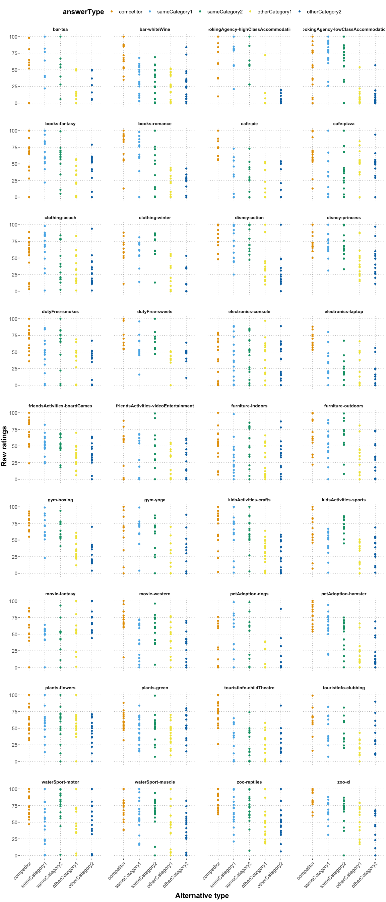
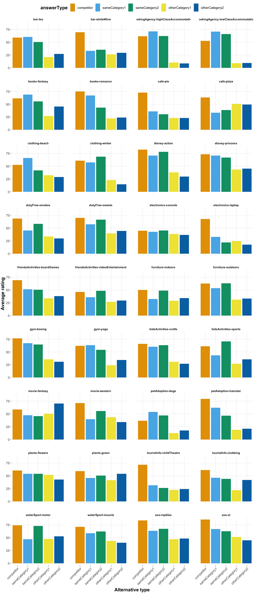
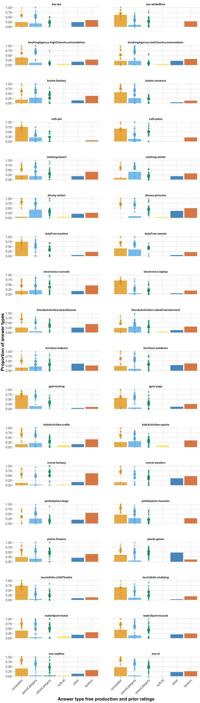
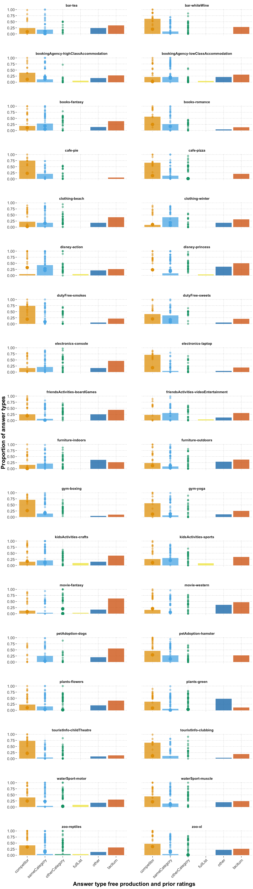

QA prior elicitation & free typing analysis
================
Polina Tsvilodub
2022-11-06

## Intro

Below, exploratory analysis of the prior elicitation QA experiment data
can be found. In the end, the results are compared against the free
production results. Details of the free production analysis can be found
[here](https://github.com/magpie-ea/magpie3-qa-overinfo-free-production/blob/main/data%2Banalysis/01_main_free_typing_analysis.md).

Participants failing all attention checks (3 out of 11 trials) are
excluded from analysis. The attention checks consisted of trials where
participants read instructions to move all sliders all the way to the
left or to the right.

    ## # A tibble: 10 x 3
    ##    itemName               passed_subj     n
    ##    <chr>                  <lgl>       <int>
    ##  1 airport-europe-UPDATED FALSE          20
    ##  2 airport-usa            FALSE          45
    ##  3 art-drawing            FALSE          40
    ##  4 art-painting           FALSE          20
    ##  5 carRental-fun          FALSE          40
    ##  6 carRental-moving       FALSE          25
    ##  7 jobCenter-engineer     FALSE          15
    ##  8 jobCenter-office       FALSE          30
    ##  9 music-hardrock         FALSE          30
    ## 10 music-softrock         FALSE          20

    ## Numbrer of subjects who failed attention checks:  19

    ## 
    ## Subject exclusion rate:  0.2375

We further exclude participants who provide the same responses on all
trials (i.e. responses within the range of 5 points, basically just
click trough the experiment).

    ## # A tibble: 40 x 5
    ## # Groups:   submission_id [1]
    ##    itemName                 submission_id answerType     response bad_subj
    ##    <chr>                            <dbl> <chr>             <dbl> <lgl>   
    ##  1 petAdoption-dogs                  4476 competitor            0 TRUE    
    ##  2 petAdoption-dogs                  4476 sameCategory1         0 TRUE    
    ##  3 petAdoption-dogs                  4476 sameCategory2         0 TRUE    
    ##  4 petAdoption-dogs                  4476 otherCategory1        0 TRUE    
    ##  5 petAdoption-dogs                  4476 otherCategory2        0 TRUE    
    ##  6 touristInfo-childTheatre          4476 competitor            3 TRUE    
    ##  7 touristInfo-childTheatre          4476 sameCategory1         3 TRUE    
    ##  8 touristInfo-childTheatre          4476 sameCategory2         3 TRUE    
    ##  9 touristInfo-childTheatre          4476 otherCategory1        3 TRUE    
    ## 10 touristInfo-childTheatre          4476 otherCategory2        3 TRUE    
    ## # … with 30 more rows

    ## 
    ## number of subjects who provided the same responses within 5 points on all main trials: 1

``` r
cat("\nNumber of analysed vignette responses: ", nrow(df_clean_main))
```

    ## 
    ## Number of analysed vignette responses:  480

``` r
df_clean_main %>% count(itemName) 
```

    ## # A tibble: 36 x 2
    ##    itemName                                 n
    ##    <chr>                                <int>
    ##  1 bar-tea                                  7
    ##  2 bar-whiteWine                           16
    ##  3 bookingAgency-highClassAccommodation     9
    ##  4 bookingAgency-lowClassAccommodation     18
    ##  5 books-fantasy                           13
    ##  6 books-romance                           11
    ##  7 cafe-pie                                10
    ##  8 cafe-pizza                              14
    ##  9 clothing-beach                          16
    ## 10 clothing-winter                         10
    ## # … with 26 more rows

``` r
cat("\naverage number of responses per vignette:", mean(df_clean_main %>% count(itemName) %>% pull(n)))
```

    ## 
    ## average number of responses per vignette: 13.33333

``` r
cat("\nvignette with most responses: ", df_clean_main %>% count(itemName) %>% arrange(desc(n)) %>% .[1,] %>% .$itemName, df_clean_main %>% count(itemName) %>% arrange(desc(n)) %>% .[1,] %>% .$n)
```

    ## 
    ## vignette with most responses:  bookingAgency-lowClassAccommodation 18

``` r
cat("\nvignette with least responses: ", df_clean_main %>% count(itemName) %>% arrange(n) %>% .[1,] %>% .$itemName, df_clean_main %>% count(itemName) %>% arrange(n) %>% .[1,] %>% .$n)
```

    ## 
    ## vignette with least responses:  bar-tea 7

The first plot below shows the raw prior ratings (y-axis) against the
alternative category (i.e., competitor, sameCategory1, otherCategory1
etc; x-axis). The second plot shows only by-vignette by-alternative
average ratings across participants.

<!-- --><!-- -->

The global plot below shows by-category ratings averaging over
vignettes:

    ## `summarise()` ungrouping output (override with `.groups` argument)

<!-- -->

The plot below shows the raw by-vignette by-alternative ratings (small
points) with labels representing the actual alternative options. The
large points indicate the by-vignette by-alternative means. **Please
note the varying order of the answer alternative categories on the
x-axis (color).**

``` r
df_clean_main_wItems_long_summary <- df_clean_main_wItems_long %>%
  group_by(answerOption_string, answerType, itemQuestion) %>% 
  summarize(mean_response = mean(response)) 
```

    ## `summarise()` regrouping output by 'answerOption_string', 'answerType' (override
    ## with `.groups` argument)

``` r
df_clean_main_wItems_long2 <- left_join(df_clean_main_wItems_long, df_clean_main_wItems_long_summary, by=c('answerOption_string', 'answerType', 'itemQuestion') )

df_clean_main_wItems_long2  %>%
  mutate(answerOption_string = tidytext::reorder_within(answerOption_string, response, itemQuestion)) %>%
  ggplot(aes(x = reorder(answerOption_string, response), color = answerType, y = response)) +
  geom_point(size=2, alpha=0.5) +
  geom_point(aes(y = mean_response), size=3.5) +
 # aes(x = fct_inorder(answerType)) +
  #scale_x_discrete(answerType) +
  tidytext::scale_x_reordered() +
  facet_wrap( itemQuestion ~ . , scales='free', ncol = 4) +
  theme(axis.text.x = element_text(angle = 55, hjust = 1)) +
  theme(strip.text.x = element_text(size = 10)) +
  theme(panel.spacing = unit(2, "lines")) +
  ylab("Rating") +
  ylim(0, 100) +
  xlab("Alternative") 
```

<!-- -->

``` r
#ggsave("viz/priorElicitation_byAnswerOption_wLabels_wMeans_woExclusions_80.pdf", width = 12, height = 32)
```

## Comparing prior ratings to free production

Below, the prior ratings are aligned with the free production data. In
this plot, the item free production responses and respective prior
ratings can be seen side by side.

    ## Parsed with column specification:
    ## cols(
    ##   itemName = col_character(),
    ##   answerType = col_character(),
    ##   responseCategory_proportion = col_double()
    ## )

<!-- -->

The plot below combines free production response rates with prior
ratings. More specifically, the x axis shows the categorized free
production response proportions (over participants) as bars. The prior
elicitation raw responses were collapsed into the categories
‘competitor’, ‘sameCategory’ (comprising ratings for ‘sameCategory1’ and
‘sameCategory2’ alternatives, respectively) and ‘otherCategory’
(collapsing ‘otherCategory1’ and ‘otherCategory2’ ratings). The raw
responses (samller points) as well as by-item by-alternative means
(larger points) are added in the respective answer categories for easier
comparison.

<!-- -->

## Exploratory analysis without participant exclusions

Since a relatively large proportion of participants was excluded due to
attention check failure, the plot below explores whether there are
qualitative differences between the cleaned results with 60 subjects and
non-cleaned results with 80 subjects. This does not seem to be the case.

<!-- -->

Below, the vignettes are sorted in terms of difference between mean
difference sizes. The items with smaller differences are taken to be
weaker items.

    ## # A tibble: 36 x 2
    ## # Groups:   itemName [36]
    ##    itemName                             response_range
    ##    <chr>                                         <dbl>
    ##  1 electronics-console                            8.44
    ##  2 plants-green                                  17.7 
    ##  3 plants-flowers                                17.9 
    ##  4 furniture-indoors                             21.1 
    ##  5 friendsActivities-videoEntertainment          21.5 
    ##  6 movie-fantasy                                 24.5 
    ##  7 waterSport-motor                              27.4 
    ##  8 cafe-pizza                                    29.7 
    ##  9 disney-princess                               29.8 
    ## 10 dutyFree-sweets                               30.3 
    ## # … with 26 more rows

    ## Top 10 weakes items (worst to best):  electronics-console plants-green plants-flowers furniture-indoors friendsActivities-videoEntertainment movie-fantasy waterSport-motor cafe-pizza disney-princess dutyFree-sweets

## Preprocessing for RSA model fitting

``` r
# TODO: z-scoring
```
