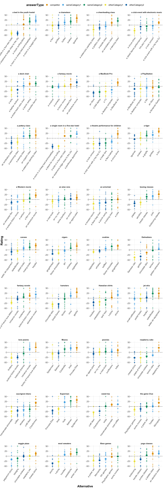

QA prior elicitation & free typing analysis
================
Polina Tsvilodub
2022-11-06

## Intro

Below, exploratory analysis of the prior elicitation QA experiment data
can be found. In the end, the results are compared against the free
production results. Details of the free production analysis can be found
[here](https://github.com/magpie-ea/magpie3-qa-overinfo-free-production/blob/main/data%2Banalysis/01_main_free_typing_analysis.md).

Participants failing all attention checks (3 out of 11 trials) are
excluded from analysis. The attention checks consisted of trials where
participants read instructions to move all sliders all the way to the
left or to the right.

    ## # A tibble: 10 x 3
    ##    itemName               passed_subj     n
    ##    <chr>                  <lgl>       <int>
    ##  1 airport-europe-UPDATED FALSE          20
    ##  2 airport-usa            FALSE          45
    ##  3 art-drawing            FALSE          40
    ##  4 art-painting           FALSE          20
    ##  5 carRental-fun          FALSE          40
    ##  6 carRental-moving       FALSE          25
    ##  7 jobCenter-engineer     FALSE          15
    ##  8 jobCenter-office       FALSE          30
    ##  9 music-hardrock         FALSE          30
    ## 10 music-softrock         FALSE          20

    ## Numbrer of subjects who failed attention checks:  19

    ## 
    ## Subject exclusion rate:  0.2375

To understand what is going on in the attention checks, plot the ratings
in the attention checking trials only, selecting participants who
failed. It seems that many participants simply ignored the instructions.

``` r
df_attention %>%
  filter(submission_id %in% subj_id_attention_fails) %>%
  mutate(answerType = factor(answerType, levels=answerOrder)) %>%
  group_by(itemName, answerType) %>%
  summarize(mean_response = mean(response)) %>%
  ggplot(aes(x = answerType, fill = answerType, y = mean_response)) +
  geom_col() +
  facet_wrap(itemName~., ncol=4) +
  theme(axis.text.x = element_text(angle = 45, hjust = 1)) +
  theme(strip.text.x = element_text(size = 10)) +
  theme(panel.spacing = unit(2, "lines")) +
  ylab("Mean ratings") +
  xlab("Alternative type")
```

    ## `summarise()` regrouping output by 'itemName' (override with `.groups` argument)

<!-- -->

We further exclude participants who provide the same responses on all
trials (i.e. responses within the range of 5 points, basically just
click trough the experiment).

    ## # A tibble: 40 x 6
    ## # Groups:   submission_id [1]
    ##    itemName        submission_id answerType   response centered_respon… bad_subj
    ##    <chr>                   <dbl> <chr>           <dbl>            <dbl> <lgl>   
    ##  1 petAdoption-do…          4476 competitor          0              -50 TRUE    
    ##  2 petAdoption-do…          4476 sameCategor…        0              -50 TRUE    
    ##  3 petAdoption-do…          4476 sameCategor…        0              -50 TRUE    
    ##  4 petAdoption-do…          4476 otherCatego…        0              -50 TRUE    
    ##  5 petAdoption-do…          4476 otherCatego…        0              -50 TRUE    
    ##  6 touristInfo-ch…          4476 competitor          3              -47 TRUE    
    ##  7 touristInfo-ch…          4476 sameCategor…        3              -47 TRUE    
    ##  8 touristInfo-ch…          4476 sameCategor…        3              -47 TRUE    
    ##  9 touristInfo-ch…          4476 otherCatego…        3              -47 TRUE    
    ## 10 touristInfo-ch…          4476 otherCatego…        3              -47 TRUE    
    ## # … with 30 more rows

    ## 
    ## number of subjects who provided the same responses within 5 points on all main trials: 1

``` r
cat("\nNumber of analysed vignette responses: ", nrow(df_clean_main))
```

    ## 
    ## Number of analysed vignette responses:  480

``` r
df_clean_main %>% count(itemName) 
```

    ## # A tibble: 36 x 2
    ##    itemName                                 n
    ##    <chr>                                <int>
    ##  1 bar-tea                                  7
    ##  2 bar-whiteWine                           16
    ##  3 bookingAgency-highClassAccommodation     9
    ##  4 bookingAgency-lowClassAccommodation     18
    ##  5 books-fantasy                           13
    ##  6 books-romance                           11
    ##  7 cafe-pie                                10
    ##  8 cafe-pizza                              14
    ##  9 clothing-beach                          16
    ## 10 clothing-winter                         10
    ## # … with 26 more rows

``` r
cat("\naverage number of responses per vignette:", mean(df_clean_main %>% count(itemName) %>% pull(n)))
```

    ## 
    ## average number of responses per vignette: 13.33333

``` r
cat("\nvignette with most responses: ", df_clean_main %>% count(itemName) %>% arrange(desc(n)) %>% .[1,] %>% .$itemName, df_clean_main %>% count(itemName) %>% arrange(desc(n)) %>% .[1,] %>% .$n)
```

    ## 
    ## vignette with most responses:  bookingAgency-lowClassAccommodation 18

``` r
cat("\nvignette with least responses: ", df_clean_main %>% count(itemName) %>% arrange(n) %>% .[1,] %>% .$itemName, df_clean_main %>% count(itemName) %>% arrange(n) %>% .[1,] %>% .$n)
```

    ## 
    ## vignette with least responses:  bar-tea 7

The first plot below shows the raw prior ratings (y-axis) against the
alternative category (i.e., competitor, sameCategory1, otherCategory1
etc; x-axis). The second plot shows only by-vignette by-alternative
average ratings across participants.

    ## Warning: `as_data_frame()` is deprecated as of tibble 2.0.0.
    ## Please use `as_tibble()` instead.
    ## The signature and semantics have changed, see `?as_tibble`.
    ## This warning is displayed once every 8 hours.
    ## Call `lifecycle::last_warnings()` to see where this warning was generated.

    ## Warning: `cols` is now required when using unnest().
    ## Please use `cols = c(strap)`

<!-- --><!-- -->

The global plot below shows by-category ratings averaging over
vignettes:

    ## Warning in mean.default(count): argument is not numeric or logical: returning NA

    ## Warning in mean.default(count): argument is not numeric or logical: returning NA

    ## Warning in mean.default(count): argument is not numeric or logical: returning NA

    ## Warning in mean.default(count): argument is not numeric or logical: returning NA

    ## Warning in mean.default(count): argument is not numeric or logical: returning NA

    ## `summarise()` ungrouping output (override with `.groups` argument)

    ## Warning: Removed 5 rows containing missing values (position_stack).

<!-- -->

The plot below shows the raw by-vignette by-alternative ratings (small
points) with labels representing the actual alternative options. The
large points indicate the by-vignette by-alternative means. **Please
note the varying order of the answer alternative categories on the
x-axis (color).**

``` r
df_clean_main_wItems_long_summary <- df_clean_main_wItems_long %>%
  group_by(answerOption_string, answerType, itemQuestion) %>% 
  summarize(mean_response = mean(centered_response)) 
```

    ## `summarise()` regrouping output by 'answerOption_string', 'answerType' (override
    ## with `.groups` argument)

``` r
df_clean_main_wItems_long2 <- left_join(df_clean_main_wItems_long, df_clean_main_wItems_long_summary, by=c('answerOption_string', 'answerType', 'itemQuestion') )

df_clean_main_wItems_long2  %>%
  mutate(answerOption_string = tidytext::reorder_within(answerOption_string, response, itemQuestion)) %>%
  ggplot(aes(x = reorder(answerOption_string, response), color = answerType, y = centered_response)) +
  geom_point(size=2, alpha=0.5) +
  geom_point(aes(y = mean_response), size=3.5) +
 # aes(x = fct_inorder(answerType)) +
  #scale_x_discrete(answerType) +
  tidytext::scale_x_reordered() +
  facet_wrap( itemQuestion ~ . , scales='free', ncol = 4) +
  theme(axis.text.x = element_text(angle = 55, hjust = 1)) +
  theme(strip.text.x = element_text(size = 10)) +
  theme(panel.spacing = unit(2, "lines")) +
  ylab("Rating") +
  ylim(-50, 50) +
  xlab("Alternative") 
```

<!-- -->

``` r
#ggsave("viz/priorElicitation_byAnswerOption_wLabels_wMeans_woExclusions_80.pdf", width = 12, height = 32)
```

## Comparing prior ratings to free production

Below, the prior ratings are aligned with the free production data. In
this plot, the item free production responses and respective prior
ratings can be seen side by side.

    ## Parsed with column specification:
    ## cols(
    ##   itemName = col_character(),
    ##   answerType = col_character(),
    ##   responseCategory_proportion = col_double()
    ## )

    ## Warning: Removed 1293 rows containing missing values (geom_point).

<!-- -->

The plot below combines free production response rates with prior
ratings. More specifically, the x axis shows the categorized free
production response proportions (over participants) as bars. The prior
elicitation raw responses were collapsed into the categories
‘competitor’, ‘sameCategory’ (comprising ratings for ‘sameCategory1’ and
‘sameCategory2’ alternatives, respectively) and ‘otherCategory’
(collapsing ‘otherCategory1’ and ‘otherCategory2’ ratings). The raw
responses (samller points) as well as by-item by-alternative means
(larger points) are added in the respective answer categories for easier
comparison.

    ## Warning: Removed 1293 rows containing missing values (geom_point).

<!-- -->

## Exploratory analysis without participant exclusions

Since a relatively large proportion of participants was excluded due to
attention check failure, the plot below explores whether there are
qualitative differences between the cleaned results with 60 subjects and
non-cleaned results with 80 subjects. This does not seem to be the case.

    ## Warning: Removed 1730 rows containing missing values (geom_point).

<!-- -->

Below, the vignettes are sorted in terms of difference between mean
difference sizes. The items with smaller differences are taken to be
weaker items.

    ## # A tibble: 36 x 2
    ## # Groups:   itemName [36]
    ##    itemName                             response_range
    ##    <chr>                                         <dbl>
    ##  1 electronics-console                            8.44
    ##  2 plants-green                                  17.8 
    ##  3 plants-flowers                                17.8 
    ##  4 furniture-indoors                             21.1 
    ##  5 friendsActivities-videoEntertainment          21.7 
    ##  6 movie-fantasy                                 24.8 
    ##  7 waterSport-motor                              27.1 
    ##  8 cafe-pizza                                    29.7 
    ##  9 disney-princess                               30.0 
    ## 10 dutyFree-sweets                               30.6 
    ## # … with 26 more rows

    ## Top 10 weakes items (worst to best):  electronics-console plants-green plants-flowers furniture-indoors friendsActivities-videoEntertainment movie-fantasy waterSport-motor cafe-pizza disney-princess dutyFree-sweets

Below, several further computations try to extract in a principled way
which items did not work well based on free production + slider rating
results.

For checking if the computed value is predictive of the proportion of
taciturn responses (optionally, combined taciturn + other rate):

Option 1: compute the difference between the mean (by-vignette)
competitor rating and the highest alternative rating. A difference of 0
indicates that the competitor was rated highest, while a negative
difference means that another option was rated higher.

Option 2: compute the difference between the competitor rating and the
mean over the same category alternatives.

Option 3: compute mean differences but add some uncertainty term

For checking if vignette worked well – focus should be the free
production data (expected pattern) Goal: combine these computations with
the results of free production. Option 4: compute a distance between the
idealized / prototype distribution and the observed distribution – e g
Wasserstein metric

``` r
# option 1: compute differences between competitor and the most salient other option
df_clean_main_summary_unique_wide <- df_clean_main_summary_unique %>%
  group_by(itemName) %>%
  mutate(max_rating = max(mean)) %>% ungroup() %>%
  pivot_wider(id_cols = c("itemName", "answerType", "max_rating"), names_from = "answerType", values_from = "mean") %>%
  rowwise() %>%
  mutate(competitor_vs_maxAlternative = competitor - max_rating,
         competitor_vs_sameCategory = competitor - mean(sameCategory1, sameCategory2), # option 2a
         competitor_vs_otherCategory = competitor - mean(otherCategory1, otherCategory2)) # option 2b


# compare the worst items returned by these three options
cat("worst items according to option 1: ", df_clean_main_summary_unique_wide %>% arrange(competitor_vs_maxAlternative) %>% pull(itemName) %>% .[1:10])
```

    ## worst items according to option 1:  bookingAgency-lowClassAccommodation petAdoption-dogs clothing-beach movie-fantasy bookingAgency-highClassAccommodation kidsActivities-sports clothing-winter books-fantasy bar-tea friendsActivities-videoEntertainment

``` r
cat("\nworst items according to option 2a (difference to same category): ", df_clean_main_summary_unique_wide %>% arrange(competitor_vs_sameCategory) %>% pull(itemName) %>% .[1:10])
```

    ## 
    ## worst items according to option 2a (difference to same category):  bookingAgency-lowClassAccommodation petAdoption-dogs clothing-beach bookingAgency-highClassAccommodation books-fantasy bar-tea gym-yoga electronics-console disney-princess clothing-winter

``` r
cat("\nworst items according to option 2b (difference to other category): ", df_clean_main_summary_unique_wide %>% arrange(competitor_vs_otherCategory) %>% pull(itemName) %>% .[1:10])
```

    ## 
    ## worst items according to option 2b (difference to other category):  electronics-console movie-fantasy plants-flowers cafe-pizza plants-green friendsActivities-videoEntertainment clothing-beach furniture-indoors petAdoption-dogs waterSport-motor

Option 4:

``` r
d_clean_main_collapsedCompetitor_summary_100_wBaseline <- d_clean_main_collapsedCompetitor_summary_100 %>%
  mutate(expected_prop = case_when(
    answerType == "competitor" ~ 0.7,
    answerType == "sameCategory" ~ 0.3,
    TRUE ~ 0
  ))
d_clean_main_collapsedCompetitor_summary_100_wBaseline <- d_clean_main_collapsedCompetitor_summary_100_wBaseline %>% group_by(itemName) %>%
  mutate(wasserstein_dist = sum(abs(responseCategory_proportion - expected_prop)))

cat("items with the largest Wasserstein distance relative to expected free production distribution:  ", d_clean_main_collapsedCompetitor_summary_100_wBaseline %>% arrange(desc(wasserstein_dist)) %>% pull(itemName) %>% unique() %>% .[1:10])
```

    ## items with the largest Wasserstein distance relative to expected free production distribution:   movie-fantasy movie-western friendsActivities-boardGames furniture-outdoors kidsActivities-crafts disney-action furniture-indoors electronics-console clothing-winter plants-flowers

Checking if either measure derived from the prior elicitation correlates
well with the Wasserstein results or the raw taciturn proportion:

``` r
wasserstein_dist_alpha <- d_clean_main_collapsedCompetitor_summary_100_wBaseline %>% select(itemName, wasserstein_dist) %>% unique() %>% arrange(itemName) %>% pull(wasserstein_dist)

competitor_vs_maxAlternative_alpha <- df_clean_main_summary_unique_wide %>% arrange(itemName) %>% pull(competitor_vs_maxAlternative)

competitor_vs_sameCategory_alpha <- df_clean_main_summary_unique_wide %>% arrange(itemName) %>% pull(competitor_vs_sameCategory)

competitor_vs_sameCategory_alpha <- df_clean_main_summary_unique_wide %>% arrange(itemName) %>% pull(competitor_vs_sameCategory)

competitor_vs_otherCategory_alpha <- df_clean_main_summary_unique_wide %>% arrange(itemName) %>% pull(competitor_vs_otherCategory)

cat("correlation of by-vignette free production Wasserstein distances and prior elicitation differences between competitor and most salient alternative: ", cor(wasserstein_dist_alpha, competitor_vs_maxAlternative_alpha))
```

    ## correlation of by-vignette free production Wasserstein distances and prior elicitation differences between competitor and most salient alternative:  -0.2667231

``` r
cat("\ncorrelation of by-vignette free production Wasserstein distances and prior elicitation differences between competitor and same category alternatives: ", cor(wasserstein_dist_alpha, competitor_vs_sameCategory_alpha))
```

    ## 
    ## correlation of by-vignette free production Wasserstein distances and prior elicitation differences between competitor and same category alternatives:  -0.3648259

``` r
cat("\ncorrelation of by-vignette free production Wasserstein distances and prior elicitation differences between competitor and other category alternatives: ", cor(wasserstein_dist_alpha, competitor_vs_otherCategory_alpha))
```

    ## 
    ## correlation of by-vignette free production Wasserstein distances and prior elicitation differences between competitor and other category alternatives:  -0.4745696

``` r
# relating the results to raw taciturn response proportions

taciturn_props <- d_clean_main_collapsedCompetitor_summary_100_wBaseline %>% filter(answerType == "taciturn") %>% arrange(itemName) %>% pull(responseCategory_proportion)
cat("correlation of by-vignette free production taciturn response proportions and prior elicitation differences between competitor and most salient alternative: ", cor(taciturn_props, competitor_vs_maxAlternative_alpha))
```

    ## correlation of by-vignette free production taciturn response proportions and prior elicitation differences between competitor and most salient alternative:  -0.4395201

``` r
cat("\ncorrelation of by-vignette free production taciturn response proportions and prior elicitation differences between competitor and same category alternatives: ", cor(taciturn_props, competitor_vs_sameCategory_alpha))
```

    ## 
    ## correlation of by-vignette free production taciturn response proportions and prior elicitation differences between competitor and same category alternatives:  -0.4187852

``` r
cat("\ncorrelation of by-vignette free production taciturn response proportions and prior elicitation differences between competitor and other category alternatives: ", cor(taciturn_props, competitor_vs_otherCategory_alpha))
```

    ## 
    ## correlation of by-vignette free production taciturn response proportions and prior elicitation differences between competitor and other category alternatives:  -0.4854417

Combine all these results to see if they overlap:

``` r
tibble(
  saliencyDistance = df_clean_main_summary_unique_wide %>% arrange(competitor_vs_maxAlternative) %>% pull(itemName) %>% .[1:10],
  sameCategoryDistance = df_clean_main_summary_unique_wide %>% arrange(competitor_vs_sameCategory) %>% pull(itemName) %>% .[1:10],
  otherCategoryDistance = df_clean_main_summary_unique_wide %>% arrange(competitor_vs_otherCategory) %>% pull(itemName) %>% .[1:10],
  wassersteinDistance = d_clean_main_collapsedCompetitor_summary_100_wBaseline %>% arrange(desc(wasserstein_dist)) %>% pull(itemName) %>% unique() %>% .[1:10],
  human_selection = c("bar-tea", "bookingAgency−lowClassAccommodation", "books-fantasy", "clothing-beach", "disney-princess", "electronics-console", "furniture-indoors", "kidsActivities-crafts", "kidsActivities-sports", "movie-fantasy") # polina's eyeballing with respect to salience of competitor + level of taciturn responses
) %>% arrange(wassersteinDistance)
```

    ## # A tibble: 10 x 5
    ##    saliencyDistance sameCategoryDis… otherCategoryDi… wassersteinDist…
    ##    <chr>            <chr>            <chr>            <chr>           
    ##  1 bar-tea          disney-princess  petAdoption-dogs clothing-winter 
    ##  2 kidsActivities-… bar-tea          friendsActiviti… disney-action   
    ##  3 books-fantasy    electronics-con… furniture-indoo… electronics-con…
    ##  4 clothing-beach   clothing-beach   plants-flowers   friendsActiviti…
    ##  5 clothing-winter  gym-yoga         clothing-beach   furniture-indoo…
    ##  6 movie-fantasy    bookingAgency-h… cafe-pizza       furniture-outdo…
    ##  7 bookingAgency-h… books-fantasy    plants-green     kidsActivities-…
    ##  8 bookingAgency-l… bookingAgency-l… electronics-con… movie-fantasy   
    ##  9 petAdoption-dogs petAdoption-dogs movie-fantasy    movie-western   
    ## 10 friendsActiviti… clothing-winter  waterSport-motor plants-flowers  
    ## # … with 1 more variable: human_selection <chr>

TODO: add some variance term as a predictor

## Preprocessing for RSA model fitting

``` r
# TODO: z-scoring
```
