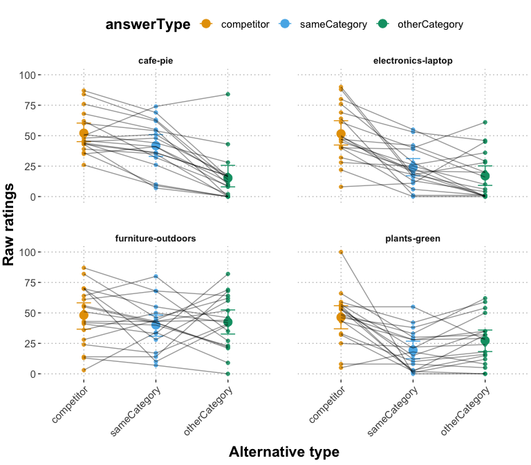
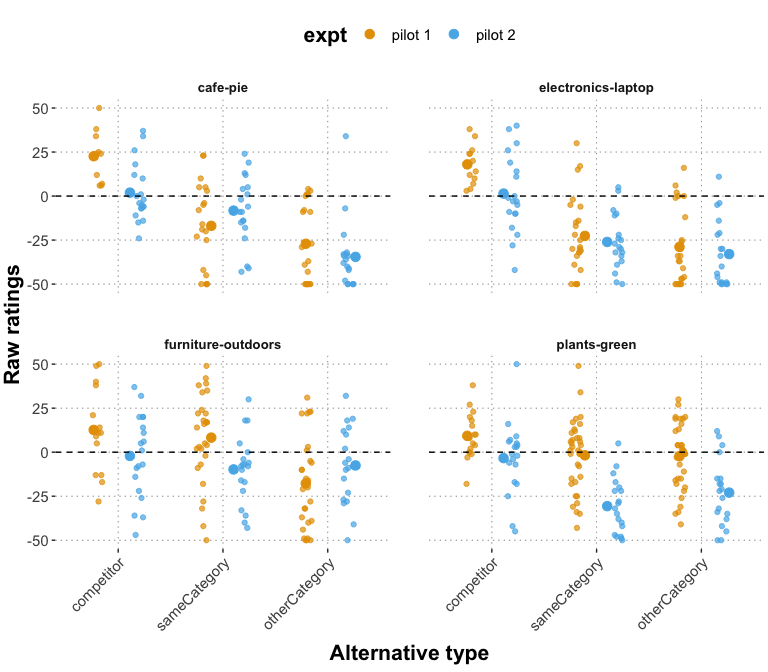
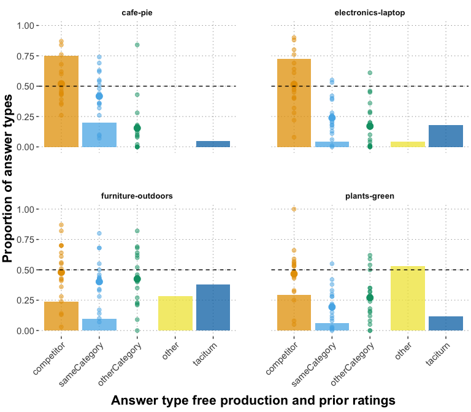

Prior Elicitation Pilot 2
================
PT
2022-11-20

## Prior Elicitation Pilot 2

This pilot follows up on the results from the [first prior elicitation
pilot](https://github.com/magpie-ea/magpie3-qa-overinfo-free-production/blob/main/data%2Banalysis/02_main_prior_eliciation_analysis.md)
(N=80).

The goal of the follow up is to improve the interpretability of the
signal we are eliciting for using the ratings as parameters of the RSA
model. More specifically, the context of the vignettes was removed and
the background and question formulations were updated to e.g. “Suppose
someone wants to have raspberry pie” - “How happy do you think they
would be if instead they got X?”. This framing might better tap into the
similarity of the alternatives. Only the words “to have” in the context
might vary across vignettes.

Furthermore, each participant only saw three sliders: competitor, a
randomly sampled same-category option and a randomly sampled
other-category option.

For piloting purposes, only four vignettes were selected and 20 subjects
who saw all vignettes and one attention check were recruited. The four
vignettes consisted on two good vignettes (according to prior
free-production + prior elicitation performance) – cafe-pie and
electronics-laptop – and two bad vignettes – furniture-outdoors and
plants-green.

    ## # A tibble: 0 × 6
    ## # Groups:   submission_id [0]
    ## # … with 6 variables: itemName <chr>, submission_id <dbl>, answerType <chr>,
    ## #   response <dbl>, centered_response <dbl>, bad_subj <lgl>

    ## 
    ## number of subjects who provided the same responses within 5 points on all main trials: 0

    ## 
    ## Number of analysed vignette responses:  76

    ## # A tibble: 4 × 2
    ##   itemName               n
    ##   <chr>              <int>
    ## 1 cafe-pie              19
    ## 2 electronics-laptop    19
    ## 3 furniture-outdoors    19
    ## 4 plants-green          19

    ## 
    ## average number of responses per vignette: 19

## Plots

Plot the raw ratings and by-vignette by-answerType means. Error bars are
bootstrapped 95%-CrIs.
<!-- -->

Compare results of current pilot (pilot 2) with new question formulation
to results from first prior elicitation experiment (pilot 1) for the
respective items (color, x-axis). Given the clearer formulation of the
current pilot, one could expect a higher concentration of competitor
ratings arounfd 50 and other ratings to be rather below 50.

    ## Rows: 2400 Columns: 5
    ## ── Column specification ────────────────────────────────────────────────────────
    ## Delimiter: ","
    ## chr (2): itemName, answerType
    ## dbl (3): submission_id, response, centered_response
    ## 
    ## ℹ Use `spec()` to retrieve the full column specification for this data.
    ## ℹ Specify the column types or set `show_col_types = FALSE` to quiet this message.
    ## `summarise()` has grouped output by 'itemName', 'answerType'. You can override using the `.groups` argument.

<!-- -->

Compare results of this pilot to free production data of respective
items.
<!-- -->

Write out means file for fitting RSA model (note that the z-scoring is
by-vignette, not grouped by answer-type).

``` r
df_clean_main_long_zScored <- df_clean_main_long %>% 
  group_by(itemName) %>%
  mutate(mean = mean(response),
         sd = sd(response),
         response_zscored = (response - mean) / sd,
         response_zscored = ifelse(is.na(response_zscored), 0, response_zscored),
         ) %>%
  group_by(itemName, answerType) %>%
  mutate(mean_response = mean(response),
         mean_zScored = mean(response_zscored))

df_clean_main_long_zScored_unique <- df_clean_main_long_zScored %>% 
  select(itemName, answerType, mean_response, mean_zScored) %>% unique()

# df_clean_main_long_zScored_unique %>% write_csv("priorElicitation_pilot2_byVignette_byCategory_means.csv")
```
