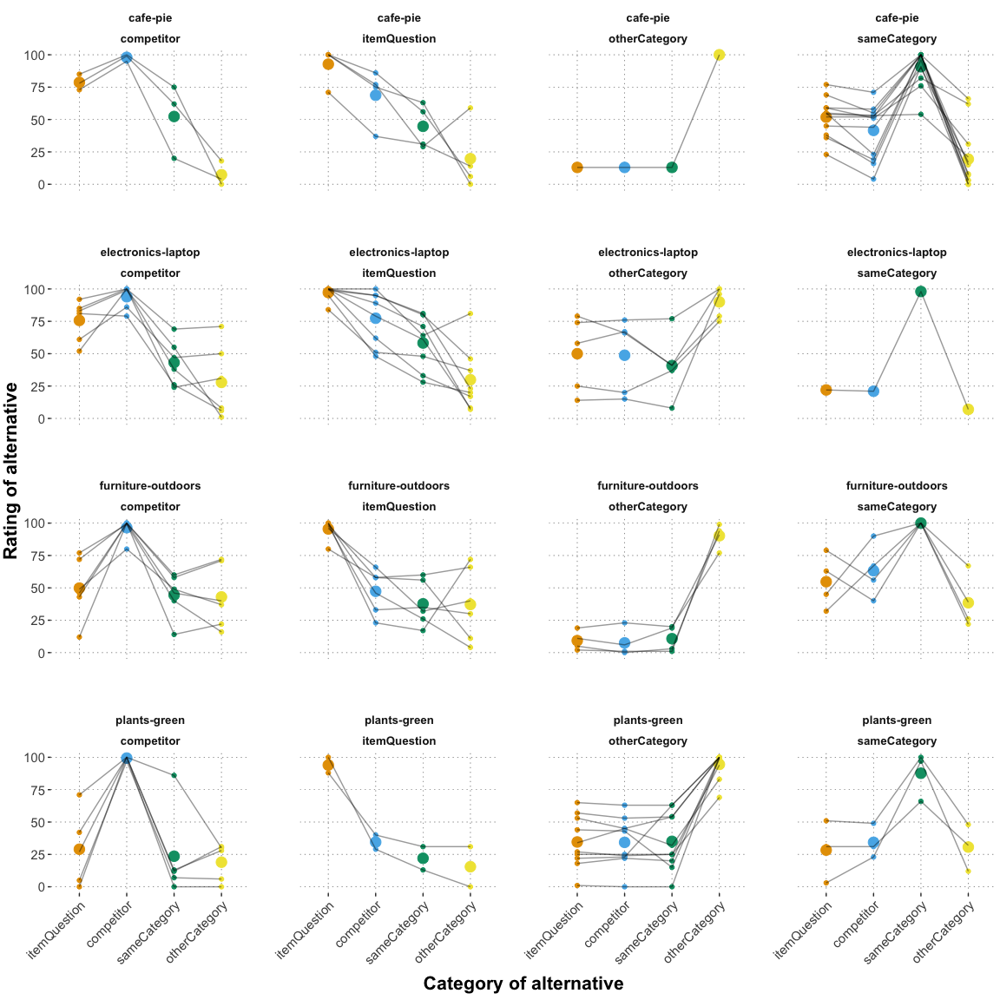

QA Prior elicitation pilot for full matrix
================
PT
2022-12-04

## Pilot 3

This pilot follows up on the prior elicitation [pilot
2](https://github.com/magpie-ea/magpie3-qa-overinfo-free-production/blob/main/data%2Banalysis/03_pilot2_prior_elicitation_analysis.md).
The goal of this pilot is to gather ratings for the full matrix of
relative utilities of alternatives when treating any of the options as
the desired target. Furthermore, rating the utility of receiving the
actual target was added. The task and the question were slightly updated
and read: “Suppose someone wants X. How happy do you think they would be
if … they actually got X? … they got Y instead?” The slider endpoints
were adjusted to the options “completely unhappy” and “completely
happy”. Furthermore, for each vignette only one same category and one
other category option were selected, resulting in a set of four ratings
per trial (target, competitor, sameCat, otherCat). The experiment can be
viewed [here](https://magpie3-qa-overinformative-priors.netlify.app/).

Each participant saw one trial for each of the four vignettes selected
in the previous pilot; additionally they saw one attention check,
resulting in five trials / subject.

## Analysis

    ## Number of recruited subjects:  20

    ## Numbrer of subjects who failed attention checks:  7

    ## 
    ## Subject exclusion rate:  0.35

Explore participants’ behavior on the attention checks since aagain, an
unexpectedly high proportion failed them. Again, it seems that
participants just ignored the instructions and “correctly answered the
trails”. The following analyses were conduced with and without
exclusions; since there was no qualitative difference, the participants
who failed the attention checks were *NOT excluded* in the following
write up.
<!-- -->

    ## # A tibble: 0 × 9
    ## # Groups:   submission_id [0]
    ## # … with 9 variables: itemName <chr>, trialNr <dbl>, submission_id <dbl>,
    ## #   targetOption <chr>, answerType <chr>, response <dbl>,
    ## #   categorized_response <chr>, centered_response <dbl>, bad_subj <lgl>

    ## 
    ## number of subjects who provided the same responses within 5 points on all main trials: 0

In the dataset, “target option” refers to the category of the item that
is mentioned as the target in the context. The variable “answer type”
refers to the item category of the option for a given rating. Whenever
target option and answer type match, the rating is the one for the case
when the received option is the actual target. Below, the counts of
different target options for each vignette are presented.

    ## 
    ## Number of analysed vignette trials:  80

    ## # A tibble: 16 × 3
    ##    itemName           targetOption      n
    ##    <chr>              <chr>         <int>
    ##  1 cafe-pie           competitor        3
    ##  2 cafe-pie           itemQuestion      4
    ##  3 cafe-pie           otherCategory     1
    ##  4 cafe-pie           sameCategory     12
    ##  5 electronics-laptop competitor        6
    ##  6 electronics-laptop itemQuestion      8
    ##  7 electronics-laptop otherCategory     5
    ##  8 electronics-laptop sameCategory      1
    ##  9 furniture-outdoors competitor        6
    ## 10 furniture-outdoors itemQuestion      6
    ## 11 furniture-outdoors otherCategory     4
    ## 12 furniture-outdoors sameCategory      4
    ## 13 plants-green       competitor        5
    ## 14 plants-green       itemQuestion      2
    ## 15 plants-green       otherCategory    10
    ## 16 plants-green       sameCategory      3

Explore target ratings in order to check if there are any unexpected
results. It seems that for all four vignettes the participants behaved
as expected.

    ## # A tibble: 4 × 6
    ##   itemName               n empirical_stat ci_lower  mean ci_upper
    ##   <chr>              <int>          <dbl>    <dbl> <dbl>    <dbl>
    ## 1 cafe-pie              20           92.7     86.3  92.8     97.5
    ## 2 electronics-laptop    20           94.5     90.2  94.5     98.0
    ## 3 furniture-outdoors    20           95.6     91.9  95.6     98.7
    ## 4 plants-green          20           94.6     89.2  94.6     98.8

## Means

Below, means of the ratings by-target option by-answer type are
computed.

The target option called “itemQuestion” is the option we defined as the
original target in our vignettes. In order to understand whether varying
the target results in intuitive responses, the target - answer type
combinations were manually categorized into the following rating
categories: “target” (target = answer type), “competitor” (when either
the target or the answer type are competitor or itemQUestion),
“sameCategory” (when either target or answer type were itemQuestion /
competitor or sameCategory), “otherCategory” (any ratings involving
otherCategory except the target case).  
Mean ratings by-category and by-item are also shown below.

    ## # A tibble: 16 × 3
    ## # Groups:   targetOption [4]
    ##    targetOption  answerType    mean_response
    ##    <chr>         <chr>                 <dbl>
    ##  1 competitor    competitor             96.7
    ##  2 competitor    itemQuestion           56.7
    ##  3 competitor    otherCategory          27.1
    ##  4 competitor    sameCategory           40.0
    ##  5 itemQuestion  competitor             62.4
    ##  6 itemQuestion  itemQuestion           95.5
    ##  7 itemQuestion  otherCategory          28.6
    ##  8 itemQuestion  sameCategory           45.8
    ##  9 otherCategory competitor             31.5
    ## 10 otherCategory itemQuestion           32.3
    ## 11 otherCategory otherCategory          92.8
    ## 12 otherCategory sameCategory           30.6
    ## 13 sameCategory  competitor             43.8
    ## 14 sameCategory  itemQuestion           47.4
    ## 15 sameCategory  otherCategory          24.3
    ## 16 sameCategory  sameCategory           92.5

    ## # A tibble: 64 × 4
    ## # Groups:   itemName, targetOption [16]
    ##    itemName targetOption  answerType    mean_response
    ##    <chr>    <chr>         <chr>                 <dbl>
    ##  1 cafe-pie competitor    competitor            98   
    ##  2 cafe-pie competitor    itemQuestion          78.7 
    ##  3 cafe-pie competitor    otherCategory          7.33
    ##  4 cafe-pie competitor    sameCategory          52.3 
    ##  5 cafe-pie itemQuestion  competitor            68.8 
    ##  6 cafe-pie itemQuestion  itemQuestion          92.8 
    ##  7 cafe-pie itemQuestion  otherCategory         19.8 
    ##  8 cafe-pie itemQuestion  sameCategory          44.8 
    ##  9 cafe-pie otherCategory competitor            13   
    ## 10 cafe-pie otherCategory itemQuestion          13   
    ## # … with 54 more rows

    ## # A tibble: 4 × 2
    ##   categorized_response mean_response
    ##   <fct>                        <dbl>
    ## 1 competitor                    59.5
    ## 2 otherCategory                 29.1
    ## 3 sameCategory                  44.2
    ## 4 target                        94.4

    ## # A tibble: 16 × 3
    ## # Groups:   categorized_response [4]
    ##    categorized_response itemName           mean_response
    ##    <fct>                <chr>                      <dbl>
    ##  1 competitor           cafe-pie                    73  
    ##  2 competitor           electronics-laptop          76.6
    ##  3 competitor           furniture-outdoors          48.6
    ##  4 competitor           plants-green                30.6
    ##  5 otherCategory        cafe-pie                    17.0
    ##  6 otherCategory        electronics-laptop          37.0
    ##  7 otherCategory        furniture-outdoors          26.6
    ##  8 otherCategory        plants-green                31.4
    ##  9 sameCategory         cafe-pie                    47  
    ## 10 sameCategory         electronics-laptop          48  
    ## 11 sameCategory         furniture-outdoors          48.2
    ## 12 sameCategory         plants-green                26.9
    ## 13 target               cafe-pie                    92.7
    ## 14 target               electronics-laptop          94.5
    ## 15 target               furniture-outdoors          95.6
    ## 16 target               plants-green                94.6

Below, the responses are plotted by-category (as described above),
collaping the categories across vignettes.

<!-- -->

Below, the responses are plotted by-category by-vignette. While the two
“good” vignettes (cafe-pie and electronics-laptop) weok well, as
expected, the other two “bad” vignettes show less consistent results.
<!-- -->

Below, the ratings are plotted by-target option, collapsing across
vignettes.
<!-- -->

Below, the ratings are plotted by-target option by-vignette. FOr some
vignette-target option combinations, there is only one data point.

``` r
df_clean_main_long %>%
  mutate(answerType = factor(answerType, levels = c("itemQuestion", "competitor", "sameCategory", "otherCategory"))) %>%
  ggplot(., aes(x = answerType, y = response, fill = answerType, color = answerType)) +
  geom_point() +
  geom_point(data = df_clean_main_long_byItem_summary, aes(x = answerType, y = mean_response), size = 4) +
  facet_wrap(itemName~targetOption) +
  theme(axis.text.x = element_text(angle = 45, hjust = 1)) +
  theme(strip.text.x = element_text(size = 10)) +
  theme(panel.spacing = unit(3, "lines")) +
  theme(legend.position="none") +
  ylab("Rating of alternative") +
  ylim(0, 100) +
  xlab("Category of alternative")
```

<!-- -->

## Ratios for the model

Below, the ratios between the rating of an option given the target and
the rating of receiving the actual target are computed (collapsing the
ratings to means across vignettes). For a better picture, bootstrapped
95% credible intervals are also computed.

    ## # A tibble: 16 × 7
    ## # Groups:   targetOption [4]
    ##    targetOption  answerType        n empirical_stat ci_lower  mean ci_upper
    ##    <chr>         <chr>         <int>          <dbl>    <dbl> <dbl>    <dbl>
    ##  1 competitor    competitor       20           96.7     93.5  96.7     99.4
    ##  2 competitor    itemQuestion     20           56.7     42.9  56.9     69.0
    ##  3 competitor    otherCategory    20           27.1     17.4  27.1     37.6
    ##  4 competitor    sameCategory     20           40.0     28.9  40.1     50.9
    ##  5 itemQuestion  competitor       20           62.4     52.2  62.5     72.5
    ##  6 itemQuestion  itemQuestion     20           95.5     91.7  95.5     98.6
    ##  7 itemQuestion  otherCategory    20           28.6     18.7  28.7     39.6
    ##  8 itemQuestion  sameCategory     20           45.8     37.1  45.9     54.7
    ##  9 otherCategory competitor       20           31.5     21.4  31.5     42.0
    ## 10 otherCategory itemQuestion     20           32.3     21.4  32.2     43.3
    ## 11 otherCategory otherCategory    20           92.8     88.4  92.9     97.2
    ## 12 otherCategory sameCategory     20           30.6     21.8  30.7     41.2
    ## 13 sameCategory  competitor       20           43.8     34.4  43.9     54.1
    ## 14 sameCategory  itemQuestion     20           47.4     38.6  47.3     56  
    ## 15 sameCategory  otherCategory    20           24.3     14.6  24.4     35.2
    ## 16 sameCategory  sameCategory     20           92.5     85.9  92.4     97.5

    ## # A tibble: 16 × 6
    ##    targetOption  answerType    mean_response response_category target_…¹ respo…²
    ##    <chr>         <chr>                 <dbl> <chr>                 <dbl>   <dbl>
    ##  1 competitor    competitor             96.7 target                 96.7   1    
    ##  2 competitor    itemQuestion           56.7 itemQuestion           96.7   0.586
    ##  3 competitor    otherCategory          27.1 otherCategory          96.7   0.280
    ##  4 competitor    sameCategory           40.0 sameCategory           96.7   0.414
    ##  5 itemQuestion  competitor             62.4 competitor             95.5   0.653
    ##  6 itemQuestion  itemQuestion           95.5 target                 95.5   1    
    ##  7 itemQuestion  otherCategory          28.6 otherCategory          95.5   0.299
    ##  8 itemQuestion  sameCategory           45.8 sameCategory           95.5   0.479
    ##  9 otherCategory competitor             31.5 competitor             92.8   0.339
    ## 10 otherCategory itemQuestion           32.3 itemQuestion           92.8   0.348
    ## 11 otherCategory otherCategory          92.8 target                 92.8   1    
    ## 12 otherCategory sameCategory           30.6 sameCategory           92.8   0.329
    ## 13 sameCategory  competitor             43.8 competitor             92.5   0.474
    ## 14 sameCategory  itemQuestion           47.4 itemQuestion           92.5   0.512
    ## 15 sameCategory  otherCategory          24.3 otherCategory          92.5   0.263
    ## 16 sameCategory  sameCategory           92.5 target                 92.5   1    
    ## # … with abbreviated variable names ¹​target_rating, ²​response_ratio
