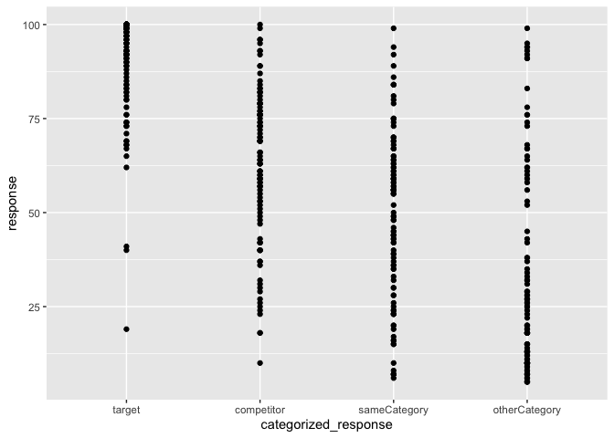
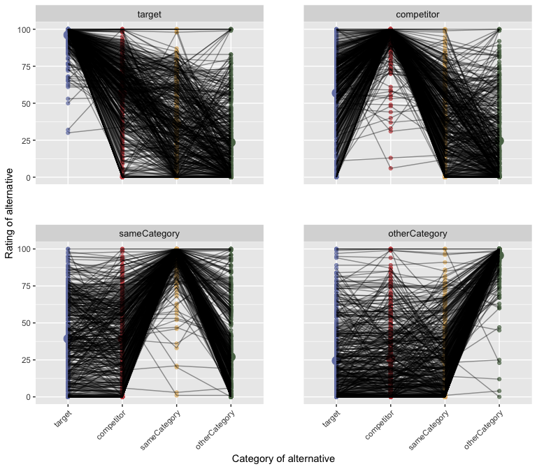

QA Prior elicitation pilot for full matrix
================
PT
2022-12-04

## Full experiment

This experiment implements a full scale study based on the design from
the prior elicitation [pilot
3](https://github.com/magpie-ea/magpie3-qa-overinfo-free-production/blob/main/data%2Banalysis/04_pilot3_prior_elicitation_analysis..md).
The experiment can be viewed
[here](https://magpie3-qa-overinformative-priors.netlify.app/).

Each participant saw one trial for four vignettes sampled at random from
the full set of 30 vignettes used in E1 of the CogSci 2023 experiment;
additionally they saw one attention check, resulting in five trials /
subject. The target is N=450, for expected 15 ratings per cell of each
vignette (for 16 cell / vignette; 30 x 16 x 15 / 16 = 450).

## Analysis

    ## Number of recruited subjects:  453

    ## Numbrer of subjects who failed attention checks:  105

    ## 
    ## Subject exclusion rate:  0.2317881

Explore participants’ behavior on the attention checks since again, an
unexpectedly high proportion failed them. To do so, we use a
classification of the requested-item + provided-item pair (called
“answer type” because this represents the rated answer). Each item of
each vignette can from one of the four categories: itemQuestion (=target
option in our vignettes and experiments), competitor, sameCategory,
otherCategory. In order to understand whether varying the requested
target results in intuitive responses, the requested item (target) -
answer type combinations were categorized into the following rating
categories: “target” (target = answer type), “competitor” (when either
the target or the answer type are competitor or itemQuestion),
“sameCategory” (when either target or answer type were itemQuestion /
competitor or sameCategory), “otherCategory” (any ratings involving
otherCategory except the target case). This categorization is used to
check whether target \> competitor ratings, sameCategory \>
otherCategory ratings, as suggested by intuition. It can be found under
categorized_response. Mean ratings by-category and by-item are also
shown below.

It seems that participants just ignored the instructions and “correctly
answered” the filler trials. The following analyses were conduced with
and without exclusions; since there was no qualitative difference, the
participants who failed the attention checks were *NOT excluded* in the
following write up and provided empirical means.
<!-- -->

One subject is excluded because they provided all ratings within 5
points.

    ## # A tibble: 16 × 8
    ## # Groups:   submission_id [1]
    ##    itemName       trialNr submission_id target…¹ answe…² respo…³ categ…⁴ bad_s…⁵
    ##    <chr>            <dbl>         <dbl> <chr>    <chr>     <dbl> <chr>   <lgl>  
    ##  1 books-romance        2          3044 competi… itemQu…     100 compet… TRUE   
    ##  2 books-romance        2          3044 competi… compet…     100 target  TRUE   
    ##  3 books-romance        2          3044 competi… sameCa…     100 sameCa… TRUE   
    ##  4 books-romance        2          3044 competi… otherC…     100 otherC… TRUE   
    ##  5 cafe-pie             3          3044 sameCat… itemQu…     100 sameCa… TRUE   
    ##  6 cafe-pie             3          3044 sameCat… compet…     100 sameCa… TRUE   
    ##  7 cafe-pie             3          3044 sameCat… sameCa…     100 target  TRUE   
    ##  8 cafe-pie             3          3044 sameCat… otherC…     100 otherC… TRUE   
    ##  9 interior-green       4          3044 itemQue… itemQu…     100 target  TRUE   
    ## 10 interior-green       4          3044 itemQue… compet…     100 compet… TRUE   
    ## 11 interior-green       4          3044 itemQue… sameCa…     100 sameCa… TRUE   
    ## 12 interior-green       4          3044 itemQue… otherC…     100 otherC… TRUE   
    ## 13 bar-whiteWine        5          3044 otherCa… itemQu…      99 otherC… TRUE   
    ## 14 bar-whiteWine        5          3044 otherCa… compet…     100 otherC… TRUE   
    ## 15 bar-whiteWine        5          3044 otherCa… sameCa…     100 otherC… TRUE   
    ## 16 bar-whiteWine        5          3044 otherCa… otherC…      99 target  TRUE   
    ## # … with abbreviated variable names ¹​targetOption, ²​answerType, ³​response,
    ## #   ⁴​categorized_response, ⁵​bad_subj

    ## 
    ## number of subjects who provided the same responses within 5 points on all main trials: 1

In the dataset, “targetOption” refers to the category of the item that
is mentioned as the requested target in the context (“Suppose someone
wants to have X”, where X is the option). The variable “answerType”
refers to the item category of the received option for a given rating
(“instead they get Y”). Whenever target option and answer type match,
the rating is the one for the case when the received option is the
actual target. Below, the counts of different option combinations for
each vignette are presented.

    ## 
    ## Number of analysed vignette trials:  1808

    ## 
    ## Number of vignettes X rated requested options (expected 120):  120

    ## 
    ## Number of vignettes X rated requested options X rated received options (expected 480):  480

    ## 
    ## Average number of rating per measurements per vignette:  15.06667

Explore target ratings in order to check if there are any unexpected
results. It seems that for all vignettes the participants behaved as
expected (mean rating when requested target = received target is \> 90).

    ## # A tibble: 30 × 2
    ##    itemName                             mean_rating
    ##    <chr>                                      <dbl>
    ##  1 bookingAgency-lowClassAccommodation         91.4
    ##  2 kidsActivities-crafts                       93.8
    ##  3 touristInfo-clubbing                        93.8
    ##  4 kidsActivities-sports                       94.2
    ##  5 interior-green                              94.5
    ##  6 friendsActivities-videoEntertainment        94.7
    ##  7 cafe-pie                                    94.7
    ##  8 dutyFree-smokes                             94.8
    ##  9 bookingAgency-highClassAccommodation        94.8
    ## 10 interior-deco                               94.8
    ## # … with 20 more rows

## Means

Below, means of the ratings by-target option (requested) by-answer type
(received) are computed. The by-item empirical means are written as a
csv with the columns “requested_option”, “received option”, and
“itemName” (the vignette names) for use with the RSA model.

    ## # A tibble: 16 × 3
    ## # Groups:   targetOption [4]
    ##    targetOption  answerType    mean_response
    ##    <fct>         <fct>                 <dbl>
    ##  1 target        target                 96.2
    ##  2 target        competitor             56.8
    ##  3 target        sameCategory           36.0
    ##  4 target        otherCategory          23.5
    ##  5 competitor    target                 56.9
    ##  6 competitor    competitor             95.4
    ##  7 competitor    sameCategory           38.5
    ##  8 competitor    otherCategory          24.6
    ##  9 sameCategory  target                 39.3
    ## 10 sameCategory  competitor             39.2
    ## 11 sameCategory  sameCategory           95.1
    ## 12 sameCategory  otherCategory          27.0
    ## 13 otherCategory target                 24.5
    ## 14 otherCategory competitor             25.8
    ## 15 otherCategory sameCategory           25.3
    ## 16 otherCategory otherCategory          95.6

``` r
df_clean_main_long_byItem_summary_clean <- df_clean_main_long_byItem_summary |> ungroup() |>
  mutate(targetOption = ifelse(targetOption == "itemQuestion", "target", targetOption),
         answerType = ifelse(answerType == "itemQuestion", "target", answerType),
         targetOption = factor(targetOption, levels = answerOrder),
         answerType  = factor(answerType, levels = answerOrder)
         ) |>
  rename(requested_option = targetOption, received_option = answerType)

#df_clean_main_long_byItem_summary_clean |> write_csv("data/PragmaticQA-E1-priorElicitation-sliderRating-full_450_byItem_means.csv")
```

Below, the ratings are plotted by-target option, collapsing across
vignettes.
<!-- -->
