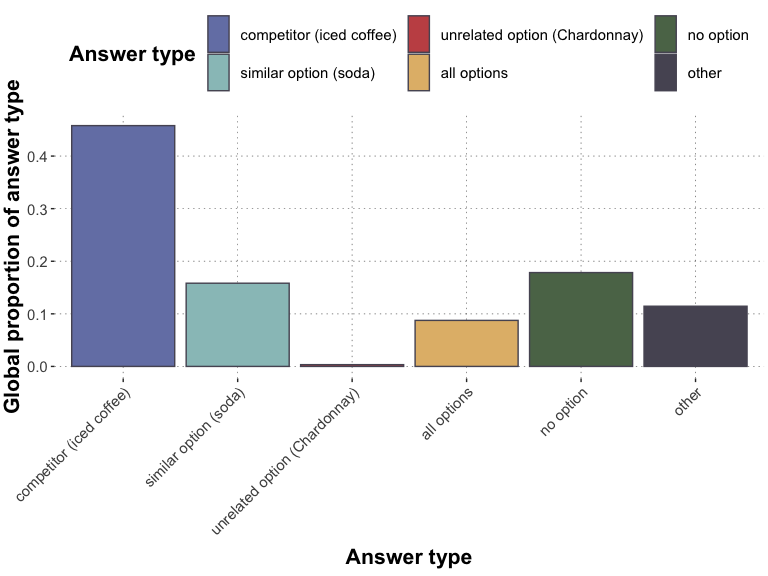
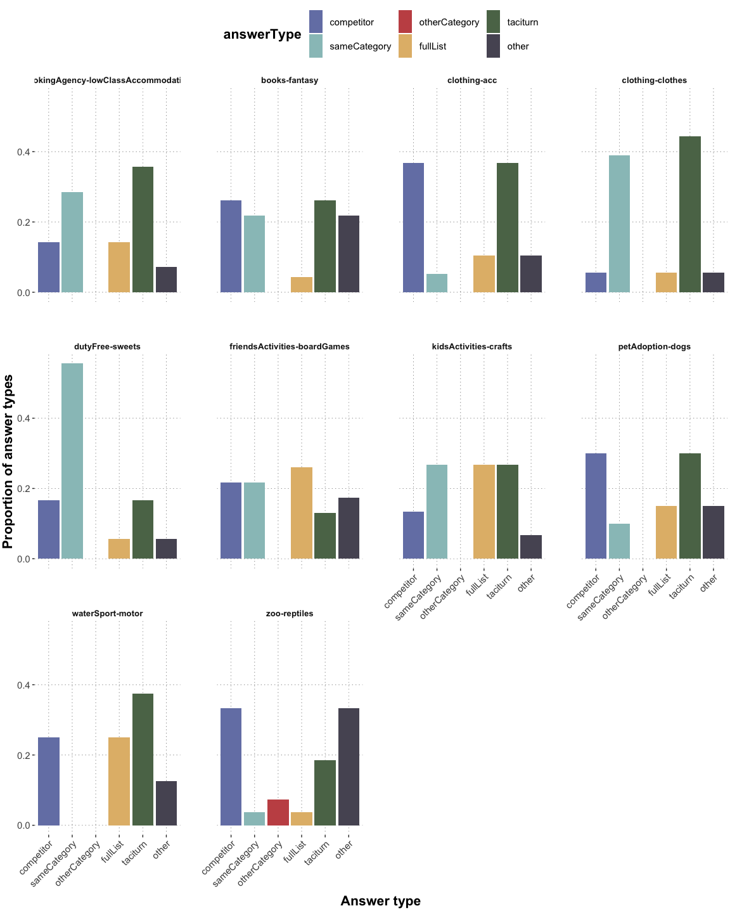
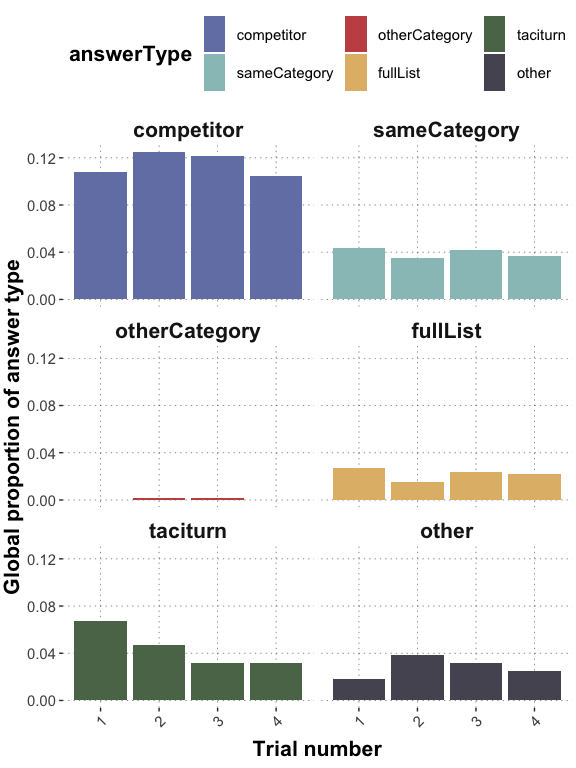

QA free typing analysis
================
Polina Tsvilodub
2022-12-28

## Intro

Below, the analysis of the free production QA experiment 1 data can be
found. In this experiment, the context is relatively uninformative
regarding the goal of the questioner with respect to the target. The
respondents may infer the questioners’ goal based on the question
itself.

The responses were manually classified by Polina into the following
categories:

- competitor: responses mentioning the anticipated competitor only
- sameCategory: responses offering both same category alternatives or
  offering the option which we did not consider the direct competitor
- otherCategory: responses offering the alternative from the different
  category
- fullList: responses where all alternatives were listed (also in two
  sentences, where one offered the competitor only)
- taciturn: responses not offering any alternative options or further
  alternative solutions
- other: responses where a same category + other category response are
  mixed, uncertain answers, unclassifiable responses, responses offering
  further teps towards solcing the problem, responses using basic level
  categories (e.g., “dogs” instead of offering specific alternatives)
- yes responses (excluded from analyses when not mentioning one of the
  alternatives)

In the experiment, each subject saw *four main trials* and *one
attention checking trial*. Participants failing attention checks were
excluded from analysis. They were reimbursed 0.60 pounds for their
participation.

## Summary and exclusions

    ## Subjects who failed attention checks:  4608 4690 4687 4733 4763

    ## Number of subjects who failed attention checks:  5

    ## 
    ## Subject exclusion rate:  0.0308642

    ## Number of excluded inccorect ('yes') responses:  32

    ## Proportion of excluded inccorect ('yes') responses:  0.03950617

    ## 
    ## Number of subjects post exclusions:  157

    ## 
    ## Number of analysed responses:  594

    ## # A tibble: 6 × 2
    ##   category          n
    ##   <chr>         <int>
    ## 1 competitor      272
    ## 2 fullList         52
    ## 3 other            68
    ## 4 otherCategory     2
    ## 5 sameCategory     94
    ## 6 taciturn        106

    ## # A tibble: 30 × 2
    ##    itemName                                 n
    ##    <chr>                                <int>
    ##  1 bar-tea                                 27
    ##  2 bar-whiteWine                           17
    ##  3 bookingAgency-highClassAccommodation    22
    ##  4 bookingAgency-lowClassAccommodation     14
    ##  5 books-fantasy                           23
    ##  6 books-romance                           20
    ##  7 cafe-pie                                14
    ##  8 cafe-pizza                              16
    ##  9 clothing-acc                            19
    ## 10 clothing-clothes                        18
    ## # … with 20 more rows

    ## 
    ## average number of responses per vignette: 19.8

    ## 
    ## vignette with most responses:  gym-boxing 33

    ## 
    ## vignette with least responses:  waterSport-motor 8

Below, the response type patterns are reported.

## Plots

The first plot displays proportions of different response types
by-vignette.

<!-- -->

The plot below shows response proportions by response category averaged
across vignettes.

    ## Global response proportions:

    ## # A tibble: 6 × 3
    ##   answerType    answerType_count answerType_proportion
    ##   <fct>                    <int>                 <dbl>
    ## 1 competitor                 272               0.458  
    ## 2 sameCategory                94               0.158  
    ## 3 otherCategory                2               0.00337
    ## 4 fullList                    52               0.0875 
    ## 5 taciturn                   106               0.178  
    ## 6 other                       68               0.114

<!-- -->

## Exploring weak vignettes and weird participant behavior

Below, vignettes particularly prone to other and taciturn responses are
extracted.

    ## Vignettes receiving the most 'other' responses (mostly 'no but we have other options which might interest you')

    ## # A tibble: 6 × 3
    ##   itemName                             answerType responseCategory_proportion
    ##   <chr>                                <fct>                            <dbl>
    ## 1 friendsActivities-videoEntertainment other                            0.368
    ## 2 zoo-reptiles                         other                            0.333
    ## 3 books-fantasy                        other                            0.217
    ## 4 zoo-xl                               other                            0.2  
    ## 5 electronics-console                  other                            0.174
    ## 6 friendsActivities-boardGames         other                            0.174

    ## 
    ## Vignettes receiving the most 'taciturn' responses

    ## # A tibble: 6 × 3
    ##   itemName                            answerType responseCategory_proportion
    ##   <chr>                               <fct>                            <dbl>
    ## 1 clothing-clothes                    taciturn                         0.444
    ## 2 waterSport-motor                    taciturn                         0.375
    ## 3 clothing-acc                        taciturn                         0.368
    ## 4 bookingAgency-lowClassAccommodation taciturn                         0.357
    ## 5 petAdoption-dogs                    taciturn                         0.3  
    ## 6 kidsActivities-crafts               taciturn                         0.267

Below, the number of “lazy” participants providing taciturn responses
only is identified.

    ## Number of participants providing taciturn responses only:  10

    ## 
    ## Number of participants providing competitor responses only:  10

    ## 
    ## Number of participants providing 'other' responses only:  0

    ## 
    ## Maximal number of distinct response types provided by a participant:  4

    ## 
    ## Number of participants providing maximal number of distinct response types (4):  5

    ## 
    ## Average number of response types provided by a participant:  2.473088

Visualize global distribution if participants producing “No” responses
only would be excluded.

<!-- -->

Below, the vignettes which do NOT fit the expected pattern are plotted
(i.e., where the competitor is not the most popular response).

<!-- -->

## Follow-up analyses

Below, analyses suggested during the meeting on Nov 10th are
incorporated. First, the length (in terms of characters) of the
anticipated competitor as well as averaged together with the same
category alternative is extracted. We check whether participants tended
to produce more taciturn responses when the alternatives were longer.

That is, first, the proportion of taciturn responses by-vignette is
regressed against the length of the competitor category of each
vignette. Then, the proportion of taciturn responses by-vignette is
regressed against the averaged length of the competitor & same category
alternatives by-vignette. No length effects are found with either
predictor.

``` r
df_vignettes <- read_csv("../experiments/free_production/trials/trials_split_cogsci_final.csv") %>% 
  select(itemName, itemQuestion, competitor, sameCategory, otherCategory)
df_vignettes <- df_vignettes %>% 
  rowwise() %>%
  mutate(
  comp_length = nchar(competitor),
  sameCat_avg_length = (nchar(competitor) + nchar(sameCategory))/ 2,
  fullList_length = nchar(competitor) + nchar(sameCategory) + nchar(otherCategory)
)  %>% select(itemName, comp_length, sameCat_avg_length, fullList_length)

# add to original df
d_clean_main_wVignette <- df_clean_main_summary %>%
  left_join(., df_vignettes, by=c('itemName'))

lm_nchar_comp_prop <- lm(responseCategory_proportion ~ comp_length, data = d_clean_main_wVignette %>% filter(answerType == "taciturn"))
summary(lm_nchar_comp_prop)
```

    ## 
    ## Call:
    ## lm(formula = responseCategory_proportion ~ comp_length, data = d_clean_main_wVignette %>% 
    ##     filter(answerType == "taciturn"))
    ## 
    ## Residuals:
    ##       Min        1Q    Median        3Q       Max 
    ## -0.170003 -0.068496 -0.005559  0.036957  0.261910 
    ## 
    ## Coefficients:
    ##             Estimate Std. Error t value Pr(>|t|)    
    ## (Intercept) 0.172316   0.040474   4.257 0.000238 ***
    ## comp_length 0.001703   0.002403   0.709 0.484768    
    ## ---
    ## Signif. codes:  0 '***' 0.001 '**' 0.01 '*' 0.05 '.' 0.1 ' ' 1
    ## 
    ## Residual standard error: 0.1009 on 26 degrees of freedom
    ## Multiple R-squared:  0.01896,    Adjusted R-squared:  -0.01878 
    ## F-statistic: 0.5024 on 1 and 26 DF,  p-value: 0.4848

``` r
lm_nchar_sameCat_prop <- lm(responseCategory_proportion ~ sameCat_avg_length, data = d_clean_main_wVignette %>% filter(answerType == "taciturn"))
summary(lm_nchar_sameCat_prop)
```

    ## 
    ## Call:
    ## lm(formula = responseCategory_proportion ~ sameCat_avg_length, 
    ##     data = d_clean_main_wVignette %>% filter(answerType == "taciturn"))
    ## 
    ## Residuals:
    ##       Min        1Q    Median        3Q       Max 
    ## -0.164043 -0.065035 -0.009103  0.036459  0.257797 
    ## 
    ## Coefficients:
    ##                    Estimate Std. Error t value Pr(>|t|)    
    ## (Intercept)        0.170014   0.043095   3.945 0.000539 ***
    ## sameCat_avg_length 0.001957   0.002740   0.714 0.481419    
    ## ---
    ## Signif. codes:  0 '***' 0.001 '**' 0.01 '*' 0.05 '.' 0.1 ' ' 1
    ## 
    ## Residual standard error: 0.1009 on 26 degrees of freedom
    ## Multiple R-squared:  0.01925,    Adjusted R-squared:  -0.01848 
    ## F-statistic: 0.5102 on 1 and 26 DF,  p-value: 0.4814

``` r
lm_nchar_fullList_prop <- lm(responseCategory_proportion ~ fullList_length, data = d_clean_main_wVignette %>% filter(answerType == "fullList"))
summary(lm_nchar_fullList_prop)
```

    ## 
    ## Call:
    ## lm(formula = responseCategory_proportion ~ fullList_length, data = d_clean_main_wVignette %>% 
    ##     filter(answerType == "fullList"))
    ## 
    ## Residuals:
    ##      Min       1Q   Median       3Q      Max 
    ## -0.07747 -0.04776 -0.01632  0.01574  0.16179 
    ## 
    ## Coefficients:
    ##                  Estimate Std. Error t value Pr(>|t|)  
    ## (Intercept)     0.0800403  0.0321509   2.490   0.0205 *
    ## fullList_length 0.0007053  0.0006996   1.008   0.3239  
    ## ---
    ## Signif. codes:  0 '***' 0.001 '**' 0.01 '*' 0.05 '.' 0.1 ' ' 1
    ## 
    ## Residual standard error: 0.06947 on 23 degrees of freedom
    ## Multiple R-squared:  0.04232,    Adjusted R-squared:  0.0006789 
    ## F-statistic: 1.016 on 1 and 23 DF,  p-value: 0.3239

Further, order effects of the trials are investigated. We check if
participants become lazy over the trials and are more likely to produce
taciturn responses towards the end of the experiment. This seems not to
be the case. If anything, participants tended to produce slightly more
taciturn responses in the beginning of the experiment.

``` r
# collapse across items and participants, look at trial number
df_trialNum <- df_clean_main %>% 
  mutate(answerType = factor(answerType, levels = c('competitor', 'sameCategory', 'otherCategory', 'fullList', 'taciturn', 'other'))) %>%
  group_by(submission_id) %>%
  mutate(trialNr_main = (1:n())) %>%
  ungroup() %>%
  group_by(answerType, trialNr_main) %>% 
  summarise(answerType_count = n(), 
            answerType_proportion = answerType_count / nrow(df_clean_main)
            ) 
```

    ## `summarise()` has grouped output by 'answerType'. You can override using the
    ## `.groups` argument.

``` r
df_trialNum %>%
  ggplot(aes(x = trialNr_main, fill = answerType, y = answerType_proportion)) +
  geom_col() +
  facet_wrap(answerType ~ ., ncol = 2) + 
  theme(axis.text.x = element_text(angle = 45, hjust = 1)) +
  ylab("Global proportion of answer type") +
  xlab("Trial number")
```

<!-- -->

The proportion of taciturn responses by trial number (averaged across
vignettes) is regressed against the trial number below.

``` r
lm_orderEffect <- lm(answerType_proportion ~ trialNr_main, data = df_trialNum %>% filter(answerType == "taciturn"))
summary(lm_orderEffect)
```

    ## 
    ## Call:
    ## lm(formula = answerType_proportion ~ trialNr_main, data = df_trialNum %>% 
    ##     filter(answerType == "taciturn"))
    ## 
    ## Residuals:
    ##         1         2         3         4 
    ##  0.004545 -0.003535 -0.006566  0.005556 
    ## 
    ## Coefficients:
    ##               Estimate Std. Error t value Pr(>|t|)  
    ## (Intercept)   0.074916   0.008964   8.358   0.0140 *
    ## trialNr_main -0.012121   0.003273  -3.703   0.0658 .
    ## ---
    ## Signif. codes:  0 '***' 0.001 '**' 0.01 '*' 0.05 '.' 0.1 ' ' 1
    ## 
    ## Residual standard error: 0.007319 on 2 degrees of freedom
    ## Multiple R-squared:  0.8727, Adjusted R-squared:  0.8091 
    ## F-statistic: 13.71 on 1 and 2 DF,  p-value: 0.0658

## Exploratory stats

Below some exploratory statistical analyses are computed. The analyses
investigate whether:

1.  the competitor is the prevalent category  
2.  competitor is more prevalent than otherCategory
3.  competitor is more prevalent than fullList
4.  sameCategory is more prevalent than otherCategory
5.  sameCategory is more prevalent than fullList

Check if the proportions of other response categories are credibly
different from the competitor responses (competitor is coded as
reference level in the dummy coding of the response categories). All
intercepts are credible (all proportions are credibly smaller). That is,
hypotheses 1-3 are supported by the data.

``` r
contrasts(df_clean_main$answerType)
```

    ##               sameCategory otherCategory fullList taciturn other
    ## competitor               0             0        0        0     0
    ## sameCategory             1             0        0        0     0
    ## otherCategory            0             1        0        0     0
    ## fullList                 0             0        1        0     0
    ## taciturn                 0             0        0        1     0
    ## other                    0             0        0        0     1

``` r
# multinomial regression with intercept only
multinom_brm <- brm(answerType ~ 1, 
    data = df_clean_main, 
    family = "categorical",
    iter = 3000
    )
```

    ## Running /Library/Frameworks/R.framework/Resources/bin/R CMD SHLIB foo.c
    ## clang -arch arm64 -I"/Library/Frameworks/R.framework/Resources/include" -DNDEBUG   -I"/Library/Frameworks/R.framework/Versions/4.2-arm64/Resources/library/Rcpp/include/"  -I"/Library/Frameworks/R.framework/Versions/4.2-arm64/Resources/library/RcppEigen/include/"  -I"/Library/Frameworks/R.framework/Versions/4.2-arm64/Resources/library/RcppEigen/include/unsupported"  -I"/Library/Frameworks/R.framework/Versions/4.2-arm64/Resources/library/BH/include" -I"/Library/Frameworks/R.framework/Versions/4.2-arm64/Resources/library/StanHeaders/include/src/"  -I"/Library/Frameworks/R.framework/Versions/4.2-arm64/Resources/library/StanHeaders/include/"  -I"/Library/Frameworks/R.framework/Versions/4.2-arm64/Resources/library/RcppParallel/include/"  -I"/Library/Frameworks/R.framework/Versions/4.2-arm64/Resources/library/rstan/include" -DEIGEN_NO_DEBUG  -DBOOST_DISABLE_ASSERTS  -DBOOST_PENDING_INTEGER_LOG2_HPP  -DSTAN_THREADS  -DBOOST_NO_AUTO_PTR  -include '/Library/Frameworks/R.framework/Versions/4.2-arm64/Resources/library/StanHeaders/include/stan/math/prim/mat/fun/Eigen.hpp'  -D_REENTRANT -DRCPP_PARALLEL_USE_TBB=1   -I/opt/R/arm64/include   -fPIC  -falign-functions=64 -Wall -g -O2  -c foo.c -o foo.o
    ## In file included from <built-in>:1:
    ## In file included from /Library/Frameworks/R.framework/Versions/4.2-arm64/Resources/library/StanHeaders/include/stan/math/prim/mat/fun/Eigen.hpp:13:
    ## In file included from /Library/Frameworks/R.framework/Versions/4.2-arm64/Resources/library/RcppEigen/include/Eigen/Dense:1:
    ## In file included from /Library/Frameworks/R.framework/Versions/4.2-arm64/Resources/library/RcppEigen/include/Eigen/Core:88:
    ## /Library/Frameworks/R.framework/Versions/4.2-arm64/Resources/library/RcppEigen/include/Eigen/src/Core/util/Macros.h:628:1: error: unknown type name 'namespace'
    ## namespace Eigen {
    ## ^
    ## /Library/Frameworks/R.framework/Versions/4.2-arm64/Resources/library/RcppEigen/include/Eigen/src/Core/util/Macros.h:628:16: error: expected ';' after top level declarator
    ## namespace Eigen {
    ##                ^
    ##                ;
    ## In file included from <built-in>:1:
    ## In file included from /Library/Frameworks/R.framework/Versions/4.2-arm64/Resources/library/StanHeaders/include/stan/math/prim/mat/fun/Eigen.hpp:13:
    ## In file included from /Library/Frameworks/R.framework/Versions/4.2-arm64/Resources/library/RcppEigen/include/Eigen/Dense:1:
    ## /Library/Frameworks/R.framework/Versions/4.2-arm64/Resources/library/RcppEigen/include/Eigen/Core:96:10: fatal error: 'complex' file not found
    ## #include <complex>
    ##          ^~~~~~~~~
    ## 3 errors generated.
    ## make: *** [foo.o] Error 1

``` r
summary(multinom_brm)
```

    ##  Family: categorical 
    ##   Links: musameCategory = logit; muotherCategory = logit; mufullList = logit; mutaciturn = logit; muother = logit 
    ## Formula: answerType ~ 1 
    ##    Data: df_clean_main (Number of observations: 594) 
    ##   Draws: 4 chains, each with iter = 3000; warmup = 1500; thin = 1;
    ##          total post-warmup draws = 6000
    ## 
    ## Population-Level Effects: 
    ##                           Estimate Est.Error l-95% CI u-95% CI Rhat Bulk_ESS
    ## musameCategory_Intercept     -1.06      0.12    -1.29    -0.83 1.00     5726
    ## muotherCategory_Intercept    -4.93      0.72    -6.57    -3.73 1.00     6620
    ## mufullList_Intercept         -1.65      0.15    -1.95    -1.36 1.00     6670
    ## mutaciturn_Intercept         -0.94      0.11    -1.17    -0.72 1.00     6329
    ## muother_Intercept            -1.38      0.13    -1.65    -1.13 1.00     6690
    ##                           Tail_ESS
    ## musameCategory_Intercept      4259
    ## muotherCategory_Intercept     3533
    ## mufullList_Intercept          4570
    ## mutaciturn_Intercept          4712
    ## muother_Intercept             4810
    ## 
    ## Draws were sampled using sampling(NUTS). For each parameter, Bulk_ESS
    ## and Tail_ESS are effective sample size measures, and Rhat is the potential
    ## scale reduction factor on split chains (at convergence, Rhat = 1).

Check if the number of sameCategory responses is larger than the number
of fullList / otherCategory responses. Both estimates are credible, so
hypotheses 4-5 are supported by the data, as well.

``` r
multinom_posteriors <- multinom_brm %>% spread_draws(b_musameCategory_Intercept, b_muotherCategory_Intercept, b_mufullList_Intercept) %>%
  mutate(
    sameCategory_vs_fullList = b_musameCategory_Intercept - b_mufullList_Intercept,
    sameCategory_vs_otherCategory = b_musameCategory_Intercept - b_muotherCategory_Intercept
  )

multinom_posteriors %>% select(sameCategory_vs_fullList, sameCategory_vs_otherCategory) %>%
  gather(key, val) %>%
  group_by(key) %>%
  summarize(
    '|95%' = quantile(val, probs = c(0.025, 0.975))[[1]],
    'mean'  = mean(val),
    '95%|' = quantile(val, probs = c(0.025, 0.975))[[2]],
    prob_gt_0 = mean(val > 0)*100,
    prob_lt_0 = mean(val < 0)*100
  ) -> multinom_posteriors_summary

multinom_posteriors_summary
```

    ## # A tibble: 2 × 6
    ##   key                           `|95%`  mean `95%|` prob_gt_0 prob_lt_0
    ##   <chr>                          <dbl> <dbl>  <dbl>     <dbl>     <dbl>
    ## 1 sameCategory_vs_fullList       0.261 0.593  0.926      100.    0.0333
    ## 2 sameCategory_vs_otherCategory  2.67  3.87   5.52       100     0
