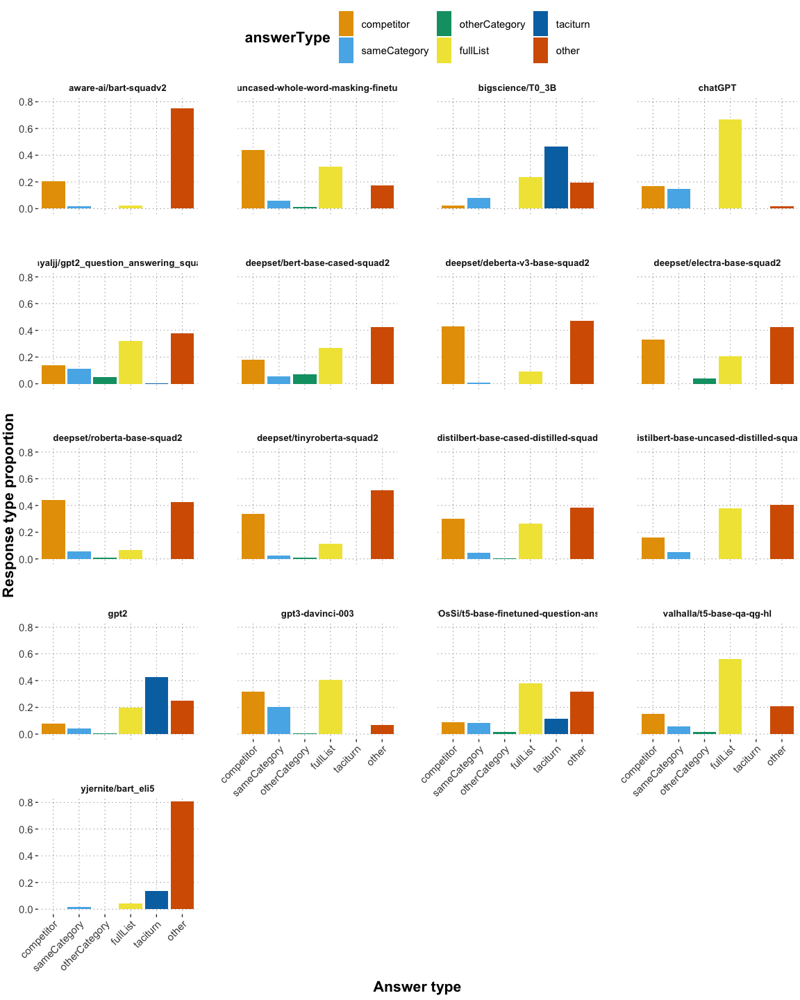
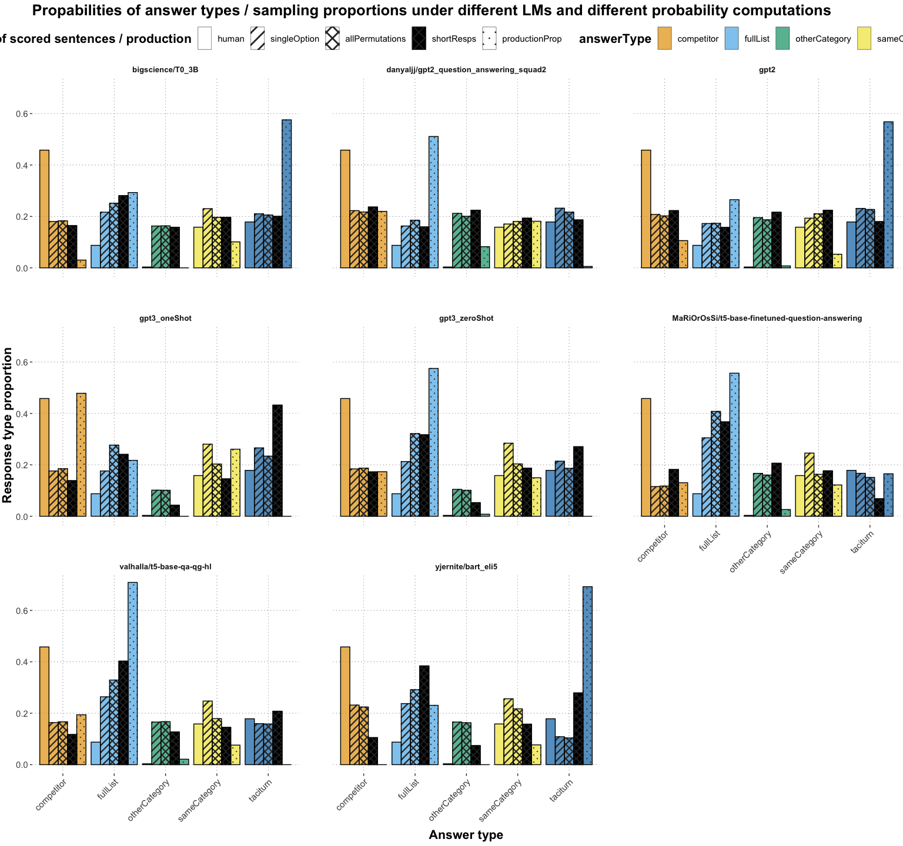
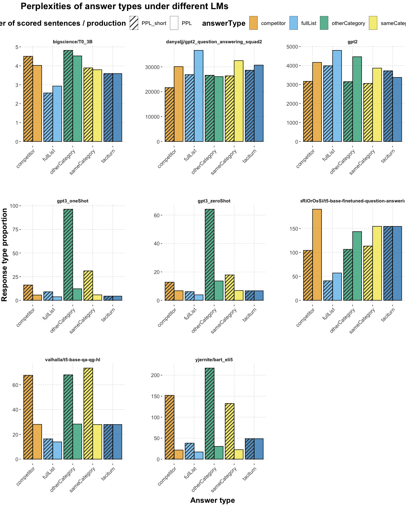
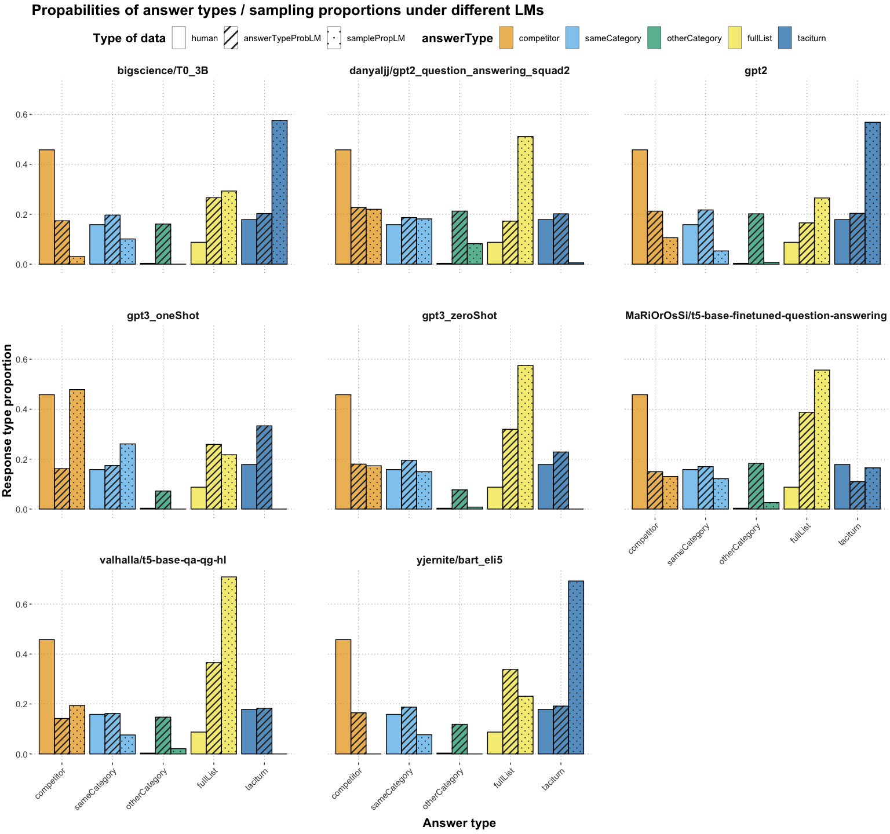
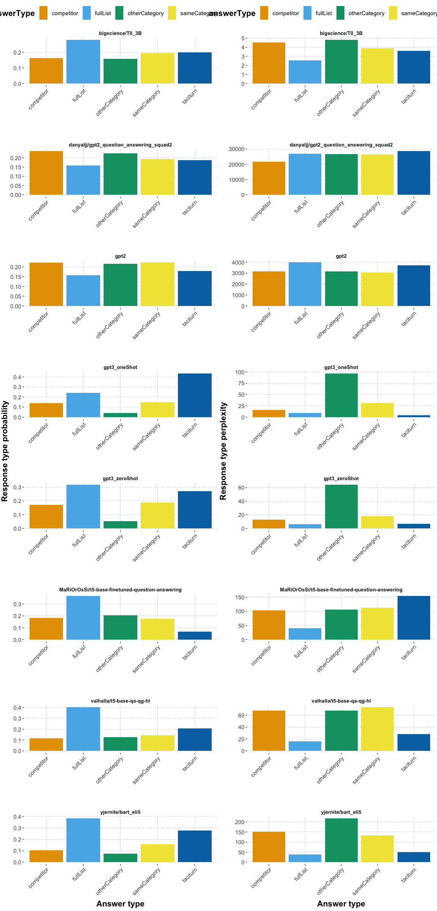
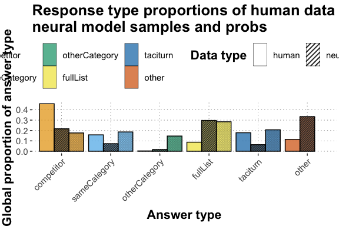

QA free typing analysis
================
Polina Tsvilodub
2023-01-02

## Intro

The following script compares the results from the [free production
human
experiment](https://github.com/magpie-ea/magpie3-qa-overinfo-free-production/blob/main/data%2Banalysis/05_main_free_typing_cogsci_analysis.md)
run on the final 30 items for CogSci to samples and scores retrieved
from Language Models (LMs) and neural models fine-tuned for question
answering on various datasets. For each model, the top 5 predictions
were retrieved. For LMs, the results are compared when using the
one-shot example also used for GPT-3, vs results without any additional
context prompting. Example model queries looked like this:

- extractive QA models: \[CLS\] Do you have raspberry cake? \[SEP\] You
  are a server in a café. Today the café has raspberry pie, chocolate
  cookies, and cheese pizza. A customer asks:\[SEP\]
- LM: You are a server in a café. Today the café has raspberry pie,
  chocolate cookies, and cheese pizza. A customer asks: Q: Do you have
  raspberry cake? A:
- LM with one shot example: You are hosting a barbecue party. You are
  standing behind the barbecue. You have the following goods to offer:
  pork sausages, vegan burgers, grilled potatoes and beef burgers. You
  reason about what that person most likely wanted to have. That they
  asked for grilled zucchini suggests that they might want vegetarian
  food. From the items you have pork sausages and beef burgers are least
  likely to satisfy the persons desires. Vegan burgers and grilled
  potatoes come much closer. Grilled potatoes are most similar to
  grilled zucchini. You reply: I’m sorry, I don’t have any grilled
  zucchini. But I do have some grilled potatoes. Now consider a
  different situation. Someone asks: Do you have grilled zucchini? You
  are a server in a café. Today the café has raspberry pie, chocolate
  cookies, and cheese pizza. A customer asks: Q: Do you have raspberry
  cake? A:

The samples from the neural models were hand-categorized into the same
categories as the human data. That is, they were categorized according
to the following criteria. Note that responses consisting of incomplete
/ ungrammatical / repetitive sentences (especially in case of GPT-2
based or one-shot models, the predictions sometimes repeated parts of
the context) were also classified as long as they contained mentions of
critical alternatives. When the alternative was mentioned incompletely
(e.g., ‘kickboxing’ instead of ‘kickboxing class’), it was only taken
into account in the classification of it was judged to be a phrase hat
could be naturally produced by human participants (mostly, kickboxing
item).

- ‘competitor’: responses mentioning the anticipated competitor only.
  Responses which started with yes but then only mentioned the
  competitor were also considered competitor category responses.
- ‘sameCategory’: responses offering both same category alternatives or
  offering the option which we did not consider the direct competitor.
  Responses which started with yes but then mentioned relevant
  alternatives were also considered same category responses.
- ‘otherCategory’: responses offering the alternative from the different
  category. Responses which started with yes but then mentioned relevant
  alternatives were also considered other category responses.
- ‘fullList’: responses where all alternatives were listed (also across
  several sentences). Responses which started with yes or repeated parts
  of the context / question but then mentioned all alternatives were
  also considered fullList responses.
- ‘taciturn’: responses not offering any alternative options or further
  alternative solutions. Responses repeating the question and saying
  ‘no’ or saying ‘no’ followed by some (generated) explanation or
  repetition were also considered taciturn responses.
- ‘other’: where a same category + other category response are mixed,
  uncertain answers, unclassifiable responses, responses offering
  further steps towards solcing the problem, responses using basic level
  categories (e.g., “dogs” instead of offering specific alternatives).
  Also nonsense responses, contradictory responses, responses mentioning
  parts of the one-shot context, completely ungrammatical responses,
  responses including insufficient formulations of some alternative were
  classified as ‘other’.
- ‘yes’: plain ‘yes’ responses, responses mentioning that the target
  item was present, responses mentioning the presense of the target otem
  even if it was followed by correctly mentioning alternative items
  (e.g., as additional options).
- The additional ‘none’ category was introduced due to extractive QA
  models which sometime predict an empty span consisting of a special
  token only. These were marked as being silent, i.e., ‘none’ (since
  such an option did not exist for human participants).

First, the script provides some descriptive information about the neural
model samples and probs, before presenting visual comparisons to human
data followed by some exploratory stats.

## Load processed experimental results and neural model data, display descriptions

Read in by-vignette response category proportions.

Read in categorized sample data from (generative) LMs and extractive QA
models.

    ## # A tibble: 6 × 6
    ##   model_name itemName                 predictions          categ…¹ probs is_fe…²
    ##   <chr>      <chr>                    <chr>                <chr>   <dbl> <lgl>  
    ## 1 chatGPT    cafe-pie                 I'm sorry, we don't… compet…     1 TRUE   
    ## 2 chatGPT    cafe-pizza               I'm sorry, we don't… fullLi…     1 TRUE   
    ## 3 chatGPT    bar-whiteWine            I'm sorry, we don't… compet…     1 TRUE   
    ## 4 chatGPT    bar-tea                  I'm sorry, we don't… sameCa…     1 TRUE   
    ## 5 chatGPT    touristInfo-childTheatre I'm sorry, there is… fullLi…     1 TRUE   
    ## 6 chatGPT    touristInfo-clubbing     I'm sorry, there is… sameCa…     1 TRUE   
    ## # … with abbreviated variable names ¹​category, ²​is_few_shot

Load all files with probabilities of different kinds of (human)
responses under pretrained LMs. All probabilities were computed
*without* one-shot examples in the context (except for GPT3).

    ## [1] "../code/results/lm_probs/trials_LLMs_bigscience_T0_3B_prob.csv"
    ## [1] "../code/results/lm_probs/trials_LLMs_danyaljj_gpt2_question_answering_squad2_prob.csv"
    ## [1] "../code/results/lm_probs/trials_LLMs_gpt2_prob.csv"
    ## [1] "../code/results/lm_probs/trials_LLMs_MaRiOrOsSi_t5_base_finetuned_question_answering_prob.csv"
    ## [1] "../code/results/lm_probs/trials_LLMs_valhalla_t5_base_qa_qg_hl_prob.csv"
    ## [1] "../code/results/lm_probs/trials_LLMs_yjernite_bart_eli5_prob.csv"

    ## # A tibble: 6 × 17
    ##    ...1 Unname…¹ itemN…² setti…³ context conte…⁴ quest…⁵ tacit…⁶ compe…⁷ sameC…⁸
    ##   <dbl>    <dbl> <chr>   <chr>   <chr>   <chr>   <chr>   <chr>   <chr>   <chr>  
    ## 1     0        0 cafe-p… cafe    You ar… You ar… Do you… I'm so… I'm so… I'm so…
    ## 2     0        0 cafe-p… cafe    You ar… You ar… Do you… I'm so… I'm so… I'm so…
    ## 3     0        0 cafe-p… cafe    You ar… You ar… Do you… I'm so… I'm so… I'm so…
    ## 4     0        0 cafe-p… cafe    You ar… You ar… Do you… I'm so… I'm so… I'm so…
    ## 5     0        0 cafe-p… cafe    You ar… You ar… Do you… I'm so… I'm so… I'm so…
    ## 6     1        1 cafe-p… cafe    You ar… You ar… Do you… I'm so… I'm so… I'm so…
    ## # … with 7 more variables: otherCategory <chr>, fullList <chr>,
    ## #   answer_type_prob <dbl>, answer_type_prob_avg <dbl>, answer_type_ppl <dbl>,
    ## #   model_name <chr>, answer_type <chr>, and abbreviated variable names
    ## #   ¹​`Unnamed: 0`, ²​itemName, ³​settingName, ⁴​context_qa, ⁵​question, ⁶​taciturn,
    ## #   ⁷​competitor, ⁸​sameCategory

Look at the distributions of response types in the sampled responses,
globally and by-model. ‘None’ and ‘yes’ responses are excluded from
global, by-model, by-item and by-model-by-item proportion summaries for
further analyses.

    ## Models that were used:  chatGPT gpt3-davinci-003 aware-ai/bart-squadv2 bert-large-uncased-whole-word-masking-finetuned-squad bigscience/T0_3B danyaljj/gpt2_question_answering_squad2 deepset/bert-base-cased-squad2 deepset/deberta-v3-base-squad2 deepset/electra-base-squad2 deepset/roberta-base-squad2 deepset/tinyroberta-squad2 distilbert-base-cased-distilled-squad distilbert-base-uncased-distilled-squad gpt2 MaRiOrOsSi/t5-base-finetuned-question-answering valhalla/t5-base-qa-qg-hl yjernite/bart_eli5

    ## Number of models that were used:  17

    ## Overall response category counts:

    ## # A tibble: 9 × 2
    ##   category          n
    ##   <chr>         <int>
    ## 1 competitor      550
    ## 2 fullList        755
    ## 3 none            271
    ## 4 other           848
    ## 5 otherCategory    42
    ## 6 sameCategory    185
    ## 7 taciturn        161
    ## 8 yes             546
    ## 9 <NA>              2

    ## By model response category counts:

    ## # A tibble: 98 × 3
    ##    model_name                                            category          n
    ##    <chr>                                                 <chr>         <int>
    ##  1 aware-ai/bart-squadv2                                 competitor       25
    ##  2 aware-ai/bart-squadv2                                 fullList          3
    ##  3 aware-ai/bart-squadv2                                 none             29
    ##  4 aware-ai/bart-squadv2                                 other            91
    ##  5 aware-ai/bart-squadv2                                 sameCategory      2
    ##  6 bert-large-uncased-whole-word-masking-finetuned-squad competitor       66
    ##  7 bert-large-uncased-whole-word-masking-finetuned-squad fullList         47
    ##  8 bert-large-uncased-whole-word-masking-finetuned-squad other            26
    ##  9 bert-large-uncased-whole-word-masking-finetuned-squad otherCategory     2
    ## 10 bert-large-uncased-whole-word-masking-finetuned-squad sameCategory      9
    ## # … with 88 more rows

    ## By dataset response category proportions:

    ## `summarise()` has grouped output by 'dataset'. You can override using the
    ## `.groups` argument.

    ## # A tibble: 51 × 4
    ## # Groups:   dataset [8]
    ##    dataset                                                   categ…¹     n  prop
    ##    <chr>                                                     <chr>   <int> <dbl>
    ##  1 eli5                                                      yes       233 0.777
    ##  2 CC, WebText, Books, Wikipedia, human data                 fullLi…    40 0.667
    ##  3 DuoRC                                                     yes       131 0.437
    ##  4 SQuADv1                                                   fullLi…   311 0.415
    ##  5 WebText                                                   yes       124 0.413
    ##  6 MC QA, EQA, CBQA, D2T, sentiment, summary, topic, paraph… tacitu…    57 0.38 
    ##  7 SQuADv2                                                   other     447 0.372
    ##  8 unknown                                                   fullLi…    98 0.327
    ##  9 SQuADv1                                                   other     207 0.276
    ## 10 unknown                                                   compet…    77 0.257
    ## # … with 41 more rows, and abbreviated variable name ¹​category

    ## Compare response category proportions of models trained on SQuADv1 vs SQuADv2:

    ## `summarise()` has grouped output by 'dataset'. You can override using the
    ## `.groups` argument.

    ## # A tibble: 9 × 3
    ##   category       SQuADv1   SQuADv2
    ##   <chr>            <dbl>     <dbl>
    ## 1 competitor     0.241    0.208   
    ## 2 fullList       0.415    0.146   
    ## 3 other          0.276    0.372   
    ## 4 otherCategory  0.0107   0.0242  
    ## 5 sameCategory   0.056    0.0442  
    ## 6 <NA>           0.00133 NA       
    ## 7 none          NA        0.197   
    ## 8 taciturn      NA        0.000833
    ## 9 yes           NA        0.0075

    ## Compare response category proportions of cased vs uncased DistilBERT models:

    ## `summarise()` has grouped output by 'model_name'. You can override using the
    ## `.groups` argument.

    ## # A tibble: 6 × 3
    ##   category      `distilbert-base-cased-distilled-squad` distilbert-base-uncase…¹
    ##   <chr>                                           <dbl>                    <dbl>
    ## 1 competitor                                    0.3                       0.16  
    ## 2 fullList                                      0.26                      0.38  
    ## 3 other                                         0.38                      0.407 
    ## 4 otherCategory                                 0.00667                  NA     
    ## 5 sameCategory                                  0.0467                    0.0533
    ## 6 <NA>                                          0.00667                  NA     
    ## # … with abbreviated variable name ¹​`distilbert-base-uncased-distilled-squad`

    ## `summarise()` has grouped output by 'model_name', 'is_few_shot'. You can
    ## override using the `.groups` argument.

    ## Proportion of response categories by model:

    ## # A tibble: 128 × 5
    ## # Groups:   model_name, is_few_shot [24]
    ##    model_name                                       is_fe…¹ categ…²     n   prop
    ##    <chr>                                            <lgl>   <chr>   <int>  <dbl>
    ##  1 aware-ai/bart-squadv2                            FALSE   compet…    25 0.167 
    ##  2 aware-ai/bart-squadv2                            FALSE   fullLi…     3 0.02  
    ##  3 aware-ai/bart-squadv2                            FALSE   none       29 0.193 
    ##  4 aware-ai/bart-squadv2                            FALSE   other      91 0.607 
    ##  5 aware-ai/bart-squadv2                            FALSE   sameCa…     2 0.0133
    ##  6 bert-large-uncased-whole-word-masking-finetuned… FALSE   compet…    66 0.44  
    ##  7 bert-large-uncased-whole-word-masking-finetuned… FALSE   fullLi…    47 0.313 
    ##  8 bert-large-uncased-whole-word-masking-finetuned… FALSE   other      26 0.173 
    ##  9 bert-large-uncased-whole-word-masking-finetuned… FALSE   otherC…     2 0.0133
    ## 10 bert-large-uncased-whole-word-masking-finetuned… FALSE   sameCa…     9 0.06  
    ## # … with 118 more rows, and abbreviated variable names ¹​is_few_shot, ²​category

    ## Proportion of 'yes' response categories by model (sorted from worst model to best):

    ## # A tibble: 11 × 5
    ## # Groups:   model_name, is_few_shot [11]
    ##    model_name                                      is_fe…¹ categ…²     n    prop
    ##    <chr>                                           <lgl>   <chr>   <int>   <dbl>
    ##  1 yjernite/bart_eli5                              TRUE    yes       118 0.787  
    ##  2 yjernite/bart_eli5                              FALSE   yes       115 0.767  
    ##  3 gpt2                                            TRUE    yes       100 0.667  
    ##  4 MaRiOrOsSi/t5-base-finetuned-question-answering TRUE    yes        69 0.46   
    ##  5 MaRiOrOsSi/t5-base-finetuned-question-answering FALSE   yes        62 0.413  
    ##  6 bigscience/T0_3B                                FALSE   yes        27 0.18   
    ##  7 gpt2                                            FALSE   yes        24 0.16   
    ##  8 gpt3-davinci-003                                FALSE   yes        22 0.147  
    ##  9 danyaljj/gpt2_question_answering_squad2         FALSE   yes         6 0.04   
    ## 10 danyaljj/gpt2_question_answering_squad2         TRUE    yes         2 0.0133 
    ## 11 deepset/roberta-base-squad2                     FALSE   yes         1 0.00667
    ## # … with abbreviated variable names ¹​is_few_shot, ²​category

    ## Proportion of 'none' response categories by QA model (sorted from worst model to best):

    ## # A tibble: 7 × 5
    ## # Groups:   model_name, is_few_shot [7]
    ##   model_name                     is_few_shot category     n  prop
    ##   <chr>                          <lgl>       <chr>    <int> <dbl>
    ## 1 deepset/electra-base-squad2    FALSE       none        77 0.513
    ## 2 deepset/deberta-v3-base-squad2 FALSE       none        50 0.333
    ## 3 gpt3-davinci-003               TRUE        none        35 0.233
    ## 4 aware-ai/bart-squadv2          FALSE       none        29 0.193
    ## 5 deepset/tinyroberta-squad2     FALSE       none        28 0.187
    ## 6 deepset/bert-base-cased-squad2 FALSE       none        27 0.18 
    ## 7 deepset/roberta-base-squad2    FALSE       none        25 0.167

    ## `summarise()` has grouped output by 'model_name', 'is_few_shot'. You can
    ## override using the `.groups` argument.
    ## `summarise()` has grouped output by 'model_name'. You can override using the
    ## `.groups` argument.
    ## `summarise()` has grouped output by 'model_type'. You can override using the
    ## `.groups` argument.
    ## `summarise()` has grouped output by 'model_name', 'is_few_shot', 'itemName'.
    ## You can override using the `.groups` argument.
    ## `summarise()` has grouped output by 'itemName'. You can override using the
    ## `.groups` argument.

    ## Proportion of response categories by vignette:

    ## # A tibble: 161 × 5
    ## # Groups:   itemName [30]
    ##    itemName      category          n   prop answerType   
    ##    <chr>         <chr>         <int>  <dbl> <fct>        
    ##  1 bar-tea       competitor       12 0.138  competitor   
    ##  2 bar-tea       fullList         40 0.460  fullList     
    ##  3 bar-tea       other            30 0.345  other        
    ##  4 bar-tea       sameCategory      4 0.0460 sameCategory 
    ##  5 bar-tea       taciturn          1 0.0115 taciturn     
    ##  6 bar-whiteWine competitor       25 0.275  competitor   
    ##  7 bar-whiteWine fullList         29 0.319  fullList     
    ##  8 bar-whiteWine other            26 0.286  other        
    ##  9 bar-whiteWine otherCategory     1 0.0110 otherCategory
    ## 10 bar-whiteWine sameCategory      3 0.0330 sameCategory 
    ## # … with 151 more rows

    ## Global response category proportions:

    ## # A tibble: 6 × 4
    ##   category          n   prop answerType   
    ##   <chr>         <int>  <dbl> <fct>        
    ## 1 competitor      550 0.216  competitor   
    ## 2 fullList        755 0.297  fullList     
    ## 3 other           848 0.334  other        
    ## 4 otherCategory    42 0.0165 otherCategory
    ## 5 sameCategory    185 0.0728 sameCategory 
    ## 6 taciturn        161 0.0634 taciturn

## Plots

The first plot shows global response proportions, averaged across models
and vignettes.

<!-- -->

The next plot displays proportions of different responses in generative
models (LMs) vs. extractive QA models:
<!-- -->

The next plot displays proportions of different responses from different
models, averaging across one-shot and zero-shot LMs.

<!-- -->

Below, we explore the idea of **weighting the proportions** of different
response types sampled deterministically from the different models by
the probability of the respective samples under the given model. Since
the samples taken were the top 5 predictions, this is to account for
potential differences in the model’s propensity to generate a given
response type (as, e.g., top 1 vs top 5 response).

``` r
df_samples_byModel_summary_weighted <- df_samples_byModel_summary %>% ungroup() %>%
  mutate(
    prop_weighted = prop * mean_probs
  ) %>% group_by(model_name) %>%
  mutate(
    sum_props = sum(prop_weighted),
    prop_weighted_renormalized = prop_weighted / sum_props
  )

df_samples_byModel_weighting_comparison <- df_samples_byModel_summary_weighted %>% 
  select(model_name, answerType, prop_weighted_renormalized) %>%
  rename("prop" = "prop_weighted_renormalized") %>%
  mutate(weighted = TRUE) %>%
  rbind(., df_samples_byModel_summary %>% select(model_name, answerType, prop) %>% mutate(weighted = FALSE))

bar.width <- 0.8
df_samples_byModel_weighting_comparison %>% ungroup() %>%
  mutate(weighted = factor(weighted, levels = c(TRUE, FALSE))) %>%
  ggplot(aes(x = answerType, fill = answerType, y = prop, pattern = weighted)) +
  geom_col_pattern(alpha = 0.7, position = position_dodge(preserve = "single"),
                   width = bar.width,
                   color = "black", 
                   pattern_fill = "black",
                   pattern_angle = 45,
                   pattern_density = 0.1,
                   pattern_spacing = 0.025,
                   pattern_key_scale_factor = 0.6
                   ) +
  scale_pattern_manual(values = c(`TRUE` = "stripe", `FALSE` = "none")) +
  labs(x = "Answer type", y = "Response type proportion", pattern = "Proportions weighted by probs?") +
  guides(pattern = guide_legend(override.aes = list(fill = "white")),
         fill = guide_legend(override.aes = list(pattern = "none"))) +
  facet_wrap( model_name ~ . , ncol = 4) +
  theme(axis.text.x = element_text(angle = 45, hjust = 1)) +
  theme(strip.text.x = element_text(size = 10)) +
  theme(panel.spacing = unit(3, "lines")) +
  ggtitle("Response type proportions weighted by response probability and renormalized")
```

<!-- -->

The next plot displays proportions of different responses from different
models, differentiating between one-shot and zero-shot LMs.

<!-- -->

The next plot displays proportions of different responses from models
by-vignette.

<!-- -->

### Comparing neural and human responses

Below, the response type categories sampled from models and collected in
the free production human experiment are plotted against each other.

First, the global proportions are compared.

<!-- -->

Next, by-vignette results can be found below.

<!-- -->

### Model probabilities

Below, the scores assigned to provided answer types are compared to the
proportions of those answer types generated by the language models
during sampling. Whenever the responses sampled from the model were
difficult to classify due to half-generated phrases (like “kick” instead
of kickboxing), they were categorized as “other” responses. The
comparison is by model type.

First, GPT-3 results are compared.
<!-- -->

Next, scores are plotted by-model.

    ## `summarise()` has grouped output by 'answerType'. You can override using the
    ## `.groups` argument.

<!-- -->

Next, probabilities computed for single response options are compared to
average probabilities computed over all permutations of alternatives in
the response sentences and generation proportions.

<!-- -->

Compare scores assigned to original response types and short responses
without the taciturn prefix.

    ## [1] "../code/results/lm_probs/short_responses//GPT3-davinci-003-predictions-overinfo-oneShotLearner-cogsci_shortPrompts_long.csv"

    ## Rows: 150 Columns: 6
    ## ── Column specification ────────────────────────────────────────────────────────
    ## Delimiter: ","
    ## chr (3): itemName, answer_type, model_name
    ## dbl (3): answer_type_prob_avg, answer_type_ppl, answer_type_length_norm_prob
    ## 
    ## ℹ Use `spec()` to retrieve the full column specification for this data.
    ## ℹ Specify the column types or set `show_col_types = FALSE` to quiet this message.

    ## [1] "../code/results/lm_probs/short_responses//GPT3-davinci-003-predictions-overinfo-zeroShotLearer-cogsci-shortPrompts-long.csv"

    ## Rows: 150 Columns: 6
    ## ── Column specification ────────────────────────────────────────────────────────
    ## Delimiter: ","
    ## chr (3): itemName, answer_type, model_name
    ## dbl (3): answer_type_prob_avg, answer_type_ppl, answer_type_length_norm_prob
    ## 
    ## ℹ Use `spec()` to retrieve the full column specification for this data.
    ## ℹ Specify the column types or set `show_col_types = FALSE` to quiet this message.

    ## [1] "../code/results/lm_probs/short_responses//trials_LLMs_bigscience_T0_3B_short_prob.csv"

    ## New names:
    ## Rows: 150 Columns: 24
    ## ── Column specification
    ## ──────────────────────────────────────────────────────── Delimiter: "," chr
    ## (19): itemName, settingName, context, context_qa, question, taciturn, co... dbl
    ## (5): ...1, Unnamed: 0, answer_type_prob_avg, answer_type_ppl, answer_ty...
    ## ℹ Use `spec()` to retrieve the full column specification for this data. ℹ
    ## Specify the column types or set `show_col_types = FALSE` to quiet this message.
    ## • `` -> `...1`

    ## [1] "../code/results/lm_probs/short_responses//trials_LLMs_danyalj_gpt2_question_answering_squad2_short.csv"

    ## New names:
    ## Rows: 150 Columns: 24
    ## ── Column specification
    ## ──────────────────────────────────────────────────────── Delimiter: "," chr
    ## (19): itemName, settingName, context, context_qa, question, taciturn, co... dbl
    ## (5): ...1, Unnamed: 0, answer_type_prob_avg, answer_type_ppl, answer_ty...
    ## ℹ Use `spec()` to retrieve the full column specification for this data. ℹ
    ## Specify the column types or set `show_col_types = FALSE` to quiet this message.
    ## • `` -> `...1`

    ## [1] "../code/results/lm_probs/short_responses//trials_LLMs_gpt2_short.csv"

    ## New names:
    ## Rows: 150 Columns: 24
    ## ── Column specification
    ## ──────────────────────────────────────────────────────── Delimiter: "," chr
    ## (19): itemName, settingName, context, context_qa, question, taciturn, co... dbl
    ## (5): ...1, Unnamed: 0, answer_type_prob_avg, answer_type_ppl, answer_ty...
    ## ℹ Use `spec()` to retrieve the full column specification for this data. ℹ
    ## Specify the column types or set `show_col_types = FALSE` to quiet this message.
    ## • `` -> `...1`

    ## [1] "../code/results/lm_probs/short_responses//trials_LLMs_MaRiOrOsSi_t5_base_finetuned_question_answering_short.csv"

    ## New names:
    ## Rows: 150 Columns: 24
    ## ── Column specification
    ## ──────────────────────────────────────────────────────── Delimiter: "," chr
    ## (19): itemName, settingName, context, context_qa, question, taciturn, co... dbl
    ## (5): ...1, Unnamed: 0, answer_type_prob_avg, answer_type_ppl, answer_ty...
    ## ℹ Use `spec()` to retrieve the full column specification for this data. ℹ
    ## Specify the column types or set `show_col_types = FALSE` to quiet this message.
    ## • `` -> `...1`

    ## [1] "../code/results/lm_probs/short_responses//trials_LLMs_valhalla_t5_base_qa_qg_hl_probs_short.csv"

    ## New names:
    ## Rows: 150 Columns: 24
    ## ── Column specification
    ## ──────────────────────────────────────────────────────── Delimiter: "," chr
    ## (19): itemName, settingName, context, context_qa, question, taciturn, co... dbl
    ## (5): ...1, Unnamed: 0, answer_type_prob_avg, answer_type_ppl, answer_ty...
    ## ℹ Use `spec()` to retrieve the full column specification for this data. ℹ
    ## Specify the column types or set `show_col_types = FALSE` to quiet this message.
    ## • `` -> `...1`

    ## [1] "../code/results/lm_probs/short_responses//trials_LLMs_yjernite_bart_eli5_question_answering_short.csv"

    ## New names:
    ## Rows: 150 Columns: 24
    ## ── Column specification
    ## ──────────────────────────────────────────────────────── Delimiter: "," chr
    ## (19): itemName, settingName, context, context_qa, question, taciturn, co... dbl
    ## (5): ...1, Unnamed: 0, answer_type_prob_avg, answer_type_ppl, answer_ty...
    ## ℹ Use `spec()` to retrieve the full column specification for this data. ℹ
    ## Specify the column types or set `show_col_types = FALSE` to quiet this message.
    ## • `` -> `...1`

    ## # A tibble: 6 × 6
    ##   itemName     answerType    model_name   answer_type_prob_avg…¹ answe…² answe…³
    ##   <chr>        <chr>         <chr>                         <dbl>   <dbl>   <dbl>
    ## 1 zoo-xl       taciturn      gpt3_oneShot                 0.502     4.97 1.00e+0
    ## 2 zoo-xl       competitor    gpt3_oneShot                 0.0991   25.2  3.92e-4
    ## 3 zoo-xl       sameCategory  gpt3_oneShot                 0.118    35.6  4.00e-6
    ## 4 zoo-xl       otherCategory gpt3_oneShot                 0.0431   57.8  7.74e-9
    ## 5 zoo-xl       fullList      gpt3_oneShot                 0.238    11.7  5.72e-7
    ## 6 zoo-reptiles taciturn      gpt3_oneShot                 0.546     3.74 1.00e+0
    ## # … with abbreviated variable names ¹​answer_type_prob_avg_short,
    ## #   ²​answer_type_ppl_short, ³​answer_type_length_norm_prob_short

    ## `summarise()` has grouped output by 'model_name'. You can override using the
    ## `.groups` argument.

<!-- -->

For comparison, look at qualitative pattern of perplexities.

<!-- -->

For the paper, we average the results from short and long response probs
and compare them to the models’ sample proportions and human
performance:
<!-- -->

For comparison, plot the length normalized probabilities retrieved from
the models. The expectation is that the qualitative pattern matches the
pattern of the PPLs by model.

    ## `summarise()` has grouped output by 'answerType'. You can override using the
    ## `.groups` argument.
    ## `summarise()` has grouped output by 'answerType'. You can override using the
    ## `.groups` argument.

<!-- -->
<!-- -->

Compare the samples and the probabilities assigned by the models to
human data (across models and vignettes).

<!-- -->

Below, scores by-vignette are compared (across models).

    ## `summarise()` has grouped output by 'answerType'. You can override using the
    ## `.groups` argument.

<!-- -->

Compare the scores of different models to their proportion predictions:

<!-- -->

A comparison of human data against average probabilities / samples
proportions of the models across models is shown below:

    ## `summarise()` has grouped output by 'answerType'. You can override using the
    ## `.groups` argument.

<!-- -->

Try plotting the raw responses against each other:

## Stats

Below, the KL-divergence of between global human response type
proportions (renormalized after excluding ‘other’ responses) and
probabilities assigned by the models are compared. Note the implicit
assumption that the proportions of different response types produced by
humans are the probabilities of producing that particular type given the
context.

``` r
compute_kl <- function(P, Q) {
  tryCatch(
    expr = {
      df <- rbind(P, Q)
      kl <- philentropy::KL(df)
      return(kl)
    },
    error = function(e){
      print("Numerical precision error")
      print(e)
    }
  )
}

df_human_global_renorm <- df_human_global %>% filter(answerType != "other") %>%
  mutate(answer_type_prob = prop / (df_human_global %>% filter(answerType != "other") %>% pull(prop) %>% sum()))
# second is the reference dist
model_human_dists <- rbind(lm_scores_global %>% pull(answer_type_prob), df_human_global_renorm %>% pull(answer_type_prob)) 
kl <- philentropy::KL(model_human_dists)
cat("KL divergence between human data and probs of responses averaged over models: ", kl)
```

    ## KL divergence between human data and probs of responses averaged over models:  1.034189

Compute KLs between response proportions, probabilities by model and by
vignette (for some cases numerical precision errors don’t allow for
computation of the KL, in that case respective / model vigntte are
skipped).

    ## KL between GPT-3 one shot probs and human data

    ## [1] 0.6423364

    ## KL between GPT-3 zero shot probs and human data

    ## [1] 0.6708533

    ## KLs between probabilities of different responses computed under different models and human response proportions

    ##                                        model_name        KL
    ## 1                                bigscience/T0_3B 0.9501250
    ## 2         danyaljj/gpt2_question_answering_squad2 1.1117283
    ## 3                                            gpt2 1.0433814
    ## 4 MaRiOrOsSi/t5-base-finetuned-question-answering 1.2242311
    ## 5                       valhalla/t5-base-qa-qg-hl 1.0667332
    ## 6                              yjernite/bart_eli5 0.9715839
    ## 7                                   gpt3_zeroShot 0.6708533
    ## 8                                    gpt3_oneShot 0.6423364

    ## [1] "aware-ai/bart-squadv2"
    ## [1] "Numerical precision error"
    ## <simpleError: Please make sure that all vectors sum up to 1.0 ...>
    ## [1] "bert-large-uncased-whole-word-masking-finetuned-squad"
    ## [1] "bigscience/T0_3B"
    ## [1] "chatGPT"
    ## [1] "Numerical precision error"
    ## <simpleError: Please make sure that all vectors sum up to 1.0 ...>
    ## [1] "danyaljj/gpt2_question_answering_squad2"
    ## [1] "Numerical precision error"
    ## <simpleError: Please make sure that all vectors sum up to 1.0 ...>
    ## [1] "deepset/bert-base-cased-squad2"
    ## [1] "deepset/deberta-v3-base-squad2"
    ## [1] "Numerical precision error"
    ## <simpleError: Please make sure that all vectors sum up to 1.0 ...>
    ## [1] "deepset/electra-base-squad2"
    ## [1] "Numerical precision error"
    ## <simpleError: Please make sure that all vectors sum up to 1.0 ...>
    ## [1] "deepset/roberta-base-squad2"
    ## [1] "deepset/tinyroberta-squad2"
    ## [1] "distilbert-base-cased-distilled-squad"
    ## [1] "distilbert-base-uncased-distilled-squad"
    ## [1] "Numerical precision error"
    ## <simpleError: Please make sure that all vectors sum up to 1.0 ...>
    ## [1] "gpt2"
    ## [1] "Numerical precision error"
    ## <simpleError: Please make sure that all vectors sum up to 1.0 ...>
    ## [1] "gpt3-davinci-003"
    ## [1] "MaRiOrOsSi/t5-base-finetuned-question-answering"
    ## [1] "Numerical precision error"
    ## <simpleError: Please make sure that all vectors sum up to 1.0 ...>
    ## [1] "valhalla/t5-base-qa-qg-hl"
    ## [1] "yjernite/bart_eli5"
    ## [1] "Numerical precision error"
    ## <simpleError: Please make sure that all vectors sum up to 1.0 ...>

    ## KLs between different response type proportions of different models and human response proportions

    ##                                              model_name        KL
    ## 1 bert-large-uncased-whole-word-masking-finetuned-squad 0.9630740
    ## 2                                      bigscience/T0_3B 1.6291534
    ## 3                        deepset/bert-base-cased-squad2 2.6212107
    ## 4                           deepset/roberta-base-squad2 2.5860372
    ## 5                            deepset/tinyroberta-squad2 3.2725399
    ## 6                 distilbert-base-cased-distilled-squad 2.3300163
    ## 7                                      gpt3-davinci-003 0.5330264
    ## 8                             valhalla/t5-base-qa-qg-hl 1.7215374

    ## [1] "bar-tea"
    ## [1] "bar-whiteWine"
    ## [1] "Numerical precision error"
    ## <simpleError: Please make sure that all vectors sum up to 1.0 ...>
    ## [1] "bookingAgency-highClassAccommodation"
    ## [1] "bookingAgency-lowClassAccommodation"
    ## [1] "Numerical precision error"
    ## <simpleError: Please make sure that all vectors sum up to 1.0 ...>
    ## [1] "books-fantasy"
    ## [1] "Numerical precision error"
    ## <simpleError: Please make sure that all vectors sum up to 1.0 ...>
    ## [1] "books-romance"
    ## [1] "Numerical precision error"
    ## <simpleError: Please make sure that all vectors sum up to 1.0 ...>
    ## [1] "cafe-pie"
    ## [1] "Numerical precision error"
    ## <simpleError: Please make sure that all vectors sum up to 1.0 ...>
    ## [1] "cafe-pizza"
    ## [1] "Numerical precision error"
    ## <simpleError: Please make sure that all vectors sum up to 1.0 ...>
    ## [1] "clothing-acc"
    ## [1] "clothing-clothes"
    ## [1] "Numerical precision error"
    ## <simpleError: Please make sure that all vectors sum up to 1.0 ...>
    ## [1] "dutyFree-smokes"
    ## [1] "dutyFree-sweets"
    ## [1] "Numerical precision error"
    ## <simpleError: Please make sure that all vectors sum up to 1.0 ...>
    ## [1] "electronics-console"
    ## [1] "Numerical precision error"
    ## <simpleError: Please make sure that all vectors sum up to 1.0 ...>
    ## [1] "electronics-laptop"
    ## [1] "Numerical precision error"
    ## <simpleError: Please make sure that all vectors sum up to 1.0 ...>
    ## [1] "friendsActivities-boardGames"
    ## [1] "friendsActivities-videoEntertainment"
    ## [1] "Numerical precision error"
    ## <simpleError: Please make sure that all vectors sum up to 1.0 ...>
    ## [1] "gym-boxing"
    ## [1] "Numerical precision error"
    ## <simpleError: Please make sure that all vectors sum up to 1.0 ...>
    ## [1] "gym-yoga"
    ## [1] "interior-deco"
    ## [1] "Numerical precision error"
    ## <simpleError: Please make sure that all vectors sum up to 1.0 ...>
    ## [1] "interior-green"
    ## [1] "kidsActivities-crafts"
    ## [1] "Numerical precision error"
    ## <simpleError: Please make sure that all vectors sum up to 1.0 ...>
    ## [1] "kidsActivities-sports"
    ## [1] "Numerical precision error"
    ## <simpleError: Please make sure that all vectors sum up to 1.0 ...>
    ## [1] "petAdoption-dogs"
    ## [1] "Numerical precision error"
    ## <simpleError: Please make sure that all vectors sum up to 1.0 ...>
    ## [1] "petAdoption-hamster"
    ## [1] "Numerical precision error"
    ## <simpleError: Please make sure that all vectors sum up to 1.0 ...>
    ## [1] "touristInfo-childTheatre"
    ## [1] "Numerical precision error"
    ## <simpleError: Please make sure that all vectors sum up to 1.0 ...>
    ## [1] "touristInfo-clubbing"
    ## [1] "Numerical precision error"
    ## <simpleError: Please make sure that all vectors sum up to 1.0 ...>
    ## [1] "waterSport-motor"
    ## [1] "Numerical precision error"
    ## <simpleError: Please make sure that all vectors sum up to 1.0 ...>
    ## [1] "waterSport-muscle"
    ## [1] "Numerical precision error"
    ## <simpleError: Please make sure that all vectors sum up to 1.0 ...>
    ## [1] "zoo-reptiles"
    ## [1] "zoo-xl"
    ## [1] "Numerical precision error"
    ## <simpleError: Please make sure that all vectors sum up to 1.0 ...>

    ## KLs between different response type proportions by item between neural model and human response proportions

    ##                               itemName        KL
    ## 1                              bar-tea 0.5117103
    ## 2 bookingAgency-highClassAccommodation 0.2513933
    ## 3                         clothing-acc 0.3662054
    ## 4                      dutyFree-smokes 0.7479666
    ## 5         friendsActivities-boardGames 0.3154953
    ## 6                             gym-yoga 0.1949593
    ## 7                       interior-green 0.1659281
    ## 8                         zoo-reptiles 0.4676427

Compute a multinomial regression with a main effect of human vs model
data, regressing the response category against an intercept and a main
effect of data source, and random by-item intercepts. Competitor
responses are coded as the reference level.

``` r
df_human_raw <- read_csv("data/results_QA-overinfo-freeTyping-cogsci_full_anonymized_categorized.csv") %>% 
  filter(category != 'yes', !(submission_id %in% c(4608, 4690, 4687, 4733, 4763))) %>% 
  mutate(answerType = factor(category, levels = answerOrder),
         model_name = "human"
         ) %>% 
  select(itemName, answerType, model_name)

df_samples_human_raw <- nm_samples_categorized %>% 
  filter((category != "yes") & (category != "none")) %>%
  mutate(
    answerType = factor(category, levels = answerOrder),
    model_name = "neural"
  ) %>%
  select(itemName, answerType, model_name) %>%
  rbind(., df_human_raw) %>%
  mutate(
    model_name = factor(model_name, levels = c("human", "neural"))
  )

contrasts(df_samples_human_raw$answerType)
```

    ##               sameCategory otherCategory fullList taciturn other
    ## competitor               0             0        0        0     0
    ## sameCategory             1             0        0        0     0
    ## otherCategory            0             1        0        0     0
    ## fullList                 0             0        1        0     0
    ## taciturn                 0             0        0        1     0
    ## other                    0             0        0        0     1

``` r
contrasts(df_samples_human_raw$model_name)
```

    ##        neural
    ## human       0
    ## neural      1

``` r
model <- brm(answerType ~ 1 + model_name + (1 | itemName), 
             data = df_samples_human_raw,
             family = "categorical",
             iter = 4000
             )
```

    ## Running /Library/Frameworks/R.framework/Resources/bin/R CMD SHLIB foo.c
    ## clang -arch arm64 -I"/Library/Frameworks/R.framework/Resources/include" -DNDEBUG   -I"/Library/Frameworks/R.framework/Versions/4.2-arm64/Resources/library/Rcpp/include/"  -I"/Library/Frameworks/R.framework/Versions/4.2-arm64/Resources/library/RcppEigen/include/"  -I"/Library/Frameworks/R.framework/Versions/4.2-arm64/Resources/library/RcppEigen/include/unsupported"  -I"/Library/Frameworks/R.framework/Versions/4.2-arm64/Resources/library/BH/include" -I"/Library/Frameworks/R.framework/Versions/4.2-arm64/Resources/library/StanHeaders/include/src/"  -I"/Library/Frameworks/R.framework/Versions/4.2-arm64/Resources/library/StanHeaders/include/"  -I"/Library/Frameworks/R.framework/Versions/4.2-arm64/Resources/library/RcppParallel/include/"  -I"/Library/Frameworks/R.framework/Versions/4.2-arm64/Resources/library/rstan/include" -DEIGEN_NO_DEBUG  -DBOOST_DISABLE_ASSERTS  -DBOOST_PENDING_INTEGER_LOG2_HPP  -DSTAN_THREADS  -DBOOST_NO_AUTO_PTR  -include '/Library/Frameworks/R.framework/Versions/4.2-arm64/Resources/library/StanHeaders/include/stan/math/prim/mat/fun/Eigen.hpp'  -D_REENTRANT -DRCPP_PARALLEL_USE_TBB=1   -I/opt/R/arm64/include   -fPIC  -falign-functions=64 -Wall -g -O2  -c foo.c -o foo.o
    ## In file included from <built-in>:1:
    ## In file included from /Library/Frameworks/R.framework/Versions/4.2-arm64/Resources/library/StanHeaders/include/stan/math/prim/mat/fun/Eigen.hpp:13:
    ## In file included from /Library/Frameworks/R.framework/Versions/4.2-arm64/Resources/library/RcppEigen/include/Eigen/Dense:1:
    ## In file included from /Library/Frameworks/R.framework/Versions/4.2-arm64/Resources/library/RcppEigen/include/Eigen/Core:88:
    ## /Library/Frameworks/R.framework/Versions/4.2-arm64/Resources/library/RcppEigen/include/Eigen/src/Core/util/Macros.h:628:1: error: unknown type name 'namespace'
    ## namespace Eigen {
    ## ^
    ## /Library/Frameworks/R.framework/Versions/4.2-arm64/Resources/library/RcppEigen/include/Eigen/src/Core/util/Macros.h:628:16: error: expected ';' after top level declarator
    ## namespace Eigen {
    ##                ^
    ##                ;
    ## In file included from <built-in>:1:
    ## In file included from /Library/Frameworks/R.framework/Versions/4.2-arm64/Resources/library/StanHeaders/include/stan/math/prim/mat/fun/Eigen.hpp:13:
    ## In file included from /Library/Frameworks/R.framework/Versions/4.2-arm64/Resources/library/RcppEigen/include/Eigen/Dense:1:
    ## /Library/Frameworks/R.framework/Versions/4.2-arm64/Resources/library/RcppEigen/include/Eigen/Core:96:10: fatal error: 'complex' file not found
    ## #include <complex>
    ##          ^~~~~~~~~
    ## 3 errors generated.
    ## make: *** [foo.o] Error 1

``` r
summary(model)
```

    ##  Family: categorical 
    ##   Links: musameCategory = logit; muotherCategory = logit; mufullList = logit; mutaciturn = logit; muother = logit 
    ## Formula: answerType ~ 1 + model_name + (1 | itemName) 
    ##    Data: df_samples_human_raw (Number of observations: 3136) 
    ##   Draws: 4 chains, each with iter = 4000; warmup = 2000; thin = 1;
    ##          total post-warmup draws = 8000
    ## 
    ## Group-Level Effects: 
    ## ~itemName (Number of levels: 31) 
    ##                               Estimate Est.Error l-95% CI u-95% CI Rhat
    ## sd(musameCategory_Intercept)      0.71      0.14     0.46     1.02 1.00
    ## sd(muotherCategory_Intercept)     1.41      0.36     0.82     2.23 1.00
    ## sd(mufullList_Intercept)          0.33      0.08     0.18     0.51 1.00
    ## sd(mutaciturn_Intercept)          0.70      0.13     0.48     1.00 1.00
    ## sd(muother_Intercept)             0.45      0.08     0.31     0.64 1.00
    ##                               Bulk_ESS Tail_ESS
    ## sd(musameCategory_Intercept)      2587     4247
    ## sd(muotherCategory_Intercept)     2410     4407
    ## sd(mufullList_Intercept)          2504     3875
    ## sd(mutaciturn_Intercept)          2541     4186
    ## sd(muother_Intercept)             2779     4727
    ## 
    ## Population-Level Effects: 
    ##                                  Estimate Est.Error l-95% CI u-95% CI Rhat
    ## musameCategory_Intercept            -1.19      0.18    -1.56    -0.84 1.00
    ## muotherCategory_Intercept           -5.89      0.87    -7.82    -4.45 1.00
    ## mufullList_Intercept                -1.68      0.17    -2.01    -1.36 1.00
    ## mutaciturn_Intercept                -1.01      0.18    -1.35    -0.66 1.00
    ## muother_Intercept                   -1.41      0.16    -1.72    -1.10 1.00
    ## musameCategory_model_nameneural     -0.04      0.15    -0.33     0.25 1.00
    ## muotherCategory_model_nameneural     2.70      0.81     1.38     4.59 1.00
    ## mufullList_model_nameneural          2.01      0.16     1.69     2.34 1.00
    ## mutaciturn_model_nameneural         -0.32      0.15    -0.61    -0.02 1.00
    ## muother_model_nameneural             1.85      0.15     1.57     2.15 1.00
    ##                                  Bulk_ESS Tail_ESS
    ## musameCategory_Intercept             3169     4557
    ## muotherCategory_Intercept            5775     4411
    ## mufullList_Intercept                 6966     5757
    ## mutaciturn_Intercept                 3357     4590
    ## muother_Intercept                    5318     5917
    ## musameCategory_model_nameneural      8246     6366
    ## muotherCategory_model_nameneural     8251     4155
    ## mufullList_model_nameneural          8526     5890
    ## mutaciturn_model_nameneural          8546     6259
    ## muother_model_nameneural             8989     6754
    ## 
    ## Draws were sampled using sampling(NUTS). For each parameter, Bulk_ESS
    ## and Tail_ESS are effective sample size measures, and Rhat is the potential
    ## scale reduction factor on split chains (at convergence, Rhat = 1).

Extract contrasts by response type between human data and neural model
data (i.e., probability that proportion of given response type is larger
in human than in neural model data):

``` r
model_posteriors <- model %>% spread_draws(b_musameCategory_Intercept, b_muotherCategory_Intercept, b_mufullList_Intercept, b_mutaciturn_Intercept, b_muother_Intercept, b_musameCategory_model_nameneural, b_muotherCategory_model_nameneural, b_mufullList_model_nameneural, b_mutaciturn_model_nameneural, b_muother_model_nameneural) %>%
  mutate(
    sameCategory = b_musameCategory_Intercept - b_musameCategory_model_nameneural,
    otherCategory = b_musameCategory_Intercept - b_muotherCategory_model_nameneural,
    fullList = b_mufullList_Intercept - b_mufullList_model_nameneural,
    taciturn = b_mutaciturn_Intercept - b_mutaciturn_model_nameneural,
    other = b_muother_Intercept - b_muother_model_nameneural
  )

model_posteriors %>% select(sameCategory, otherCategory, fullList, taciturn, other) %>%
  gather(key, val) %>%
  group_by(key) %>%
  summarize(
    '|95%' = quantile(val, probs = c(0.025, 0.975))[[1]],
    'mean'  = mean(val),
    '95%|' = quantile(val, probs = c(0.025, 0.975))[[2]],
    prob_gt_0 = mean(val > 0)*100,
    prob_lt_0 = mean(val < 0)*100
  ) -> model_posteriors_summary

model_posteriors_summary
```

    ## # A tibble: 5 × 6
    ##   key           `|95%`   mean `95%|` prob_gt_0 prob_lt_0
    ##   <chr>          <dbl>  <dbl>  <dbl>     <dbl>     <dbl>
    ## 1 fullList       -4.33 -3.69  -3.07       0        100  
    ## 2 other          -3.85 -3.26  -2.70       0        100  
    ## 3 otherCategory  -5.82 -3.89  -2.51       0        100  
    ## 4 sameCategory   -1.73 -1.15  -0.581      0        100  
    ## 5 taciturn       -1.24 -0.683 -0.120      0.75      99.2

``` r
# TODO: determine the prob that competitor proportion in human data larger than in neural data
```

Compute p-value of human data under model data: Chi-square tests of
human response proportions vs model probabilities and response
proportions (assumed to be ground truth).

``` r
# assumed order of counts / proportions: comp, sameCat, otherCat, fullList, taciturn (excluding other)
human_counts <- df_human_raw %>% filter(answerType != "other") %>% group_by(answerType) %>%
  summarize(count = n()) 

compute_p <- function(human_counts, name, models_df, type) {
  cats <- c("competitor", "sameCategory", "otherCategory", "fullList", "taciturn")
  
  if (type == "samples") {
    df <- models_df %>% filter(model_name == name) %>% select(answerType, prop) %>% filter(answerType != "other")
  } else {
    df <- models_df %>% filter(model_name == name) %>% select(answerType, answer_type_prob) %>%
      rename("prop" = "answer_type_prob") %>% filter(answerType != "other")
  }
  answer_types <- df$answerType
  # pad missing category with epsilon and renormalize
  if (answer_types %>% length() < 5) {
    for (a in setdiff(cats, answer_types)) {
      df <- df %>% ungroup() %>%
      add_row(answerType = a, prop = 0.01)
    }
  }
  df <- df %>% ungroup() %>% mutate(
        answerType = factor(answerType, levels = c("competitor", "sameCategory", "otherCategory", "fullList", "taciturn")),
        sum_prop = sum(prop),
        prop = prop / sum_prop
      ) 
  res <- chisq.test(x = human_counts, p = df %>% pull(prop))
  return(res$p.value)
}

compute_p(human_counts %>% pull(count), "chatGPT", df_samples_byModel_summary, "samples")
```

    ## [1] 0

``` r
# define df 
df_pvals_models_vs_humans <- data.frame(model_name=character(), type=character(), p=double())
# iterate over model samples
for (m in all_sample_models) {
  p <- compute_p(human_counts %>% pull(count), m, df_samples_byModel_summary, "samples")
  df_pvals_models_vs_humans <- df_pvals_models_vs_humans %>%
    add_row(model_name=m, type="samples", p=p)
}
# iterate over scores
for (m in all_score_models) {
  p <- compute_p(human_counts %>% pull(count), m, lm_scores_byModel, "prob")
  df_pvals_models_vs_humans <- df_pvals_models_vs_humans %>%
    add_row(model_name=m, type="prob", p=p)
}
cat("P values under Chi square tests of human data against probabilities / sample proportions of neural models ")
```

    ## P values under Chi square tests of human data against probabilities / sample proportions of neural models

``` r
df_pvals_models_vs_humans
```

    ##                                               model_name    type             p
    ## 1                                  aware-ai/bart-squadv2 samples 2.591250e-117
    ## 2  bert-large-uncased-whole-word-masking-finetuned-squad samples  0.000000e+00
    ## 3                                       bigscience/T0_3B samples  0.000000e+00
    ## 4                                                chatGPT samples  0.000000e+00
    ## 5                danyaljj/gpt2_question_answering_squad2 samples  0.000000e+00
    ## 6                         deepset/bert-base-cased-squad2 samples 6.957347e-276
    ## 7                         deepset/deberta-v3-base-squad2 samples 1.096517e-261
    ## 8                            deepset/electra-base-squad2 samples 3.485499e-292
    ## 9                            deepset/roberta-base-squad2 samples 1.089853e-238
    ## 10                            deepset/tinyroberta-squad2 samples 7.245397e-196
    ## 11                 distilbert-base-cased-distilled-squad samples 4.992191e-262
    ## 12               distilbert-base-uncased-distilled-squad samples  0.000000e+00
    ## 13                                                  gpt2 samples 5.709550e-215
    ## 14                                      gpt3-davinci-003 samples  0.000000e+00
    ## 15       MaRiOrOsSi/t5-base-finetuned-question-answering samples 5.947934e-162
    ## 16                             valhalla/t5-base-qa-qg-hl samples  0.000000e+00
    ## 17                                    yjernite/bart_eli5 samples 2.653637e-205
    ## 18                                      bigscience/T0_3B    prob  1.375686e-96
    ## 19               danyaljj/gpt2_question_answering_squad2    prob  1.002617e-69
    ## 20                                                  gpt2    prob  1.096270e-76
    ## 21       MaRiOrOsSi/t5-base-finetuned-question-answering    prob 6.707184e-195
    ## 22                             valhalla/t5-base-qa-qg-hl    prob 7.208425e-119
    ## 23                                    yjernite/bart_eli5    prob  1.219888e-77
    ## 24                                         gpt3_zeroShot    prob  8.313942e-90
    ## 25                                          gpt3_oneShot    prob  2.582429e-94

``` r
all(df_pvals_models_vs_humans %>% pull(p) < 0.05)
```

    ## [1] TRUE
