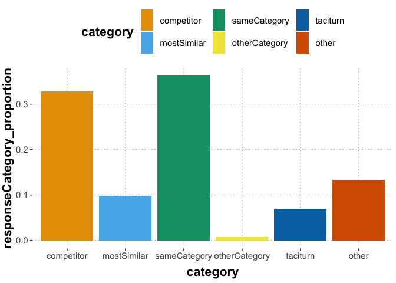
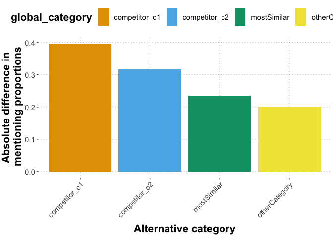
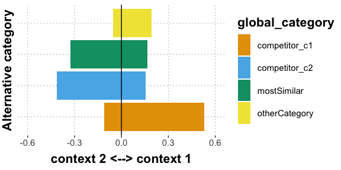
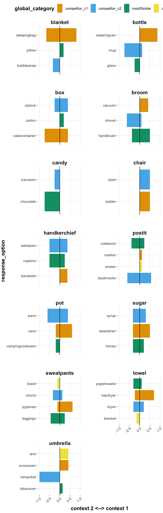

QA free typing with varying context pilot analysis
================
Polina Tsvilodub
2023-01-14

## Intro

The vignettes presented pairs of different contexts. However, the list
of alternatives was the same for both contexts. The hypothesis is that
the suggested competitors will differ across contexts.

The responses were manually classified by Polina into the following
categories:

- competitor: responses mentioning the anticipated competitor only (vary
  across contexts, sometimes several options were categorized as
  competitors)
- mostSimilar: one of the sameCategory alternatives is an items that can
  be considered most similar to the target *out of context* (i.e., same
  for both contexts), so this category comprises responses offering that
  alternative
- sameCategory: responses offering both same category alternatives or
  offering the option which we did not consider the direct competitor
  (options categorised as competitors in one context usually are
  sameCategory items in the second context)
- otherCategory: responses offering the alternative from the different
  category (distractors; usually same in both contexts. In some
  vignettes, there are two, in some there is only one other category
  alternative)
- fullList: responses where all alternatives were listed (also in two
  sentences, where one offered the competitor only etc)
- taciturn: responses not offering any alternative options or further
  alternative solutions
- other: responses where a same category + other category response are
  mixed, uncertain answers, unclassifiable responses, responses offering
  further teps towards solcing the problem, responses using basic level
  categories (e.g., “dogs” instead of offering specific alternatives)
- yes responses (excluded from analyses when not mentioning one of the
  alternatives)

In the experiment, each subject saw *four main trials* and *one
attention checking trial*. Participants failing attention checks were
excluded from analysis. They were reimbursed 0.60 pounds for their
participation.

## Summary and exclusions

    ## Subjects who failed attention checks:  4846 4872

    ## 
    ## Number of subjects who failed attention checks:  2

    ## 
    ## Subject exclusion rate:  0.05263158

    ## Number of excluded inccorect ('yes') responses:  2

    ## Proportion of excluded inccorect ('yes') responses:  0.01052632

    ## 
    ## Number of subjects post exclusions:  36

    ## 
    ## Number of analysed responses:  143

    ## # A tibble: 6 × 2
    ##   category          n
    ##   <fct>         <int>
    ## 1 competitor       47
    ## 2 mostSimilar      14
    ## 3 other            19
    ## 4 otherCategory     1
    ## 5 sameCategory     52
    ## 6 taciturn         10

    ## # A tibble: 25 × 2
    ##    itemName                   n
    ##    <chr>                  <int>
    ##  1 blanket-sleepover          9
    ##  2 blanket-transportation     3
    ##  3 bottle-plants              7
    ##  4 bottle-water               5
    ##  5 box-bbq                    6
    ##  6 box-muffins                5
    ##  7 broom-renovation           8
    ##  8 broom-snow                 6
    ##  9 candy-dessert              7
    ## 10 chair-party                2
    ## # … with 15 more rows

    ## 
    ## average number of responses per vignette: 5.72

    ## 
    ## vignette with most responses:  blanket-sleepover 9

    ## 
    ## vignette with least responses:  chair-party 2

    ## [1] 5.72

Below, the response type patterns are reported. The types are classified
akin to Experiment 1, with the addition of the mostSimilar category.
First, the response category distribution across vignettes is reported.

``` r
e3_summary %>% 
  mutate(category = factor(category, levels = c("competitor", "mostSimilar", "sameCategory", "otherCategory", "fullList", "taciturn", "other"))) %>%
  ggplot(., aes(x = category, y = responseCategory_proportion, fill = category)) +
  geom_col()
```

<!-- -->

Below, context 1 vs context 2 are compared in terms of numbers of
mentions of the different option types in the respective context
(comp_c1, comp_c2, mostSimilar, otherCategory; mostSimilar and
otherCategory match for both contexts ). The mapping of alternatives to
these option types depending on context can be found in the experiment
folder file. To this end, the responses which do not mention any
alternatives are excluded (i.e., other category, yes, and no are
excluded).

Below, a plot of *absolute differences* in production proportions of the
different response options are shown. This is so as to not to cancel out
the plotted proportions with what is categorized as context 1 vs context
2 when comparing the categorization.

<!-- -->

Below, the distribution comparison of response proportions mirrored by
context is displayed.

<!-- -->

Look at alternative mentioning proportions by-item:
<!-- -->
