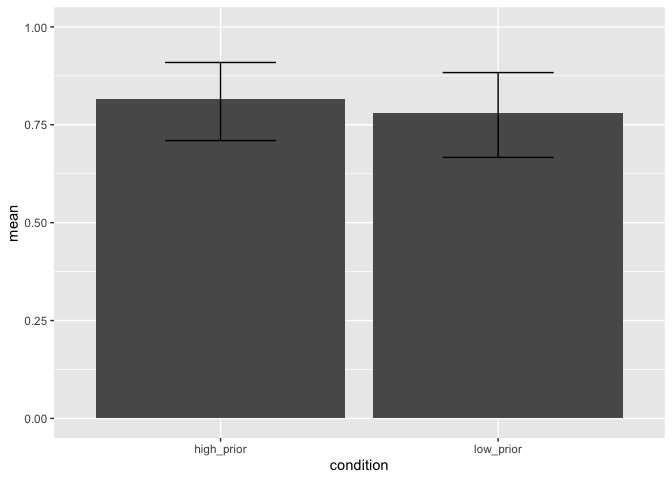

PragmaticQA E4: Prior Sensitivity Free Production
================
PT
2024-04-30

# Intro

This is another experiment in the PragmaticQA project, wherein we
investigate whether speakers’ overinformativeness in response to polar
questions depends on the (commonly known) prior probability of the
available options. The live experiment can be found
[here](https://magpie-ea.github.io/magpie3-qa-overinfo-free-production/experiments/04-priorSensitivity_free_production/).
We manipulate the prior probability of the available options in context,
resulting in two critical conditions, highPrior (high prior options
available) and lowPrior (high prior option not available). The
experiment is a free production experiment. Each participant sees four
main trials (two per condition, assigned at random to four randomly
chosen vignettes), and one filler trial. Fillers are re-used from CogSci
E1.

- Pilot 1: five vignettes only were chosen here: cardBlanche,
  icecreamFlavors, streamingOptions, coffeeShops, socialMedia. N=30 were
  recruited.

The freely typed responses were manually categorized into the following
categories:

- “taciturn”: responses just saying “yes” or “yes, we do” or similar.
- “taciturn_more”: responses saying “yes” but providing some additional
  information without mentioning specific options, for instance “Yes
  there are some coffee shops around the corner”
- “mostLikely”: response mentioning the most likely option among the
  available ones, e.g., “Yes we do, we have 3 flavours the chocolate
  delight is the favourite of them”
- “fullList”: responses mentioning the two specific available options,
  e.g., “Sure, we’ve got Chocolate Delight and Strawberry Swirl”
- “exceptive: responses mentioning which option is NOT available,
  e.g.,”Yes, all except Card Blanche”

Below the single category proportions are displayed by condition.

``` r
df_answerOptions_global_summary <- d_main %>% 
  group_by(category) %>% 
  summarise(answerType_count = n(), 
            answerType_proportion = answerType_count / nrow(d)
            )

df_answerOptions_byCondition_summary <- d_main %>% 
  group_by(condition) %>%
  mutate(condition_counts = n()) %>%
  group_by(category, condition) %>% 
  summarise(answerType_count = n(), 
            answerType_proportion = answerType_count / condition_counts
            ) %>% unique()
```

    ## `summarise()` has grouped output by 'category', 'condition'. You can override
    ## using the `.groups` argument.

``` r
df_answerOptions_byCondition_summary %>%
  ggplot(aes(x = condition, y = answerType_proportion, fill = category)) +
  geom_col(color = "#575463") +
  theme_csp() +
  theme(plot.title = element_text(hjust = 0.5)) +
  ylab("Proportion of answer type") +
  xlab("") 
```

<!-- -->

The main hypothesis is that speakers will be more overinformative in the
low prior condition; i.e., they will produce more responses of
categories exceptive, fullList, taciturn_more, mostLikely. This
binarized distinction is used to plot “overinformativeness” proportions
by-condition below:

We see that the difference is not very large.

``` r
d_main_binary_summary %>%
  ggplot(., aes(x = condition, y = mean, ymin=ci_lower, ymax=ci_upper)) +
  geom_col() +
  geom_errorbar(width = 0.4) +
  ylim(0, 1)
```

<!-- -->
