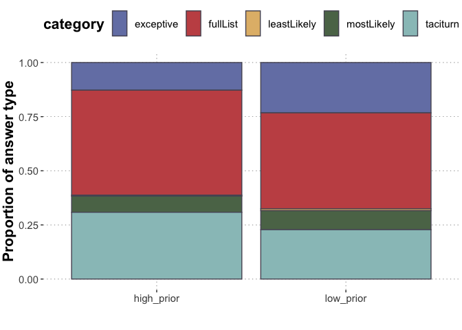
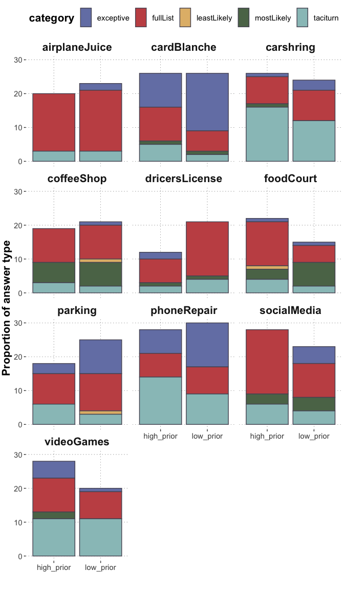

PragmaticQA E4: Prior Sensitivity Free Production: Main
================
PT
2024-04-30

# Intro

This is another experiment in the PragmaticQA project, wherein we
investigate whether speakers’ overinformativeness in response to polar
questions depends on the (commonly known) prior probability of the
available options. The live experiment can be found
[here](https://magpie-ea.github.io/magpie3-qa-overinfo-free-production/experiments/04-priorSensitivity_free_production/).
We manipulate the prior probability of the available options in context,
resulting in two critical conditions, highPrior (high prior options
available) and lowPrior (high prior option not available). The
experiment is a free production experiment. Each participant sees four
main trials (two per condition, assigned at random to four randomly
chosen vignettes), and one filler trial. Fillers are re-used from CogSci
E1.

- Main experiment: N=99 were recruited. Ten items were used (as in pilot
  2). Therefore, the combined data of pilot 2 (N=30) and the main data
  collection are analysed here.

We exclude the following invalid response categories:

- “no”: participants answered no to the question (although all questions
  were yes-questions)
- “other”: uncategorizable responses
- “yes”: all three options were stated as available

Furthermore, some responses had two categories, namely the full list
(i.e., the two available options were named) and the exceptive phrase
(i.e, it was stated that one option was not available). Such responses
were split into two data points with single labels.

``` r
d_main_clean <- d_main %>%
  filter(category != "no") %>%
  filter(category != "other") %>%
  filter(category != "yes") %>%
  mutate(
    category = str_split(category, ", ", simplify = FALSE) 
  ) %>%
  unnest(category) %>%
  mutate(
    category = ifelse(category == "taciturn_more", "taciturn", category)
  )
  
d_main_clean
```

    ## # A tibble: 456 × 14
    ##    submiss…¹   age answer categ…² comme…³ condi…⁴ corre…⁵ educa…⁶ gender itemN…⁷
    ##        <dbl> <dbl> <chr>  <chr>   <chr>   <chr>   <chr>   <chr>   <chr>  <chr>  
    ##  1      3363    30 Yes w… tacitu… This w… low_pr… <NA>    Gradua… female videoG…
    ##  2      3363    30 Yes, … fullLi… This w… high_p… <NA>    Gradua… female coffee…
    ##  3      3363    30 Hi! W… except… This w… high_p… <NA>    Gradua… female cardBl…
    ##  4      3363    30 There… except… This w… low_pr… <NA>    Gradua… female phoneR…
    ##  5      3364    29 Yes, … fullLi… <NA>    low_pr… <NA>    Gradua… female parking
    ##  6      3364    29 Yes, … except… <NA>    low_pr… <NA>    Gradua… female parking
    ##  7      3364    29 Yes, … fullLi… <NA>    high_p… <NA>    Gradua… female carshr…
    ##  8      3364    29 You c… fullLi… <NA>    high_p… <NA>    Gradua… female foodCo…
    ##  9      3364    29 Yes w… fullLi… <NA>    low_pr… <NA>    Gradua… female airpla…
    ## 10      3365    24 You c… fullLi… <NA>    high_p… <NA>    Gradua… other  social…
    ## # … with 446 more rows, 4 more variables: languages <chr>, responseTime <dbl>,
    ## #   trialNr <dbl>, trial_type <chr>, and abbreviated variable names
    ## #   ¹​submission_id, ²​category, ³​comments, ⁴​condition, ⁵​correct_response,
    ## #   ⁶​education, ⁷​itemName

The freely typed responses were manually categorized into the following
categories:

- “taciturn”: responses just saying “yes” or “yes, we do” or similar.
- “taciturn_more”: responses saying “yes” but providing some additional
  information without mentioning specific options, for instance “Yes
  there are some coffee shops around the corner”
- “mostLikely”: response mentioning the most likely option among the
  available ones, e.g., “Yes we do accept American Express”
- “leastLikely”: only one option was named, namely the least likely one
  among the available ones, e.g., “Yes we do accept Visa” in the high
  prior condition
- “fullList”: responses mentioning the two specific available options
- “exceptive: responses mentioning which option is NOT available,
  e.g.,”Yes, all except Card Blanche”

Below the single category proportions are displayed by condition. For
the purposes of the main analysis, taciturn and taciturn_more responses
are collapsed.

``` r
df_answerOptions_global_summary <- d_main_clean %>% 
  group_by(category) %>% 
  summarise(answerType_count = n(), 
            answerType_proportion = answerType_count / nrow(d)
            )

df_answerOptions_byCondition_summary <- d_main_clean %>% 
  filter(category != "no") %>%
  group_by(condition) %>%
  mutate(condition_counts = n()) %>%
  group_by(category, condition) %>% 
  summarise(answerType_count = n(), 
            answerType_proportion = answerType_count / condition_counts
            ) %>% unique()
```

    ## `summarise()` has grouped output by 'category', 'condition'. You can override
    ## using the `.groups` argument.

``` r
df_answerOptions_byCondition_summary %>%
  ggplot(aes(x = condition, y = answerType_proportion, fill = category)) +
  geom_col(color = "#575463") +
  theme_csp() +
  theme(plot.title = element_text(hjust = 0.5)) +
  ylab("Proportion of answer type") +
  xlab("") 
```

<!-- -->

Below, the response categories are plotted by-item, so as to check if
respondents might have chosen different strategies, e.g., full-list
responses, in e.g. commercial contexts so as to not loose customers:

``` r
df_answerOptions_byCondition_byItem_summary <- d_main_clean %>% 
  filter(category != "no") %>%
  group_by(itemName, condition) %>%
  mutate(condition_counts = n()) %>%
  group_by(itemName, category, condition) %>% 
  summarise(answerType_count = n(), 
            answerType_proportion = answerType_count / condition_counts
            ) %>% unique()
```

    ## `summarise()` has grouped output by 'itemName', 'category', 'condition'. You
    ## can override using the `.groups` argument.

``` r
df_answerOptions_byCondition_byItem_summary %>%
  ggplot(aes(x = condition, y = answerType_count, fill = category)) +
  geom_col(color = "#575463") +
  theme_csp() +
  theme(plot.title = element_text(hjust = 0.5)) +
  ylab("Proportion of answer type") +
  facet_wrap(~itemName, ncol=3) +
  xlab("") 
```

<!-- -->

We can also check whether there is a credible difference between the
rate of fullList responses (i.e., both fullList and exceptive responses)
in the two conditions, by fitting a Bayesian logistic regression with a
main effect of condition and maximal random effects. Uninformative
priors are used. The hypothesis is that there are more fullList
responses in the lowPrior condition than in the highPrior condition.

``` r
d_main_fullList_binary <- d_main_clean %>% 
  mutate(is_fullList = ifelse(category == "exceptive", 1, ifelse(category == "fullList", 1, 0))) 

priors <- set_prior("student_t(1, 0, 0.25)", class = "b")

lm_full <- brm(
  is_fullList ~ condition + (1 + condition | submission_id) + (1 + condition | itemName),
  data = d_main_fullList_binary,
  family = "bernoulli",
  prior = priors,
  control = list(adapt_delta = 0.95),
  iter = 3000,
  chains = 4
)
```

    ## Running /Library/Frameworks/R.framework/Resources/bin/R CMD SHLIB foo.c
    ## clang -arch arm64 -I"/Library/Frameworks/R.framework/Resources/include" -DNDEBUG   -I"/Library/Frameworks/R.framework/Versions/4.2-arm64/Resources/library/Rcpp/include/"  -I"/Library/Frameworks/R.framework/Versions/4.2-arm64/Resources/library/RcppEigen/include/"  -I"/Library/Frameworks/R.framework/Versions/4.2-arm64/Resources/library/RcppEigen/include/unsupported"  -I"/Library/Frameworks/R.framework/Versions/4.2-arm64/Resources/library/BH/include" -I"/Library/Frameworks/R.framework/Versions/4.2-arm64/Resources/library/StanHeaders/include/src/"  -I"/Library/Frameworks/R.framework/Versions/4.2-arm64/Resources/library/StanHeaders/include/"  -I"/Library/Frameworks/R.framework/Versions/4.2-arm64/Resources/library/RcppParallel/include/"  -I"/Library/Frameworks/R.framework/Versions/4.2-arm64/Resources/library/rstan/include" -DEIGEN_NO_DEBUG  -DBOOST_DISABLE_ASSERTS  -DBOOST_PENDING_INTEGER_LOG2_HPP  -DSTAN_THREADS  -DBOOST_NO_AUTO_PTR  -include '/Library/Frameworks/R.framework/Versions/4.2-arm64/Resources/library/StanHeaders/include/stan/math/prim/mat/fun/Eigen.hpp'  -D_REENTRANT -DRCPP_PARALLEL_USE_TBB=1   -I/opt/R/arm64/include   -fPIC  -falign-functions=64 -Wall -g -O2  -c foo.c -o foo.o
    ## In file included from <built-in>:1:
    ## In file included from /Library/Frameworks/R.framework/Versions/4.2-arm64/Resources/library/StanHeaders/include/stan/math/prim/mat/fun/Eigen.hpp:13:
    ## In file included from /Library/Frameworks/R.framework/Versions/4.2-arm64/Resources/library/RcppEigen/include/Eigen/Dense:1:
    ## In file included from /Library/Frameworks/R.framework/Versions/4.2-arm64/Resources/library/RcppEigen/include/Eigen/Core:88:
    ## /Library/Frameworks/R.framework/Versions/4.2-arm64/Resources/library/RcppEigen/include/Eigen/src/Core/util/Macros.h:628:1: error: unknown type name 'namespace'
    ## namespace Eigen {
    ## ^
    ## /Library/Frameworks/R.framework/Versions/4.2-arm64/Resources/library/RcppEigen/include/Eigen/src/Core/util/Macros.h:628:16: error: expected ';' after top level declarator
    ## namespace Eigen {
    ##                ^
    ##                ;
    ## In file included from <built-in>:1:
    ## In file included from /Library/Frameworks/R.framework/Versions/4.2-arm64/Resources/library/StanHeaders/include/stan/math/prim/mat/fun/Eigen.hpp:13:
    ## In file included from /Library/Frameworks/R.framework/Versions/4.2-arm64/Resources/library/RcppEigen/include/Eigen/Dense:1:
    ## /Library/Frameworks/R.framework/Versions/4.2-arm64/Resources/library/RcppEigen/include/Eigen/Core:96:10: fatal error: 'complex' file not found
    ## #include <complex>
    ##          ^~~~~~~~~
    ## 3 errors generated.
    ## make: *** [foo.o] Error 1

``` r
summary(lm_full)
```

    ## Warning: There were 1 divergent transitions after warmup. Increasing adapt_delta
    ## above 0.95 may help. See http://mc-stan.org/misc/warnings.html#divergent-
    ## transitions-after-warmup

    ##  Family: bernoulli 
    ##   Links: mu = logit 
    ## Formula: is_fullList ~ condition + (1 + condition | submission_id) + (1 + condition | itemName) 
    ##    Data: d_main_fullList_binary (Number of observations: 456) 
    ##   Draws: 4 chains, each with iter = 3000; warmup = 1500; thin = 1;
    ##          total post-warmup draws = 6000
    ## 
    ## Group-Level Effects: 
    ## ~itemName (Number of levels: 10) 
    ##                                   Estimate Est.Error l-95% CI u-95% CI Rhat
    ## sd(Intercept)                         1.19      0.45     0.50     2.25 1.00
    ## sd(conditionlow_prior)                0.64      0.47     0.03     1.76 1.00
    ## cor(Intercept,conditionlow_prior)    -0.16      0.52    -0.94     0.88 1.00
    ##                                   Bulk_ESS Tail_ESS
    ## sd(Intercept)                         2172     3047
    ## sd(conditionlow_prior)                1587     1934
    ## cor(Intercept,conditionlow_prior)     3527     3194
    ## 
    ## ~submission_id (Number of levels: 121) 
    ##                                   Estimate Est.Error l-95% CI u-95% CI Rhat
    ## sd(Intercept)                         2.74      0.65     1.72     4.21 1.01
    ## sd(conditionlow_prior)                1.38      0.74     0.10     2.94 1.01
    ## cor(Intercept,conditionlow_prior)    -0.61      0.36    -0.98     0.48 1.00
    ##                                   Bulk_ESS Tail_ESS
    ## sd(Intercept)                         1018     2769
    ## sd(conditionlow_prior)                 757     1170
    ## cor(Intercept,conditionlow_prior)     2284     2596
    ## 
    ## Population-Level Effects: 
    ##                    Estimate Est.Error l-95% CI u-95% CI Rhat Bulk_ESS Tail_ESS
    ## Intercept              0.90      0.48    -0.04     1.90 1.00     2313     3046
    ## conditionlow_prior     0.09      0.26    -0.40     0.64 1.00     5631     3733
    ## 
    ## Draws were sampled using sampling(NUTS). For each parameter, Bulk_ESS
    ## and Tail_ESS are effective sample size measures, and Rhat is the potential
    ## scale reduction factor on split chains (at convergence, Rhat = 1).

The same analysis is done with the rate of “exceptive” answers only. The
same hypothesis is tested (i.e., more exceptive answers are expected in
the lowPrior than in the highPrior condition).

``` r
d_main_exceptive_binary <- d_main_clean %>% 
  mutate(is_exceptive = ifelse(category == "exceptive", 1, 0)) 

priors <- set_prior("student_t(1, 0, 0.25)", class = "b")

lm_exceptive <- brm(
  is_exceptive ~ condition + (1 + condition | submission_id) + (1 + condition | itemName),
  data = d_main_exceptive_binary,
  family = "bernoulli",
  prior = priors,
  control = list(adapt_delta = 0.95),
  iter = 3000,
  chains = 4
)
```

    ## Running /Library/Frameworks/R.framework/Resources/bin/R CMD SHLIB foo.c
    ## clang -arch arm64 -I"/Library/Frameworks/R.framework/Resources/include" -DNDEBUG   -I"/Library/Frameworks/R.framework/Versions/4.2-arm64/Resources/library/Rcpp/include/"  -I"/Library/Frameworks/R.framework/Versions/4.2-arm64/Resources/library/RcppEigen/include/"  -I"/Library/Frameworks/R.framework/Versions/4.2-arm64/Resources/library/RcppEigen/include/unsupported"  -I"/Library/Frameworks/R.framework/Versions/4.2-arm64/Resources/library/BH/include" -I"/Library/Frameworks/R.framework/Versions/4.2-arm64/Resources/library/StanHeaders/include/src/"  -I"/Library/Frameworks/R.framework/Versions/4.2-arm64/Resources/library/StanHeaders/include/"  -I"/Library/Frameworks/R.framework/Versions/4.2-arm64/Resources/library/RcppParallel/include/"  -I"/Library/Frameworks/R.framework/Versions/4.2-arm64/Resources/library/rstan/include" -DEIGEN_NO_DEBUG  -DBOOST_DISABLE_ASSERTS  -DBOOST_PENDING_INTEGER_LOG2_HPP  -DSTAN_THREADS  -DBOOST_NO_AUTO_PTR  -include '/Library/Frameworks/R.framework/Versions/4.2-arm64/Resources/library/StanHeaders/include/stan/math/prim/mat/fun/Eigen.hpp'  -D_REENTRANT -DRCPP_PARALLEL_USE_TBB=1   -I/opt/R/arm64/include   -fPIC  -falign-functions=64 -Wall -g -O2  -c foo.c -o foo.o
    ## In file included from <built-in>:1:
    ## In file included from /Library/Frameworks/R.framework/Versions/4.2-arm64/Resources/library/StanHeaders/include/stan/math/prim/mat/fun/Eigen.hpp:13:
    ## In file included from /Library/Frameworks/R.framework/Versions/4.2-arm64/Resources/library/RcppEigen/include/Eigen/Dense:1:
    ## In file included from /Library/Frameworks/R.framework/Versions/4.2-arm64/Resources/library/RcppEigen/include/Eigen/Core:88:
    ## /Library/Frameworks/R.framework/Versions/4.2-arm64/Resources/library/RcppEigen/include/Eigen/src/Core/util/Macros.h:628:1: error: unknown type name 'namespace'
    ## namespace Eigen {
    ## ^
    ## /Library/Frameworks/R.framework/Versions/4.2-arm64/Resources/library/RcppEigen/include/Eigen/src/Core/util/Macros.h:628:16: error: expected ';' after top level declarator
    ## namespace Eigen {
    ##                ^
    ##                ;
    ## In file included from <built-in>:1:
    ## In file included from /Library/Frameworks/R.framework/Versions/4.2-arm64/Resources/library/StanHeaders/include/stan/math/prim/mat/fun/Eigen.hpp:13:
    ## In file included from /Library/Frameworks/R.framework/Versions/4.2-arm64/Resources/library/RcppEigen/include/Eigen/Dense:1:
    ## /Library/Frameworks/R.framework/Versions/4.2-arm64/Resources/library/RcppEigen/include/Eigen/Core:96:10: fatal error: 'complex' file not found
    ## #include <complex>
    ##          ^~~~~~~~~
    ## 3 errors generated.
    ## make: *** [foo.o] Error 1

``` r
summary(lm_exceptive)
```

    ##  Family: bernoulli 
    ##   Links: mu = logit 
    ## Formula: is_exceptive ~ condition + (1 + condition | submission_id) + (1 + condition | itemName) 
    ##    Data: d_main_exceptive_binary (Number of observations: 456) 
    ##   Draws: 4 chains, each with iter = 3000; warmup = 1500; thin = 1;
    ##          total post-warmup draws = 6000
    ## 
    ## Group-Level Effects: 
    ## ~itemName (Number of levels: 10) 
    ##                                   Estimate Est.Error l-95% CI u-95% CI Rhat
    ## sd(Intercept)                         1.50      0.57     0.65     2.83 1.00
    ## sd(conditionlow_prior)                1.23      0.70     0.11     2.82 1.00
    ## cor(Intercept,conditionlow_prior)     0.10      0.48    -0.76     0.93 1.00
    ##                                   Bulk_ESS Tail_ESS
    ## sd(Intercept)                         2773     3541
    ## sd(conditionlow_prior)                1528     2090
    ## cor(Intercept,conditionlow_prior)     2706     3359
    ## 
    ## ~submission_id (Number of levels: 121) 
    ##                                   Estimate Est.Error l-95% CI u-95% CI Rhat
    ## sd(Intercept)                         1.39      0.49     0.49     2.46 1.00
    ## sd(conditionlow_prior)                0.82      0.58     0.04     2.18 1.00
    ## cor(Intercept,conditionlow_prior)    -0.22      0.54    -0.96     0.89 1.00
    ##                                   Bulk_ESS Tail_ESS
    ## sd(Intercept)                         1297     1478
    ## sd(conditionlow_prior)                1212     2432
    ## cor(Intercept,conditionlow_prior)     3061     3724
    ## 
    ## Population-Level Effects: 
    ##                    Estimate Est.Error l-95% CI u-95% CI Rhat Bulk_ESS Tail_ESS
    ## Intercept             -2.88      0.66    -4.30    -1.66 1.00     2214     3135
    ## conditionlow_prior     0.39      0.52    -0.35     1.68 1.00     3091     3107
    ## 
    ## Draws were sampled using sampling(NUTS). For each parameter, Bulk_ESS
    ## and Tail_ESS are effective sample size measures, and Rhat is the potential
    ## scale reduction factor on split chains (at convergence, Rhat = 1).

We also check whether there is a credible difference between the rate of
taciturn responses in the two conditions, by fitting a Bayesian logistic
regression with a main effect of condition and maximal random effects.
We expect more taciturn responses in the highPrior condition compared to
the lowPrior condition.

``` r
d_main_taciturn_binary <- d_main_clean %>% 
  mutate(is_taciturn = ifelse(category == "taciturn", 1, 0)) 

lm_taciturn <- brm(
  is_taciturn ~ condition + (1 + condition | submission_id) + (1 + condition | itemName),
  data = d_main_taciturn_binary,
  family = "bernoulli",
  prior = priors,
  control = list(adapt_delta = 0.95),
  iter = 3000,
  chains = 4
)
```

    ## Running /Library/Frameworks/R.framework/Resources/bin/R CMD SHLIB foo.c
    ## clang -arch arm64 -I"/Library/Frameworks/R.framework/Resources/include" -DNDEBUG   -I"/Library/Frameworks/R.framework/Versions/4.2-arm64/Resources/library/Rcpp/include/"  -I"/Library/Frameworks/R.framework/Versions/4.2-arm64/Resources/library/RcppEigen/include/"  -I"/Library/Frameworks/R.framework/Versions/4.2-arm64/Resources/library/RcppEigen/include/unsupported"  -I"/Library/Frameworks/R.framework/Versions/4.2-arm64/Resources/library/BH/include" -I"/Library/Frameworks/R.framework/Versions/4.2-arm64/Resources/library/StanHeaders/include/src/"  -I"/Library/Frameworks/R.framework/Versions/4.2-arm64/Resources/library/StanHeaders/include/"  -I"/Library/Frameworks/R.framework/Versions/4.2-arm64/Resources/library/RcppParallel/include/"  -I"/Library/Frameworks/R.framework/Versions/4.2-arm64/Resources/library/rstan/include" -DEIGEN_NO_DEBUG  -DBOOST_DISABLE_ASSERTS  -DBOOST_PENDING_INTEGER_LOG2_HPP  -DSTAN_THREADS  -DBOOST_NO_AUTO_PTR  -include '/Library/Frameworks/R.framework/Versions/4.2-arm64/Resources/library/StanHeaders/include/stan/math/prim/mat/fun/Eigen.hpp'  -D_REENTRANT -DRCPP_PARALLEL_USE_TBB=1   -I/opt/R/arm64/include   -fPIC  -falign-functions=64 -Wall -g -O2  -c foo.c -o foo.o
    ## In file included from <built-in>:1:
    ## In file included from /Library/Frameworks/R.framework/Versions/4.2-arm64/Resources/library/StanHeaders/include/stan/math/prim/mat/fun/Eigen.hpp:13:
    ## In file included from /Library/Frameworks/R.framework/Versions/4.2-arm64/Resources/library/RcppEigen/include/Eigen/Dense:1:
    ## In file included from /Library/Frameworks/R.framework/Versions/4.2-arm64/Resources/library/RcppEigen/include/Eigen/Core:88:
    ## /Library/Frameworks/R.framework/Versions/4.2-arm64/Resources/library/RcppEigen/include/Eigen/src/Core/util/Macros.h:628:1: error: unknown type name 'namespace'
    ## namespace Eigen {
    ## ^
    ## /Library/Frameworks/R.framework/Versions/4.2-arm64/Resources/library/RcppEigen/include/Eigen/src/Core/util/Macros.h:628:16: error: expected ';' after top level declarator
    ## namespace Eigen {
    ##                ^
    ##                ;
    ## In file included from <built-in>:1:
    ## In file included from /Library/Frameworks/R.framework/Versions/4.2-arm64/Resources/library/StanHeaders/include/stan/math/prim/mat/fun/Eigen.hpp:13:
    ## In file included from /Library/Frameworks/R.framework/Versions/4.2-arm64/Resources/library/RcppEigen/include/Eigen/Dense:1:
    ## /Library/Frameworks/R.framework/Versions/4.2-arm64/Resources/library/RcppEigen/include/Eigen/Core:96:10: fatal error: 'complex' file not found
    ## #include <complex>
    ##          ^~~~~~~~~
    ## 3 errors generated.
    ## make: *** [foo.o] Error 1

``` r
summary(lm_taciturn)
```

    ##  Family: bernoulli 
    ##   Links: mu = logit 
    ## Formula: is_taciturn ~ condition + (1 + condition | submission_id) + (1 + condition | itemName) 
    ##    Data: d_main_taciturn_binary (Number of observations: 456) 
    ##   Draws: 4 chains, each with iter = 3000; warmup = 1500; thin = 1;
    ##          total post-warmup draws = 6000
    ## 
    ## Group-Level Effects: 
    ## ~itemName (Number of levels: 10) 
    ##                                   Estimate Est.Error l-95% CI u-95% CI Rhat
    ## sd(Intercept)                         1.72      0.58     0.84     3.10 1.00
    ## sd(conditionlow_prior)                0.68      0.55     0.02     2.00 1.00
    ## cor(Intercept,conditionlow_prior)    -0.09      0.54    -0.94     0.92 1.00
    ##                                   Bulk_ESS Tail_ESS
    ## sd(Intercept)                         2479     3582
    ## sd(conditionlow_prior)                2033     3500
    ## cor(Intercept,conditionlow_prior)     5245     3898
    ## 
    ## ~submission_id (Number of levels: 121) 
    ##                                   Estimate Est.Error l-95% CI u-95% CI Rhat
    ## sd(Intercept)                         3.56      0.83     2.25     5.44 1.00
    ## sd(conditionlow_prior)                1.76      0.90     0.14     3.64 1.00
    ## cor(Intercept,conditionlow_prior)    -0.51      0.38    -0.96     0.55 1.00
    ##                                   Bulk_ESS Tail_ESS
    ## sd(Intercept)                         1183     2744
    ## sd(conditionlow_prior)                 728     1238
    ## cor(Intercept,conditionlow_prior)     2853     2172
    ## 
    ## Population-Level Effects: 
    ##                    Estimate Est.Error l-95% CI u-95% CI Rhat Bulk_ESS Tail_ESS
    ## Intercept             -2.07      0.73    -3.56    -0.67 1.00     2458     3380
    ## conditionlow_prior    -0.24      0.39    -1.17     0.37 1.00     4521     3902
    ## 
    ## Draws were sampled using sampling(NUTS). For each parameter, Bulk_ESS
    ## and Tail_ESS are effective sample size measures, and Rhat is the potential
    ## scale reduction factor on split chains (at convergence, Rhat = 1).
