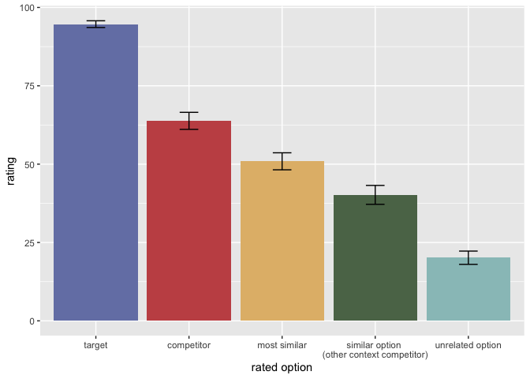
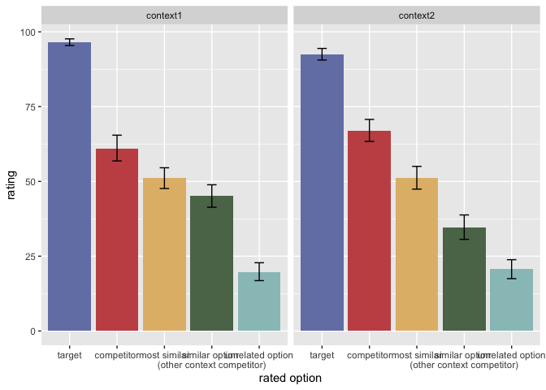
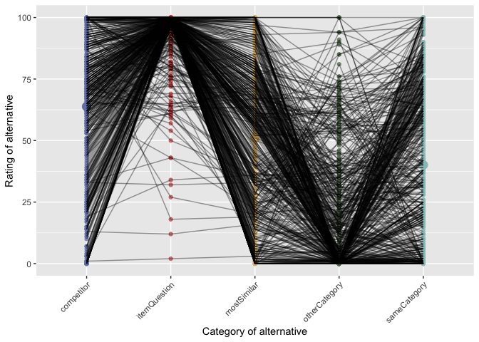

E2 prior elicitation
================
PT
2024-06-14

Here we elicit prior utilities for the alternatives that could be
mentioned by a pragmatic respondent for
[E2](https://magpie-ea.github.io/magpie3-qa-overinfo-free-production/experiments/contextSensitive_free_production/)
from CogSci. The experiment followed the prior elicitation for E1, but
presented the rating in functional context, drawn from the vignettes of
the free production experiment E2. Additionally, utilities were only
elicited for the alternatives, given the target trigger from the free
production experiment (i.e., not the full utilities matrix was
elicited). The live experiment can be found
[here](https://magpie-ea.github.io/magpie3-qa-overinfo-free-production/experiments/05-contextSensitive-prior_elicitation/).

``` r
library(tidyverse)
```

    ## ── Attaching packages ─────────────────────────────────────── tidyverse 1.3.2 ──
    ## ✔ ggplot2 3.4.0      ✔ purrr   0.3.5 
    ## ✔ tibble  3.1.8      ✔ dplyr   1.0.10
    ## ✔ tidyr   1.2.1      ✔ stringr 1.4.1 
    ## ✔ readr   2.1.3      ✔ forcats 0.5.2 
    ## ── Conflicts ────────────────────────────────────────── tidyverse_conflicts() ──
    ## ✖ dplyr::filter() masks stats::filter()
    ## ✖ dplyr::lag()    masks stats::lag()

``` r
library(tidyboot)
library(cspplot)
```

    ## 
    ## Attaching package: 'cspplot'
    ## 
    ## The following objects are masked from 'package:ggplot2':
    ## 
    ##     scale_color_continuous, scale_color_discrete, scale_color_gradient,
    ##     scale_color_gradient2, scale_color_gradientn,
    ##     scale_colour_continuous, scale_colour_discrete,
    ##     scale_colour_gradient, scale_colour_gradient2,
    ##     scale_colour_gradientn, scale_fill_continuous, scale_fill_discrete,
    ##     scale_fill_gradient, scale_fill_gradient2, scale_fill_gradientn

The rated options are categorized as competitor 1 (anticipated to be the
best alternative in context 1), competitor 2 (anticipated to be the best
alternative in context 2), mostSimilar (a priori most similar object to
target), otherCategory (unrelated alternative).

``` r
answerOrder <- c('itemQuestion', 'competitor', 'mostSimilar', 'sameCategory', 'otherCategory')

df <- read_csv("../experiments/05-contextSensitive-prior_elicitation/trials/PragmaticQA-E2-priorElicitation-sliderRating-full_120.csv") 
```

    ## Rows: 610 Columns: 24
    ## ── Column specification ────────────────────────────────────────────────────────
    ## Delimiter: ","
    ## chr (12): comments, education, gender, itemName, itemOrder, languages, proli...
    ## dbl (12): submission_id, age, competitor, experiment_duration, experiment_en...
    ## 
    ## ℹ Use `spec()` to retrieve the full column specification for this data.
    ## ℹ Specify the column types or set `show_col_types = FALSE` to quiet this message.

``` r
# look at comments to see if anything went wrong
#df |> pull(comments) |> unique()
#df %>% select(-prolific_pid, -prolific_session_id, -prolific_study_id) %>% write_csv("data/PragmaticQA-E2-priorElicitation-sliderRating-full_120.csv")

df <- read_csv("data/PragmaticQA-E2-priorElicitation-sliderRating-full_120.csv")
```

    ## Rows: 610 Columns: 21
    ## ── Column specification ────────────────────────────────────────────────────────
    ## Delimiter: ","
    ## chr  (9): comments, education, gender, itemName, itemOrder, languages, setti...
    ## dbl (12): submission_id, age, competitor, experiment_duration, experiment_en...
    ## 
    ## ℹ Use `spec()` to retrieve the full column specification for this data.
    ## ℹ Specify the column types or set `show_col_types = FALSE` to quiet this message.

``` r
# head(df)
# target number of subjects for full experiment: n = 24 * 20 / 4 = 120
cat("Number of recruited subjects: ", df %>% pull(submission_id) %>% unique() %>% length())
```

    ## Number of recruited subjects:  122

    ## Numbrer of subjects who failed attention checks:  12

    ## 
    ## Subject exclusion rate:  0.09836066

``` r
# get main clean data and center responses
df_clean_main <- df %>% #filter(!(submission_id %in% subj_id_attention_fails)) %>%
  filter(trial_type == "main") 
cat("Numbrer of main trial data points that are used for analysis: ", nrow(df_clean_main) )
```

    ## Numbrer of main trial data points that are used for analysis:  488

``` r
df_clean_main_long <- df_clean_main %>%
  select(itemName, trialNr, submission_id, targetOption, itemQuestion, competitor, sameCategory, otherCategory, mostSimilar,) %>%
   pivot_longer(cols = c(itemQuestion, competitor, sameCategory, otherCategory, mostSimilar), names_to = 'answerType', values_to = "response") %>%
  mutate(
    categorized_response = targetOption
  ) 
```

Check for lazy subject who only provide ratings within 5 points: One
subject is excluded because they provided all ratings within 5 points.

    ## # A tibble: 0 × 8
    ## # Groups:   submission_id [0]
    ## # … with 8 variables: itemName <chr>, trialNr <dbl>, submission_id <dbl>,
    ## #   targetOption <chr>, answerType <chr>, response <dbl>,
    ## #   categorized_response <chr>, bad_subj <lgl>

    ## 
    ## number of subjects who provided the same responses within 5 points on all main trials: 0

Check how many ratings / vignette we have:

``` r
df_clean_main %>% count(itemName) %>% pull(n) %>% mean()
```

    ## [1] 20.33333

Compute means:

``` r
df_clean_main_summary <- df_clean_main_long %>%
  group_by(answerType) %>%
  tidyboot_mean(column = response)
```

    ## Warning: `as_data_frame()` was deprecated in tibble 2.0.0.
    ## ℹ Please use `as_tibble()` instead.
    ## ℹ The signature and semantics have changed, see `?as_tibble`.
    ## ℹ The deprecated feature was likely used in the purrr package.
    ##   Please report the issue at <]8;;https://github.com/tidyverse/purrr/issueshttps://github.com/tidyverse/purrr/issues]8;;>.

    ## Warning: `cols` is now required when using unnest().
    ## Please use `cols = c(strap)`

By-item means:

``` r
df_clean_main_byItem_summary <- df_clean_main_long %>% 
  group_by(itemName, answerType) %>%
  summarize(mean_response = mean(response))
```

    ## `summarise()` has grouped output by 'itemName'. You can override using the
    ## `.groups` argument.

``` r
#df_clean_main_byItem_summary %>% write_csv("data/PragmaticQA-E2-priorElicitation-sliderRating-full_means.csv")
#df_clean_main_long %>% write_csv("data/PragmaticQA-E2-priorElicitation-sliderRating-full_120_long.csv")
```

Plot across contexts:

``` r
df_clean_main_summary %>%
  mutate(answerType = factor(answerType, levels = answerOrder, labels = c("target", "competitor", "most similar", "similar option \n(other context competitor)", "unrelated option"))) %>%
  ggplot(., aes(x = answerType, y = mean, ymin = ci_lower, ymax = ci_upper, fill = answerType)) +
  geom_col() +
  geom_errorbar(width = 0.2) +
  theme(legend.position = "none") +
  #theme_csp() +
  xlab("rated option") +
  ylab("rating")
```

<!-- -->

Plot by context, just to be sure:

``` r
# add context number information
context_info <- read_csv("../data_paper_neural/e2_vignettes.csv")
```

    ## Rows: 24 Columns: 3
    ## ── Column specification ────────────────────────────────────────────────────────
    ## Delimiter: ","
    ## chr (3): itemName, settingName, context_nr
    ## 
    ## ℹ Use `spec()` to retrieve the full column specification for this data.
    ## ℹ Specify the column types or set `show_col_types = FALSE` to quiet this message.

``` r
df_clean_main_long_wContext <- df_clean_main_long %>%
  left_join(., context_info, by=c("itemName" ))

# summary
df_clean_main_summary_byContext <- df_clean_main_long_wContext %>%
  group_by(answerType, context_nr) %>%
  tidyboot_mean(column = response)
```

    ## Warning: `cols` is now required when using unnest().
    ## Please use `cols = c(strap)`

``` r
df_clean_main_summary_byContext %>%
  mutate(answerType = factor(answerType, levels = answerOrder, labels = c("target", "competitor", "most similar", "similar option \n(other context competitor)", "unrelated option"))) %>%
  ggplot(., aes(x = answerType, y = mean, ymin = ci_lower, ymax = ci_upper, fill = answerType)) +
  geom_col() +
  facet_wrap(~context_nr) +
  geom_errorbar(width = 0.2) +
  theme(legend.position = "none") +
  #theme_csp() +
  xlab("rated option") +
  ylab("rating")
```

<!-- -->

Plot the single-trial lines to make sure that there are no weird
bi-modalities in the distribution / weird orders in single items that
are averaged in the means:

``` r
num_subj <- df_clean_main_long %>% pull(submission_id) %>% unique() %>% length()
df_clean_main_long <- df_clean_main_long %>% 
  mutate(categorized_response = factor(categorized_response, levels = answerOrder),
         by_trial_nr = rep(1:(num_subj*4), each = 5),
         by_trial_nr = factor(by_trial_nr)
         )


df_clean_main_long %>%
  ggplot(., aes(x = answerType, y = response, fill = answerType, color = answerType)) +
  geom_point(alpha = 0.7) +
  geom_point(data = df_clean_main_summary, aes(x = answerType, y = mean), size = 4) + 
  geom_line(data = df_clean_main_long, inherit.aes=F, aes(x = answerType, y = response, group = by_trial_nr), alpha  = 0.4) +
  theme(axis.text.x = element_text(angle = 45, hjust = 1)) +
  theme(strip.text.x = element_text(size = 10)) +
  theme(panel.spacing = unit(3, "lines")) +
  theme(legend.position="none") +
  ylab("Rating of alternative") +
  ylim(0, 100) +
  xlab("Category of alternative")
```

<!-- -->
